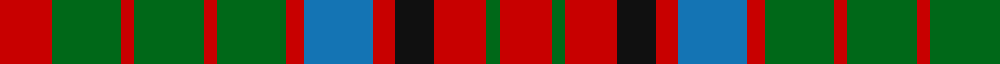

In pattern [RGRGRGRBRKRGR](/patterns/rgrgrgrbrkrgr/).

This was sourced from register-of-tartans.  It is a [13 stripes tartan](/stripes/stripes13/).

Original link https://www.tartanregister.gov.uk/tartanDetails.aspx?ref=1509

## Attestations

This cloth appears in 2 source records; the oldest owns this page.

- 01/01/1810 — Grant of Monymusk (register-of-tartans, [record](https://www.tartanregister.gov.uk/tartanDetails.aspx?ref=1509))
- 1810 — Grant of Monymusk - 1810 (Clan) (tartans-authority, [record](http://www.tartansauthority.com/tartan-ferret/display/1497/))

## Register references

External register numbers recorded for this tartan.

- Scottish Register of Tartans: [1509](https://www.tartanregister.gov.uk/tartanDetails.aspx?ref=1509)
- Scottish Tartans Authority (ITI): 1497
- Scottish Tartans World Register: 1497

## Thread count
R/24 G32 R6 G32 R6 G32 R8 B32 R10 K18 R24 G6 R/24

## Palette
Each colour and its ΔE from the base-6 reference it is a variant of.

| Colour | Shade | Base | ΔE (OKLab) |
|---|---|---|---|
| B | <code style="background-color:#1474B4;">#1474B4</code> `#1474B4` | B <code style="background-color:#2A418A;">#2A418A</code> | 0.15 |
| G | <code style="background-color:#006818;">#006818</code> `#006818` | G <code style="background-color:#006100;">#006100</code> | 0.02 |
| K | <code style="background-color:#101010;">#101010</code> `#101010` | K <code style="background-color:#000000;">#000000</code> | 0.17 |
| R | <code style="background-color:#C80000;">#C80000</code> `#C80000` | R <code style="background-color:#CC0000;">#CC0000</code> | 0.01 |

## Nearest tartans

The nearest existing variants by ΔTartan distance.

1. [Grant of Monymusk Clan Tartan Tartan Number: 1497. Earliest known date: 1810-15 An old tartan in the Cockburn Collection housed in the Mitchell Library in Glasgow. D.C.Stewart comments that it is made up of elements of the Huntly group of tartans. See products available Copyright © Blair Urquhart, Comrie, 2015](/setts/s13/r12g16r3g16r3g16r4b16r5k9r12g3r12~b2c2c80-g006818-k101010-rc80000~x2/) — ΔT 0.29
1. [Grant of Monymusk](/setts/s13/r12g16r3g16r3g16r4b16r5k9r12g3r12~b304080-g008000-k000000-rc00000~x2/) — ΔT 0.67
1. [Stewart/Stuart C18th - Cf 1314 & 4454](/setts/s12/g4b9r9g9k2r2k2g9r9b8g4r2~b2c2c80-g006818-k101010-rc80000~x4/) — ΔT 0.85
1. [MacRae](/setts/s12/g21r5g21r21g5r4g5r21w4r5b21r4~b304080-g008000-rc00000-we0e0e0/) — ΔT 0.90
1. [Grant of Ballindalloch Clan Tartan Tartan Number: 2149. Earliest known date: 1993 Grant of Ballindalloch tartan was designed during the refurbishment of Ballindalloch Castle. It is based on the Grant tartan recorded by Logan in 1831. The first samples produced by Johnstons of Elgin were woven in 'Antique' colours. See products available Copyright © Blair Urquhart, Comrie, 2015](/setts/s15/r5b5r3g16r3g3r3b10r3ba5r12b5r3b3r5~b003c64-ba2888c4-g006818-rc80000~x2/) — ΔT 1.03
1. [Londonderry Irish County Tartan Tartan Number: 2279. Earliest known date: 1995 One of a series of Irish District tartans designed by Polly Wittering of the House of Edgar, with colours reminiscent of the Country with soft warm colours dominating. See products available Copyright © Blair Urquhart, Comrie, 2015](/setts/s13/g10y8r5k2g3k2r5y8g12k2r6k2g2~g3c6838-k000000-rb03000-yd09000~x4/) — ΔT 1.06
1. [MacRae (Sample)](/setts/s12/g21r5g21r21g5r4g5r21w4r5b21r4~b2c4084-g005020-rdc0000-we0e0e0/) — ΔT 1.12
1. [Matheson](/setts/s13/r2g2r12b10ba3g10r2g2r2g10r12g2r2~b304080-ba5480b0-g008000-rc00000~x2/) — ΔT 1.16
1. [Grant of Monymusk](/setts/s13/r12g14r4g14r4g14r4b8r5b8r12g3r12~b304080-g008000-rc00000~x2/) — ΔT 1.22
1. [Maple Leaf](/setts/s12/g19r3g3r15y13r15g3r3g19ya6y6ga6~g004024-ga603311-r880000-ya08858-yaffd700~x2/) — ΔT 1.23

## Neighbour map

Every grey dot is one of 15726 variants placed by the first two principal components of the ΔTartan feature space (44% of its variance). Red is this tartan; blue dots are its nearest — click one to open its page.

<svg viewBox="0 0 640 380" role="img" style="max-width:100%;height:auto;border:1px solid #e0e0e0;border-radius:4px;display:block" xmlns="http://www.w3.org/2000/svg"><image href="/nn/cloud.v1.png" width="640" height="380"/><a href="/setts/s13/r12g16r3g16r3g16r4b16r5k9r12g3r12~b2c2c80-g006818-k101010-rc80000~x2/"><circle cx="169.9" cy="227.1" r="4" fill="#3465a4"><title>Grant of Monymusk Clan Tartan Tartan Number: 1497. Earliest known date: 1810-15 An old tartan in the Cockburn Collection housed in the Mitchell Library in Glasgow. D.C.Stewart comments that it is made up of elements of the Huntly group of tartans. See products available Copyright © Blair Urquhart, Comrie, 2015</title></circle></a><a href="/setts/s13/r12g16r3g16r3g16r4b16r5k9r12g3r12~b304080-g008000-k000000-rc00000~x2/"><circle cx="151.4" cy="220.8" r="4" fill="#3465a4"><title>Grant of Monymusk</title></circle></a><a href="/setts/s12/g4b9r9g9k2r2k2g9r9b8g4r2~b2c2c80-g006818-k101010-rc80000~x4/"><circle cx="143.0" cy="236.5" r="4" fill="#3465a4"><title>Stewart/Stuart C18th - Cf 1314 &amp; 4454</title></circle></a><a href="/setts/s12/g21r5g21r21g5r4g5r21w4r5b21r4~b304080-g008000-rc00000-we0e0e0/"><circle cx="202.6" cy="210.0" r="4" fill="#3465a4"><title>MacRae</title></circle></a><a href="/setts/s15/r5b5r3g16r3g3r3b10r3ba5r12b5r3b3r5~b003c64-ba2888c4-g006818-rc80000~x2/"><circle cx="192.4" cy="205.9" r="4" fill="#3465a4"><title>Grant of Ballindalloch Clan Tartan Tartan Number: 2149. Earliest known date: 1993 Grant of Ballindalloch tartan was designed during the refurbishment of Ballindalloch Castle. It is based on the Grant tartan recorded by Logan in 1831. The first samples produced by Johnstons of Elgin were woven in 'Antique' colours. See products available Copyright © Blair Urquhart, Comrie, 2015</title></circle></a><a href="/setts/s13/g10y8r5k2g3k2r5y8g12k2r6k2g2~g3c6838-k000000-rb03000-yd09000~x4/"><circle cx="144.6" cy="202.5" r="4" fill="#3465a4"><title>Londonderry Irish County Tartan Tartan Number: 2279. Earliest known date: 1995 One of a series of Irish District tartans designed by Polly Wittering of the House of Edgar, with colours reminiscent of the Country with soft warm colours dominating. See products available Copyright © Blair Urquhart, Comrie, 2015</title></circle></a><a href="/setts/s12/g21r5g21r21g5r4g5r21w4r5b21r4~b2c4084-g005020-rdc0000-we0e0e0/"><circle cx="201.6" cy="207.4" r="4" fill="#3465a4"><title>MacRae (Sample)</title></circle></a><a href="/setts/s13/r2g2r12b10ba3g10r2g2r2g10r12g2r2~b304080-ba5480b0-g008000-rc00000~x2/"><circle cx="225.3" cy="199.0" r="4" fill="#3465a4"><title>Matheson</title></circle></a><a href="/setts/s13/r12g14r4g14r4g14r4b8r5b8r12g3r12~b304080-g008000-rc00000~x2/"><circle cx="218.5" cy="257.2" r="4" fill="#3465a4"><title>Grant of Monymusk</title></circle></a><a href="/setts/s12/g19r3g3r15y13r15g3r3g19ya6y6ga6~g004024-ga603311-r880000-ya08858-yaffd700~x2/"><circle cx="160.3" cy="197.4" r="4" fill="#3465a4"><title>Maple Leaf</title></circle></a><circle cx="169.5" cy="227.2" r="5" fill="#c00000"/></svg>

ID: /setts/s13/r12g16r3g16r3g16r4b16r5k9r12g3r12~b1474b4-g006818-k101010-rc80000~x2/
