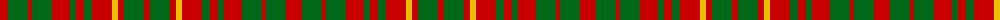

In pattern [RGRGRGRGRYRGR](/patterns/rgrgrgrgryrgr/).

This was sourced from register-of-tartans.  It is a [13 stripes tartan](/stripes/stripes13/).

Original link https://www.tartanregister.gov.uk/tartanDetails.aspx?ref=2762

## Attestations

This cloth appears in 2 source records; the oldest owns this page.

- 01/01/1950 — MacRurie/MacRory (register-of-tartans, [record](https://www.tartanregister.gov.uk/tartanDetails.aspx?ref=2762))
- pre 1950 — MacRory (tartans-authority, [record](http://www.tartansauthority.com/tartan-ferret/display/1498/))

## Thread count
R/16 G20 R4 G20 R18 G6 R8 G8 R20 Y6 R6 G20 R/6

## Palette
Each colour and its ΔE from the base-6 reference it is a variant of.

| Colour | Shade | Base | ΔE (OKLab) |
|---|---|---|---|
| G | <code style="background-color:#006818;">#006818</code> `#006818` | G <code style="background-color:#006400;">#006400</code> | 0.02 |
| R | <code style="background-color:#C80000;">#C80000</code> `#C80000` | R <code style="background-color:#C80000;">#C80000</code> | 0.00 |
| Y | <code style="background-color:#E8C000;">#E8C000</code> `#E8C000` | Y <code style="background-color:#E8C000;">#E8C000</code> | 0.00 |

ID: /setts/s13/r16g20r4g20r18g6r8g8r20y6r6g20r6-g006818-rc80000-ye8c000/
