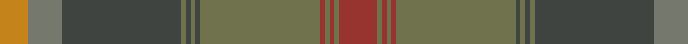

In pattern [RGRGRGBGBGBGY](/patterns/rgrgrgbgbgbgy/).

This was sourced from register-of-tartans.  It is a [13 stripes tartan](/stripes/stripes13/).

Original link https://www.tartanregister.gov.uk/tartanDetails.aspx?ref=10457

## Thread count
DO/12 Na14 N50 G2 N2 G2 N2 G50 DR2 G2 DR2 G2 DR/16

## Palette
Each colour and its ΔE from the base-6 reference it is a variant of.

| Colour | Shade | Base | ΔE (OKLab) |
|---|---|---|---|
| DO | <code style="background-color:#C5831B;">#C5831B</code> `#C5831B` | Y <code style="background-color:#E8C000;">#E8C000</code> | 0.17 |
| DR | <code style="background-color:#97342F;">#97342F</code> `#97342F` | R <code style="background-color:#C80000;">#C80000</code> | 0.10 |
| G | <code style="background-color:#70714D;">#70714D</code> `#70714D` | G <code style="background-color:#006400;">#006400</code> | 0.15 |
| N | <code style="background-color:#3F4441;">#3F4441</code> `#3F4441` | B <code style="background-color:#2C4084;">#2C4084</code> | 0.12 |
| Na | <code style="background-color:#75786C;">#75786C</code> `#75786C` | G <code style="background-color:#006400;">#006400</code> | 0.19 |

## Nearest tartans

The nearest existing variants by ΔTartan distance.

1. [Johansson (Personal)](/setts/s13/r16g2r2g2r2g50b2g2b2g2b50ra14y12-b5c5c5c-g5c6428-r880000-ra888888-ybc8c00/) — ΔT 0.45
1. [Tricor](/setts/s12/g16w4g16ga24gb24r16g92r16gb24ga24g16w4-g8c7038-ga00643c-gb604000-r98481c-wc0c0c0/) — ΔT 1.82
1. [Broons, The (DC Thomson)](/setts/s9/r6k2g16y2ga14y2g38gb50k2-g556b2f-ga603311-gb8b6508-k101010-rff0000-yffd700/) — ΔT 1.94
1. [The Broons (Corporate)](/setts/s9/r6k2g16y2ga14y2g38gb50k2-g5c6428-ga604000-gb603800-k101010-rc80000-ybc8c00/) — ΔT 1.96
1. [Clarks No.1](/setts/s10/b10ba4b22g4b4g12r34ra18b2r2-b32485c-ba6d8399-g5e633e-ra73e1d-rab07d0f/) — ΔT 1.97
1. [Scottish Borderland (Fashion)](/setts/s9/w4g4b2g60ba20b40g2b4y2-b405460-ba646464-g005020-wc8c8c8-yc88c00/) — ΔT 2.00
1. [Strathmore](/setts/s16/g6r30ga4r4ga4r4ga36b4ga4b4ga4b54k4b4k12y4-b3c2118-g4c5419-ga344625-k101010-r87041c-yff8a00/) — ΔT 2.01
1. [Crowne Plaza (Corporate)](/setts/s13/g54r4g6r6b6y4b28r4b6y6b6r4b28-b405468-g285c30-rc80000-ybc8c00/) — ΔT 2.01
1. [Mead (Tennessee) Hunting (Personal)](/setts/s10/g72k6r12k6b20r10b6y8k2g4-b4b2e24-g4e3d20-k120a01-ra5422f-yc5831b/) — ΔT 2.01
1. [Cochrane Hunting](/setts/s15/g46r6g6r2g8r2g6r2g6b36r2ga47r6ga24y6-b4c3428-g408060-ga789484-rc8002c-ydc943c/) — ΔT 2.03

## Neighbour map

Every grey dot is one of 15726 variants placed by the first two principal components of the ΔTartan feature space (44% of its variance). Red is this tartan; blue dots are its nearest — click one to open its page.

<svg viewBox="0 0 640 380" role="img" style="max-width:100%;height:auto;border:1px solid #e0e0e0;border-radius:4px;display:block" xmlns="http://www.w3.org/2000/svg"><image href="/nn/cloud.v1.png" width="640" height="380"/><a href="/setts/s13/r16g2r2g2r2g50b2g2b2g2b50ra14y12-b5c5c5c-g5c6428-r880000-ra888888-ybc8c00/"><circle cx="342.9" cy="145.0" r="4" fill="#3465a4"><title>Johansson (Personal)</title></circle></a><a href="/setts/s12/g16w4g16ga24gb24r16g92r16gb24ga24g16w4-g8c7038-ga00643c-gb604000-r98481c-wc0c0c0/"><circle cx="381.3" cy="178.7" r="4" fill="#3465a4"><title>Tricor</title></circle></a><a href="/setts/s9/r6k2g16y2ga14y2g38gb50k2-g556b2f-ga603311-gb8b6508-k101010-rff0000-yffd700/"><circle cx="317.0" cy="144.4" r="4" fill="#3465a4"><title>Broons, The (DC Thomson)</title></circle></a><a href="/setts/s9/r6k2g16y2ga14y2g38gb50k2-g5c6428-ga604000-gb603800-k101010-rc80000-ybc8c00/"><circle cx="370.6" cy="171.5" r="4" fill="#3465a4"><title>The Broons (Corporate)</title></circle></a><a href="/setts/s10/b10ba4b22g4b4g12r34ra18b2r2-b32485c-ba6d8399-g5e633e-ra73e1d-rab07d0f/"><circle cx="255.7" cy="178.4" r="4" fill="#3465a4"><title>Clarks No.1</title></circle></a><a href="/setts/s9/w4g4b2g60ba20b40g2b4y2-b405460-ba646464-g005020-wc8c8c8-yc88c00/"><circle cx="408.9" cy="171.1" r="4" fill="#3465a4"><title>Scottish Borderland (Fashion)</title></circle></a><a href="/setts/s16/g6r30ga4r4ga4r4ga36b4ga4b4ga4b54k4b4k12y4-b3c2118-g4c5419-ga344625-k101010-r87041c-yff8a00/"><circle cx="271.4" cy="142.6" r="4" fill="#3465a4"><title>Strathmore</title></circle></a><a href="/setts/s13/g54r4g6r6b6y4b28r4b6y6b6r4b28-b405468-g285c30-rc80000-ybc8c00/"><circle cx="354.1" cy="187.4" r="4" fill="#3465a4"><title>Crowne Plaza (Corporate)</title></circle></a><a href="/setts/s10/g72k6r12k6b20r10b6y8k2g4-b4b2e24-g4e3d20-k120a01-ra5422f-yc5831b/"><circle cx="408.6" cy="136.8" r="4" fill="#3465a4"><title>Mead (Tennessee) Hunting (Personal)</title></circle></a><a href="/setts/s15/g46r6g6r2g8r2g6r2g6b36r2ga47r6ga24y6-b4c3428-g408060-ga789484-rc8002c-ydc943c/"><circle cx="259.4" cy="126.9" r="4" fill="#3465a4"><title>Cochrane Hunting</title></circle></a><circle cx="334.6" cy="140.9" r="5" fill="#c00000"/></svg>

ID: /setts/s13/r16g2r2g2r2g50b2g2b2g2b50ga14y12-b3f4441-g70714d-ga75786c-r97342f-yc5831b/
