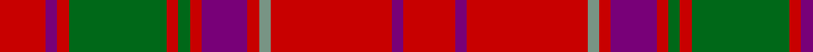

In pattern [RBRGRBRGRGRBR](/patterns/rbrgrbrgrgrbr/).

This was sourced from tartans-authority.  It is a [13 stripes tartan](/stripes/stripes13/).

Original link http://www.tartansauthority.com/tartan-ferret/display/1388/

## Thread count
R/16 P4 R4 G34 R4 G4 R4 P16 R4 LG4 R42 P4 R/18

## Palette
Each colour and its ΔE from the base-6 reference it is a variant of.

| Colour | Shade | Base | ΔE (OKLab) |
|---|---|---|---|
| G | <code style="background-color:#006818;">#006818</code> `#006818` | G <code style="background-color:#006400;">#006400</code> | 0.02 |
| LG | <code style="background-color:#789484;">#789484</code> `#789484` | G <code style="background-color:#006400;">#006400</code> | 0.23 |
| P | <code style="background-color:#780078;">#780078</code> `#780078` | B <code style="background-color:#2C4084;">#2C4084</code> | 0.16 |
| R | <code style="background-color:#C80000;">#C80000</code> `#C80000` | R <code style="background-color:#C80000;">#C80000</code> | 0.00 |

ID: /setts/s13/r18b4r42g4r4b16r4ga4r4ga34r4b4r16-b780078-g789484-ga006818-rc80000/
