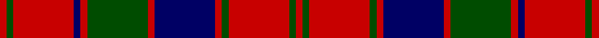

In pattern [RGRBRGRBRGRGR](/stripes/rgrbrgrbrgrgr/).

This was sourced from weddslist.  It is a [13 stripe tartan](/stripes/stripes13/).

Original link http://www.weddslist.com/cgi-bin/tartans/pg.pl?source=rb

## Thread count
R/1 G1 R9 DB1 R1 G9 R1 DB9 R1 G1 R9 G1 R/1

## Palette
Each colour and the base-6 reference it is a variant of.

| Colour | Shade | Base |
|---|---|---|
| DB | <code style="background-color:#000064;">#000064</code> `oklch(22.7% 0.158 264.1)` <small>#000064</small> | B <code style="background-color:#2A418A;">#2A418A</code> |
| G | <code style="background-color:#004C00;">#004C00</code> `oklch(36.1% 0.123 142.5)` <small>#004C00</small> | G <code style="background-color:#006100;">#006100</code> |
| R | <code style="background-color:#C80000;">#C80000</code> `oklch(52.3% 0.215 29.2)` <small>#C80000</small> | R <code style="background-color:#CC0000;">#CC0000</code> |

## Nearest tartans

The nearest existing variants by ΔTartan distance.

1. [Robertson](/setts/s13/r1dg1r9dg1r1db9r1dg9r1db1r9dg1r1~x2/) — ΔT 0.71
1. [Robertson 1819](/setts/s13/r3g3r35db3r3db35r3g35r3db3r35g3r3~x2/) — ΔT 0.72
1. [Robertson #3](/setts/s13/r1dg1r9dg1r1db9r1dg9r1db1r9dg1r1~x4/) — ΔT 0.79
1. [Robertson D](/setts/s13/r3dg1r15db2r2dg15r2db15r2db2r15dg1r3~x2/) — ΔT 0.87
1. [Robertson Curtain](/setts/s13/r3dg2r19db2r3dg20r3db20r3db2r19dg2r3~x4/) — ΔT 0.89
1. [Robertson 1](/setts/s13/r4g4r35dp4r4dp35r4g35r4dp4r35g4r4/) — ΔT 0.89
1. [Bruce Old](/setts/s14/r45db4r4dg48r4db4r4db15r4db4r40dg4r4dg30/) — ΔT 0.99
1. [Robertson D](/setts/s13/r5dg2r30db3r3dg30r3db30r3db3r30dg2r5~x2/) — ΔT 1.02
1. [Robertson D](/setts/s13/r5dg2r30db3r3dg30r3db30r3db3r30dg2r5/) — ΔT 1.02
1. [Robertson, Curtain](/setts/s13/r3g2r19db2r3db20r3g20r3db2r19g2r3~x4/) — ΔT 1.06

## Neighbour map

Every grey dot is one of 14299 variants placed by the first two principal components of the ΔTartan feature space (44% of its variance). Red is this tartan; blue dots are its nearest — click one to open its page.

<svg viewBox="0 0 640 380" role="img" style="max-width:100%;height:auto;border:1px solid #e0e0e0;border-radius:4px;display:block" xmlns="http://www.w3.org/2000/svg"><image href="/nn/cloud.v1.png" width="640" height="380"/><a href="/setts/s13/r1dg1r9dg1r1db9r1dg9r1db1r9dg1r1~x2/"><circle cx="311.6" cy="183.5" r="4" fill="#3465a4"><title>Robertson</title></circle></a><a href="/setts/s13/r3g3r35db3r3db35r3g35r3db3r35g3r3~x2/"><circle cx="319.5" cy="160.5" r="4" fill="#3465a4"><title>Robertson 1819</title></circle></a><a href="/setts/s13/r1dg1r9dg1r1db9r1dg9r1db1r9dg1r1~x4/"><circle cx="307.8" cy="173.2" r="4" fill="#3465a4"><title>Robertson #3</title></circle></a><a href="/setts/s13/r3dg1r15db2r2dg15r2db15r2db2r15dg1r3~x2/"><circle cx="321.2" cy="155.5" r="4" fill="#3465a4"><title>Robertson D</title></circle></a><a href="/setts/s13/r3dg2r19db2r3dg20r3db20r3db2r19dg2r3~x4/"><circle cx="315.3" cy="172.9" r="4" fill="#3465a4"><title>Robertson Curtain</title></circle></a><a href="/setts/s13/r4g4r35dp4r4dp35r4g35r4dp4r35g4r4/"><circle cx="308.8" cy="174.6" r="4" fill="#3465a4"><title>Robertson 1</title></circle></a><a href="/setts/s14/r45db4r4dg48r4db4r4db15r4db4r40dg4r4dg30/"><circle cx="319.3" cy="160.5" r="4" fill="#3465a4"><title>Bruce Old</title></circle></a><a href="/setts/s13/r5dg2r30db3r3dg30r3db30r3db3r30dg2r5~x2/"><circle cx="339.8" cy="163.4" r="4" fill="#3465a4"><title>Robertson D</title></circle></a><a href="/setts/s13/r5dg2r30db3r3dg30r3db30r3db3r30dg2r5/"><circle cx="339.8" cy="163.4" r="4" fill="#3465a4"><title>Robertson D</title></circle></a><a href="/setts/s13/r3g2r19db2r3db20r3g20r3db2r19g2r3~x4/"><circle cx="320.2" cy="178.8" r="4" fill="#3465a4"><title>Robertson, Curtain</title></circle></a><circle cx="293.6" cy="171.0" r="5" fill="#c00000"/></svg>

ID: /setts/s13/r1dg1r9dg1r1db9r1dg9r1db1r9dg1r1/
