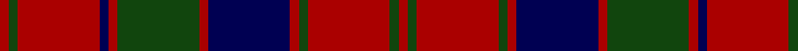

In pattern [RGRBRGRBRGRGR](/patterns/rgrbrgrbrgrgr/).

This was sourced from weddslist.  It is a [13 stripes tartan](/stripes/stripes13/).

Original link http://www.weddslist.com/cgi-bin/tartans/pg.pl?source=tinsel

## Thread count
DR/2 DG2 DR18 DB2 DR2 DG18 DR2 DB18 DR2 DG2 DR18 DG2 DR/2

## Palette
Each colour and its ΔE from the base-6 reference it is a variant of.

| Colour | Shade | Base | ΔE (OKLab) |
|---|---|---|---|
| DB | <code style="background-color:#000052;">#000052</code> `#000052` | B <code style="background-color:#2A418A;">#2A418A</code> | 0.20 |
| DG | <code style="background-color:#11450D;">#11450D</code> `#11450D` | G <code style="background-color:#006100;">#006100</code> | 0.09 |
| DR | <code style="background-color:#AA0000;">#AA0000</code> `#AA0000` | R <code style="background-color:#CC0000;">#CC0000</code> | 0.07 |

## Nearest tartans

The nearest existing variants by ΔTartan distance.

1. [Robertson](/setts/s13/r1g1r9b1r1g9r1b9r1g1r9g1r1~b000052-g11450d-raa0000/) — ΔT 0.00
1. [Robertson](/setts/s13/r1g1r9b1r1g9r1b9r1g1r9g1r1~b000064-g004c00-rc80000/) — ΔT 0.71
1. [Robertson D](/setts/s13/r5g2r30b3r3b30r3g30r3b3r30g2r5~b000052-g11450d-raa0000~x2/) — ΔT 0.80
1. [Robertson D](/setts/s13/r5g2r30b3r3b30r3g30r3b3r30g2r5~b000052-g11450d-raa0000/) — ΔT 0.80
1. [Robertson Clan Tartan Tartan Number: 1391. Earliest known date: 1831 The oldest records show Robertson tartan with a white line. But the modern weavers sett, without the white, can be traced to Logan's book 'The Scottish Gael' published in 1831. D.C.Stewart noted a subtle difference in Logan's count which is reproduced here. That is the use of contrasting narrow stripes next to the broader stripe. Other versions have only blue, narrow stripes. Stewart reckoned that it added 'balance in the design'. Mid toned blues and greens are used in this illustration. See products available Copyright © Blair Urquhart, Comrie, 2015](/setts/s13/r1g1r9b1r1g9r1b9r1g1r9g1r1~b2c2c80-g006818-rc80000~x4/) — ΔT 0.83
1. [Robertson 1819](/setts/s13/r3g3r35b3r3b35r3g35r3b3r35g3r3~b202060-g006818-rc80000~x2/) — ΔT 0.85
1. [Robertson #3](/setts/s13/r1g1r9b1r1g9r1b9r1g1r9g1r1~b2c4084-g005020-rdc0000~x4/) — ΔT 0.98
1. [Robertson 1](/setts/s13/r4g4r35b4r4b35r4g35r4b4r35g4r4~b500060-g008000-rc00000/) — ΔT 1.04
1. [Robertson, Curtain](/setts/s13/r3g2r19b2r3b20r3g20r3b2r19g2r3~b304080-g008000-rc00000~x4/) — ΔT 1.07
1. [Robertson Curtain](/setts/s13/r3g2r19b2r3b20r3g20r3b2r19g2r3~b2c4084-g005020-rdc0000~x4/) — ΔT 1.07

## Neighbour map

Every grey dot is one of 15726 variants placed by the first two principal components of the ΔTartan feature space (44% of its variance). Red is this tartan; blue dots are its nearest — click one to open its page.

<svg viewBox="0 0 640 380" role="img" style="max-width:100%;height:auto;border:1px solid #e0e0e0;border-radius:4px;display:block" xmlns="http://www.w3.org/2000/svg"><image href="/nn/cloud.v1.png" width="640" height="380"/><a href="/setts/s13/r1g1r9b1r1g9r1b9r1g1r9g1r1~b000052-g11450d-raa0000/"><circle cx="310.4" cy="183.6" r="4" fill="#3465a4"><title>Robertson</title></circle></a><a href="/setts/s13/r1g1r9b1r1g9r1b9r1g1r9g1r1~b000064-g004c00-rc80000/"><circle cx="292.4" cy="173.5" r="4" fill="#3465a4"><title>Robertson</title></circle></a><a href="/setts/s13/r5g2r30b3r3b30r3g30r3b3r30g2r5~b000052-g11450d-raa0000~x2/"><circle cx="338.7" cy="164.0" r="4" fill="#3465a4"><title>Robertson D</title></circle></a><a href="/setts/s13/r5g2r30b3r3b30r3g30r3b3r30g2r5~b000052-g11450d-raa0000/"><circle cx="338.7" cy="164.0" r="4" fill="#3465a4"><title>Robertson D</title></circle></a><a href="/setts/s13/r1g1r9b1r1g9r1b9r1g1r9g1r1~b2c2c80-g006818-rc80000~x4/"><circle cx="309.1" cy="177.3" r="4" fill="#3465a4"><title>Robertson Clan Tartan Tartan Number: 1391. Earliest known date: 1831 The oldest records show Robertson tartan with a white line. But the modern weavers sett, without the white, can be traced to Logan's book 'The Scottish Gael' published in 1831. D.C.Stewart noted a subtle difference in Logan's count which is reproduced here. That is the use of contrasting narrow stripes next to the broader stripe. Other versions have only blue, narrow stripes. Stewart reckoned that it added 'balance in the design'. Mid toned blues and greens are used in this illustration. See products available Copyright © Blair Urquhart, Comrie, 2015</title></circle></a><a href="/setts/s13/r3g3r35b3r3b35r3g35r3b3r35g3r3~b202060-g006818-rc80000~x2/"><circle cx="318.7" cy="161.8" r="4" fill="#3465a4"><title>Robertson 1819</title></circle></a><a href="/setts/s13/r1g1r9b1r1g9r1b9r1g1r9g1r1~b2c4084-g005020-rdc0000~x4/"><circle cx="307.3" cy="174.6" r="4" fill="#3465a4"><title>Robertson #3</title></circle></a><a href="/setts/s13/r4g4r35b4r4b35r4g35r4b4r35g4r4~b500060-g008000-rc00000/"><circle cx="308.4" cy="176.1" r="4" fill="#3465a4"><title>Robertson 1</title></circle></a><a href="/setts/s13/r3g2r19b2r3b20r3g20r3b2r19g2r3~b304080-g008000-rc00000~x4/"><circle cx="319.6" cy="179.2" r="4" fill="#3465a4"><title>Robertson, Curtain</title></circle></a><a href="/setts/s13/r3g2r19b2r3b20r3g20r3b2r19g2r3~b2c4084-g005020-rdc0000~x4/"><circle cx="314.9" cy="174.6" r="4" fill="#3465a4"><title>Robertson Curtain</title></circle></a><circle cx="310.4" cy="183.6" r="5" fill="#c00000"/></svg>

ID: /setts/s13/r1g1r9b1r1g9r1b9r1g1r9g1r1~b000052-g11450d-raa0000~x2/
