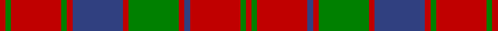

In pattern [RGRBRGRBRGRGR](/stripes/rgrbrgrbrgrgr/).

This was sourced from weddslist.  It is a [13 stripe tartan](/stripes/stripes13/).

Original link http://www.weddslist.com/cgi-bin/tartans/pg.pl?source=sts

## Also known as

This cloth is also recorded under:

- Robertson
- Robertson #3

## Attestations

This cloth appears in 2 source records; the oldest owns this page.

- undated — Robertson 3 (weddslist, [record](http://www.weddslist.com/cgi-bin/tartans/pg.pl?source=sts))
- undated — Robertson Clan Tartan Tartan Number: 1391. Earliest known date: 1831 The oldest records show Robertson tartan with a white line. But the modern weavers sett, without the white, can be traced to Logan's book 'The Scottish Gael' published in 1831. D.C.Stewart noted a subtle difference in Logan's count which is reproduced here. That is the use of contrasting narrow stripes next to the broader stripe. Other versions have only blue, narrow stripes. Stewart reckoned that it added 'balance in the design'. Mid toned blues and greens are used in this illustration. See products available Copyright © Blair Urquhart, Comrie, 2015 (house-of-tartan, [record](http://www.house-of-tartan.scotland.net/house/TartanViewjs.asp?colr=Def&tnam=1391))

## Thread count
R/4 G4 R36 G4 R4 B36 R4 G36 R4 B4 R36 G4 R/4

## Palette
Each colour and the base-6 reference it is a variant of.

| Colour | Shade | Base |
|---|---|---|
| B | <code style="background-color:#304080;">#304080</code> `oklch(39.4% 0.109 270.2)` <small>#304080</small> | B <code style="background-color:#2A418A;">#2A418A</code> |
| G | <code style="background-color:#008000;">#008000</code> `oklch(52.0% 0.177 142.5)` <small>#008000</small> | G <code style="background-color:#006100;">#006100</code> |
| R | <code style="background-color:#C00000;">#C00000</code> `oklch(50.7% 0.208 29.2)` <small>#C00000</small> | R <code style="background-color:#CC0000;">#CC0000</code> |

## Nearest tartans

The nearest existing variants by ΔTartan distance.

1. [Robertson, Curtain](/setts/s13/r3g2r19db2r3db20r3g20r3db2r19g2r3~x4/) — ΔT 0.30
1. [Robertson #3](/setts/s13/r1dg1r9dg1r1db9r1dg9r1db1r9dg1r1~x4/) — ΔT 0.59
1. [Bruce Old](/setts/s14/r45db4r4dg48r4db4r4db15r4db4r40dg4r4dg30/) — ΔT 0.63
1. [Bruce Old Clan Tartan Tartan Number: 876. Earliest known date: 1797 An order dated 1797 in the Wilson's of Bannockburn papers requests '50 Ells Bruce sett tartan'. As no distinction is made between 'old' and 'new' we assume that the 'new' sett, which has much in common with this one, had not been introduced. (Reduced in proportion for illustration.) See products available Copyright © Blair Urquhart, Comrie, 2015](/setts/s14/r45dp4r4g48r4dp4r4dp15r4dp4r40g4r4g30/) — ΔT 0.68
1. [Robertson 1819](/setts/s13/r3g3r35db3r3db35r3g35r3db3r35g3r3~x2/) — ΔT 0.73
1. [Robertson 1](/setts/s13/r4g4r35dp4r4dp35r4g35r4dp4r35g4r4/) — ΔT 0.74
1. [Robertson Curtain](/setts/s13/r3dg2r19db2r3dg20r3db20r3db2r19dg2r3~x4/) — ΔT 0.74
1. [Unidentified, Early 18th C](/setts/s10/db3r23db3r26db3r3db25r3g24r3~x2/) — ΔT 0.79
1. [Bruce, Old](/setts/s14/r45db4r4g48r4db4r4db15r4db4r40g4r4g30/) — ΔT 0.82
1. [Wilson's No.119](/setts/s12/r6g28r6dp2r6dp19r6dp2r6g28r6dp2~x2/) — ΔT 0.95

## Neighbour map

Every grey dot is one of 14299 variants placed by the first two principal components of the ΔTartan feature space (44% of its variance). Red is this tartan; blue dots are its nearest — click one to open its page.

<svg viewBox="0 0 640 380" role="img" style="max-width:100%;height:auto;border:1px solid #e0e0e0;border-radius:4px;display:block" xmlns="http://www.w3.org/2000/svg"><image href="/nn/cloud.v1.png" width="640" height="380"/><a href="/setts/s13/r3g2r19db2r3db20r3g20r3db2r19g2r3~x4/"><circle cx="320.2" cy="178.8" r="4" fill="#3465a4"><title>Robertson, Curtain</title></circle></a><a href="/setts/s13/r1dg1r9dg1r1db9r1dg9r1db1r9dg1r1~x4/"><circle cx="307.8" cy="173.2" r="4" fill="#3465a4"><title>Robertson #3</title></circle></a><a href="/setts/s14/r45db4r4dg48r4db4r4db15r4db4r40dg4r4dg30/"><circle cx="319.3" cy="160.5" r="4" fill="#3465a4"><title>Bruce Old</title></circle></a><a href="/setts/s14/r45dp4r4g48r4dp4r4dp15r4dp4r40g4r4g30/"><circle cx="331.7" cy="165.3" r="4" fill="#3465a4"><title>Bruce Old Clan Tartan Tartan Number: 876. Earliest known date: 1797 An order dated 1797 in the Wilson's of Bannockburn papers requests '50 Ells Bruce sett tartan'. As no distinction is made between 'old' and 'new' we assume that the 'new' sett, which has much in common with this one, had not been introduced. (Reduced in proportion for illustration.) See products available Copyright © Blair Urquhart, Comrie, 2015</title></circle></a><a href="/setts/s13/r3g3r35db3r3db35r3g35r3db3r35g3r3~x2/"><circle cx="319.5" cy="160.5" r="4" fill="#3465a4"><title>Robertson 1819</title></circle></a><a href="/setts/s13/r4g4r35dp4r4dp35r4g35r4dp4r35g4r4/"><circle cx="308.8" cy="174.6" r="4" fill="#3465a4"><title>Robertson 1</title></circle></a><a href="/setts/s13/r3dg2r19db2r3dg20r3db20r3db2r19dg2r3~x4/"><circle cx="315.3" cy="172.9" r="4" fill="#3465a4"><title>Robertson Curtain</title></circle></a><a href="/setts/s10/db3r23db3r26db3r3db25r3g24r3~x2/"><circle cx="301.6" cy="202.5" r="4" fill="#3465a4"><title>Unidentified, Early 18th C</title></circle></a><a href="/setts/s14/r45db4r4g48r4db4r4db15r4db4r40g4r4g30/"><circle cx="321.5" cy="165.0" r="4" fill="#3465a4"><title>Bruce, Old</title></circle></a><a href="/setts/s12/r6g28r6dp2r6dp19r6dp2r6g28r6dp2~x2/"><circle cx="305.2" cy="179.3" r="4" fill="#3465a4"><title>Wilson's No.119</title></circle></a><circle cx="311.6" cy="178.4" r="5" fill="#c00000"/></svg>

ID: /setts/s13/r1g1r9db1r1g9r1db9r1g1r9g1r1~x4/
