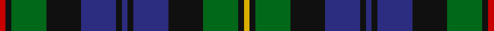

In pattern [RKGKBKBKBKGKY](/stripes/rkgkbkbkbkgky/).

This was sourced from register-of-tartans.  It is a [13 stripe tartan](/stripes/stripes13/).

Original link https://www.tartanregister.gov.uk/tartanDetails.aspx?ref=2428

## Also known as

This cloth is also recorded under:

- MacEwen/MacEwan

## Attestations

This cloth appears in 2 source records; the oldest owns this page.

- 01/01/2002 — MacEwen/MacEwan (register-of-tartans, [record](https://www.tartanregister.gov.uk/tartanDetails.aspx?ref=2428))
- pre 2002 — MacEwen (Clan) (tartans-authority, [record](http://www.tartansauthority.com/tartan-ferret/display/1587/))

## Register references

External register numbers recorded for this tartan.

- Scottish Register of Tartans: [2428](https://www.tartanregister.gov.uk/tartanDetails.aspx?ref=2428)
- Scottish Tartans Authority (ITI): 1587
- Scottish Tartans World Register: 1587

## Thread count
R/4 K4 G24 K24 DB24 K4 DB4 K4 DB24 K24 G24 K4 Y/4

## Palette
Each colour and the base-6 reference it is a variant of.

| Colour | Shade | Base |
|---|---|---|
| DB | <code style="background-color:#2C2C80;">#2C2C80</code> `oklch(35.0% 0.138 276.6)` <small>#2C2C80</small> | B <code style="background-color:#2A418A;">#2A418A</code> |
| G | <code style="background-color:#006818;">#006818</code> `oklch(45.0% 0.142 145.0)` <small>#006818</small> | G <code style="background-color:#006100;">#006100</code> |
| K | <code style="background-color:#101010;">#101010</code> `oklch(17.3% 0.000 89.9)` <small>#101010</small> | K <code style="background-color:#000000;">#000000</code> |
| R | <code style="background-color:#C80000;">#C80000</code> `oklch(52.3% 0.215 29.2)` <small>#C80000</small> | R <code style="background-color:#CC0000;">#CC0000</code> |
| Y | <code style="background-color:#D8B000;">#D8B000</code> `oklch(77.1% 0.158 92.3)` <small>#D8B000</small> | Y <code style="background-color:#F2BF00;">#F2BF00</code> |

## Nearest tartans

The nearest existing variants by ΔTartan distance.

1. [Black Watch Plaid of Pipers](/setts/s13/db12k2r2k2r2k12g11ly2g11k12db11k2r2~x2/) — ΔT 0.49
1. [Akins of Candler (Personal)](/setts/s12/g12r2g2r2k12db12ly2db12k2g11r2g2~x2/) — ΔT 0.65
1. [MacKenzie MINI Clan Miniature Tartan Tartan Number: 2677. Earliest known date: 1778 Generated for Dupion Silk Stock list for display purpose. See products available Copyright © Blair Urquhart, Comrie, 2015](/setts/s15/db6k1db1k1db1k6g6k1w2k1g6k6db6k1r2~x2/) — ΔT 0.69
1. [MacLellan Clan Tartan Tartan Number: 323. Earliest known date: pre 2003 Very similar to MacLaren See products available Copyright © Blair Urquhart, Comrie, 2015](/setts/s14/db29k15g5r5g8k4ly4k4g8r5g5k15db7k15~x2/) — ΔT 0.73
1. [MacLeod of Gesto](/setts/s13/db9k1db1k1db1k7dg8ly2dg8k7db8k1r2~x2/) — ΔT 0.76
1. [MacClellan](/setts/s14/db18k5dg3r3dg6k2ly2k2dg6r3dg3k10db5k10/) — ΔT 0.78
1. [MacKenzie Morgan](/setts/s15/db12k2db2k2db2k12g12r2w2r2g12k12db12r3db2~x2/) — ΔT 0.78
1. [Stephenson Hunting Tartan Tartan Number: 770. Earliest known date: 1981 Based on an old and un-named sett in the records of Messrs Bolingbroke and Jones of Norwich, prior to 1870. See products available Copyright © Blair Urquhart, Comrie, 2015](/setts/s15/r5k3db25k25g25k3w3k6w3k3g25k25db25k3g5/) — ΔT 0.78
1. [Gemmell Clan Tartan Tartan Number: 3213. Earliest known date: 2001 Design copyright is owned by Thomas Kempsill Gemmell and Davina Creighton Gemmell. Designed in traditional tartan colours. See products available Copyright © Blair Urquhart, Comrie, 2015](/setts/s14/db4k1db1k1db1k5g6k1g6k6db3w1r1w1~x4/) — ΔT 0.78
1. [Junior Chamber International](/setts/s12/dg16k16db4dg3db12lo2db12dg3db4k16dg16r4~x2/) — ΔT 0.79

## Neighbour map

Every grey dot is one of 14299 variants placed by the first two principal components of the ΔTartan feature space (44% of its variance). Red is this tartan; blue dots are its nearest — click one to open its page.

<svg viewBox="0 0 640 380" role="img" style="max-width:100%;height:auto;border:1px solid #e0e0e0;border-radius:4px;display:block" xmlns="http://www.w3.org/2000/svg"><image href="/nn/cloud.v1.png" width="640" height="380"/><a href="/setts/s13/db12k2r2k2r2k12g11ly2g11k12db11k2r2~x2/"><circle cx="145.4" cy="204.1" r="4" fill="#3465a4"><title>Black Watch Plaid of Pipers</title></circle></a><a href="/setts/s12/g12r2g2r2k12db12ly2db12k2g11r2g2~x2/"><circle cx="148.8" cy="197.9" r="4" fill="#3465a4"><title>Akins of Candler (Personal)</title></circle></a><a href="/setts/s15/db6k1db1k1db1k6g6k1w2k1g6k6db6k1r2~x2/"><circle cx="131.7" cy="190.6" r="4" fill="#3465a4"><title>MacKenzie MINI Clan Miniature Tartan Tartan Number: 2677. Earliest known date: 1778 Generated for Dupion Silk Stock list for display purpose. See products available Copyright © Blair Urquhart, Comrie, 2015</title></circle></a><a href="/setts/s14/db29k15g5r5g8k4ly4k4g8r5g5k15db7k15~x2/"><circle cx="164.0" cy="189.9" r="4" fill="#3465a4"><title>MacLellan Clan Tartan Tartan Number: 323. Earliest known date: pre 2003 Very similar to MacLaren See products available Copyright © Blair Urquhart, Comrie, 2015</title></circle></a><a href="/setts/s13/db9k1db1k1db1k7dg8ly2dg8k7db8k1r2~x2/"><circle cx="166.1" cy="193.2" r="4" fill="#3465a4"><title>MacLeod of Gesto</title></circle></a><a href="/setts/s14/db18k5dg3r3dg6k2ly2k2dg6r3dg3k10db5k10/"><circle cx="168.8" cy="184.9" r="4" fill="#3465a4"><title>MacClellan</title></circle></a><a href="/setts/s15/db12k2db2k2db2k12g12r2w2r2g12k12db12r3db2~x2/"><circle cx="126.0" cy="186.8" r="4" fill="#3465a4"><title>MacKenzie Morgan</title></circle></a><a href="/setts/s15/r5k3db25k25g25k3w3k6w3k3g25k25db25k3g5/"><circle cx="163.9" cy="175.0" r="4" fill="#3465a4"><title>Stephenson Hunting Tartan Tartan Number: 770. Earliest known date: 1981 Based on an old and un-named sett in the records of Messrs Bolingbroke and Jones of Norwich, prior to 1870. See products available Copyright © Blair Urquhart, Comrie, 2015</title></circle></a><a href="/setts/s14/db4k1db1k1db1k5g6k1g6k6db3w1r1w1~x4/"><circle cx="134.8" cy="189.7" r="4" fill="#3465a4"><title>Gemmell Clan Tartan Tartan Number: 3213. Earliest known date: 2001 Design copyright is owned by Thomas Kempsill Gemmell and Davina Creighton Gemmell. Designed in traditional tartan colours. See products available Copyright © Blair Urquhart, Comrie, 2015</title></circle></a><a href="/setts/s12/dg16k16db4dg3db12lo2db12dg3db4k16dg16r4~x2/"><circle cx="167.3" cy="217.6" r="4" fill="#3465a4"><title>Junior Chamber International</title></circle></a><circle cx="161.8" cy="207.3" r="5" fill="#c00000"/></svg>

ID: /setts/s13/r1k1g6k6db6k1db1k1db6k6g6k1ly1~x4/
