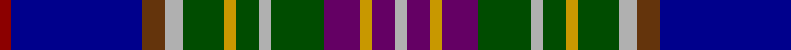

In pattern [RBGYGYGYGBYBY](/patterns/rbgygygygbyby/).

This was sourced from register-of-tartans.  It is a [13 stripes tartan](/stripes/stripes13/).

Original link https://www.tartanregister.gov.uk/tartanDetails.aspx?ref=2799

## Attestations

This cloth appears in 2 source records; the oldest owns this page.

- 01/01/1975 — Man, Isle of (register-of-tartans, [record](https://www.tartanregister.gov.uk/tartanDetails.aspx?ref=2799))
- 1975 — Man, Isle of (District) (tartans-authority, [record](http://www.tartansauthority.com/tartan-ferret/display/5697/))

## Thread count
DR/4 DB44 T8 N6 G14 DY4 G8 N4 G18 P12 DY4 P8 N/4

## Palette
Each colour and its ΔE from the base-6 reference it is a variant of.

| Colour | Shade | Base | ΔE (OKLab) |
|---|---|---|---|
| DB | <code style="background-color:#00008C;">#00008C</code> `#00008C` | B <code style="background-color:#2A418A;">#2A418A</code> | 0.13 |
| DR | <code style="background-color:#8C0000;">#8C0000</code> `#8C0000` | R <code style="background-color:#CC0000;">#CC0000</code> | 0.14 |
| DY | <code style="background-color:#C89800;">#C89800</code> `#C89800` | Y <code style="background-color:#F2BF00;">#F2BF00</code> | 0.12 |
| G | <code style="background-color:#004C00;">#004C00</code> `#004C00` | G <code style="background-color:#006100;">#006100</code> | 0.07 |
| N | <code style="background-color:#B0B0B0;">#B0B0B0</code> `#B0B0B0` | Y <code style="background-color:#F2BF00;">#F2BF00</code> | 0.18 |
| P | <code style="background-color:#640064;">#640064</code> `#640064` | B <code style="background-color:#2A418A;">#2A418A</code> | 0.16 |
| T | <code style="background-color:#64340C;">#64340C</code> `#64340C` | G <code style="background-color:#006100;">#006100</code> | 0.17 |

## Nearest tartans

The nearest existing variants by ΔTartan distance.

1. [Stevens (Personal)](/setts/s17/r6y3r3b24ba24g24bb3y4bb3g24ba10w3ba10b24r3y3r6~b1c0070-ba2c2c80-bb2888c4-g006818-rc80000-wf8f8f8-ye8c000/) — ΔT 0.92
1. [MacLean (Dress)](/setts/s12/b4r1k3y1k1ya1k1ba8bb12r1bb2k1~b1c0070-ba2c2c80-bb5c8ca8-k101010-r880000-ybc8c00-yab8b8b8~x4/) — ΔT 0.93
1. [Fitzgerald Hunting Family Tartan Tartan Number: 1336. Earliest known date: 1985 Sample in STS collection. See products available Copyright © Blair Urquhart, Comrie, 2015](/setts/s11/w2b3ba3b13k13b4r2b4g12wa3r1~b202060-ba5c8ca8-g006818-k101010-rc80000-we0e0e0-wac49cd8~x2/) — ΔT 1.03
1. [Liberton](/setts/s13/k5y5ya2y5k5b25k5y3g5r2g5y3k5~b003c64-g003820-k101010-rc80000-ya0a0a0-yae8c000~x2/) — ΔT 1.04
1. [Carnegie of Skibo (Corporate)](/setts/s11/w3b5ba2b9bb10k2bb5k2g8ga29w2~b202060-ba2888c4-bb780078-g003820-ga006818-k101010-we0e0e0~x2/) — ΔT 1.05
1. [Ross Anderson (Fashion) #2](/setts/s14/g4r2b3r1b3y1k2y1k2w2k2ra11r1k1~b202060-g003820-k101010-r880000-ra888888-wc0c0c0-yd09800~x4/) — ΔT 1.06
1. [Unidentified No 20](/setts/s11/b3k2b2ba8bb20r4g16ba4b2k2b3~b3c82af-ba0596fa-bb080848-g005020-k101010-rdc0000/) — ΔT 1.11
1. [Carnegie of Skibo Corporate Tartan Tartan Number: 8314. Earliest known date: December 2001 Only available from Robert Mathieson, The Kilt Centre, 1 Campbell Lane, Hamilton. ML3 6DB. Scotland. Tel: +44 (0)1698 200 234. e-mail: kiltcentre@btconnect.com Lochcarron swatch. A corporate tartan for use in kilt hire. The name was chosen to imbue the tartan with some relevant provenance - Andrew Carnegie's retirement residence. See products available Copyright © Blair Urquhart, Comrie, 2015](/setts/s11/w3b5wa2b9ba10k2ba5k5g9ga31w2~b2c2c80-ba750c69-g0a3321-ga006818-k080808-we0e0e0-wa0ce1d7~x2/) — ΔT 1.12
1. [Scotland's International - Home (Fas](/setts/s10/b24k24ka2w6ka2y2ka16wa5r6w2~b344454-k00002c-ka101010-rc80000-we0e0e0-wa98c8e8-ye8c000~x2/) — ΔT 1.13
1. [Selkirk, New (District)](/setts/s17/b24g2r12k2w2k3ba2k3b4k3ba2k3w2k2bb12g2bb24~b1474b4-ba780078-bb2c2c80-g006818-k101010-rc80000-we0e0e0~x2/) — ΔT 1.14

## Neighbour map

Every grey dot is one of 15726 variants placed by the first two principal components of the ΔTartan feature space (44% of its variance). Red is this tartan; blue dots are its nearest — click one to open its page.

<svg viewBox="0 0 640 380" role="img" style="max-width:100%;height:auto;border:1px solid #e0e0e0;border-radius:4px;display:block" xmlns="http://www.w3.org/2000/svg"><image href="/nn/cloud.v1.png" width="640" height="380"/><a href="/setts/s17/r6y3r3b24ba24g24bb3y4bb3g24ba10w3ba10b24r3y3r6~b1c0070-ba2c2c80-bb2888c4-g006818-rc80000-wf8f8f8-ye8c000/"><circle cx="49.5" cy="118.4" r="4" fill="#3465a4"><title>Stevens (Personal)</title></circle></a><a href="/setts/s12/b4r1k3y1k1ya1k1ba8bb12r1bb2k1~b1c0070-ba2c2c80-bb5c8ca8-k101010-r880000-ybc8c00-yab8b8b8~x4/"><circle cx="140.4" cy="103.9" r="4" fill="#3465a4"><title>MacLean (Dress)</title></circle></a><a href="/setts/s11/w2b3ba3b13k13b4r2b4g12wa3r1~b202060-ba5c8ca8-g006818-k101010-rc80000-we0e0e0-wac49cd8~x2/"><circle cx="130.6" cy="129.4" r="4" fill="#3465a4"><title>Fitzgerald Hunting Family Tartan Tartan Number: 1336. Earliest known date: 1985 Sample in STS collection. See products available Copyright © Blair Urquhart, Comrie, 2015</title></circle></a><a href="/setts/s13/k5y5ya2y5k5b25k5y3g5r2g5y3k5~b003c64-g003820-k101010-rc80000-ya0a0a0-yae8c000~x2/"><circle cx="127.9" cy="125.7" r="4" fill="#3465a4"><title>Liberton</title></circle></a><a href="/setts/s11/w3b5ba2b9bb10k2bb5k2g8ga29w2~b202060-ba2888c4-bb780078-g003820-ga006818-k101010-we0e0e0~x2/"><circle cx="138.0" cy="105.7" r="4" fill="#3465a4"><title>Carnegie of Skibo (Corporate)</title></circle></a><a href="/setts/s14/g4r2b3r1b3y1k2y1k2w2k2ra11r1k1~b202060-g003820-k101010-r880000-ra888888-wc0c0c0-yd09800~x4/"><circle cx="72.0" cy="101.3" r="4" fill="#3465a4"><title>Ross Anderson (Fashion) #2</title></circle></a><a href="/setts/s11/b3k2b2ba8bb20r4g16ba4b2k2b3~b3c82af-ba0596fa-bb080848-g005020-k101010-rdc0000/"><circle cx="94.4" cy="138.2" r="4" fill="#3465a4"><title>Unidentified No 20</title></circle></a><a href="/setts/s11/w3b5wa2b9ba10k2ba5k5g9ga31w2~b2c2c80-ba750c69-g0a3321-ga006818-k080808-we0e0e0-wa0ce1d7~x2/"><circle cx="130.8" cy="103.2" r="4" fill="#3465a4"><title>Carnegie of Skibo Corporate Tartan Tartan Number: 8314. Earliest known date: December 2001 Only available from Robert Mathieson, The Kilt Centre, 1 Campbell Lane, Hamilton. ML3 6DB. Scotland. Tel: +44 (0)1698 200 234. e-mail: kiltcentre@btconnect.com Lochcarron swatch. A corporate tartan for use in kilt hire. The name was chosen to imbue the tartan with some relevant provenance - Andrew Carnegie's retirement residence. See products available Copyright © Blair Urquhart, Comrie, 2015</title></circle></a><a href="/setts/s10/b24k24ka2w6ka2y2ka16wa5r6w2~b344454-k00002c-ka101010-rc80000-we0e0e0-wa98c8e8-ye8c000~x2/"><circle cx="61.4" cy="113.6" r="4" fill="#3465a4"><title>Scotland's International - Home (Fas</title></circle></a><a href="/setts/s17/b24g2r12k2w2k3ba2k3b4k3ba2k3w2k2bb12g2bb24~b1474b4-ba780078-bb2c2c80-g006818-k101010-rc80000-we0e0e0~x2/"><circle cx="125.4" cy="85.9" r="4" fill="#3465a4"><title>Selkirk, New (District)</title></circle></a><circle cx="93.1" cy="111.1" r="5" fill="#c00000"/></svg>

ID: /setts/s13/r2b22g4y3ga7ya2ga4y2ga9ba6ya2ba4y2~b00008c-ba640064-g64340c-ga004c00-r8c0000-yb0b0b0-yac89800~x2/
