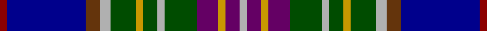

This page is one **sett** — a single exact thread-count. It belongs to the [tartan](/tartans/r2db22dy4lr3dg7ly2dg4lr2dg9dp6ly2dp4lr2/)
(the same proportion at any scale), whose colour order is pattern [RBGYGYGYGBYBY](/stripes/rbgygygygbyby/).

Sourced from register-of-tartans.  It is a [13 stripe tartan](/stripes/stripes13/).

Original link https://www.tartanregister.gov.uk/tartanDetails.aspx?ref=2799

2 attestations — the source records this cloth was collapsed from (oldest owns this page)

<ul>
<li>01/01/1975 — Man, Isle of (register-of-tartans, <a href="https://www.tartanregister.gov.uk/tartanDetails.aspx?ref=2799">record</a>)</li>
<li>1975 — Man, Isle of (District) (tartans-authority, <a href="http://www.tartansauthority.com/tartan-ferret/display/5697/">record</a>)</li>
</ul>

## Register references

External register numbers recorded for this tartan.

- Scottish Register of Tartans: [2799](https://www.tartanregister.gov.uk/tartanDetails.aspx?ref=2799)
- Scottish Tartans Authority (ITI): 5697

## Thread count
DR/4 DB44 T8 N6 G14 DY4 G8 N4 G18 P12 DY4 P8 N/4

## Palette

Palette: <strong>Tartan Register</strong> <small style="color:#888">(4 of 7 colours)</small>
<table><thead><tr><th>Colour</th><th>Threads</th><th>Shade</th><th>Base</th><th>OKLCh</th></tr></thead><tbody><tr><td>DR/</td><td style="text-align:right;font-variant-numeric:tabular-nums">4</td><td><code style="background-color:#8C0000;">#8C0000</code> <small style="color:#888">#8C0000</small></td><td>R <code style="background-color:#CC0000;">#CC0000</code></td><td><small style="color:#888">oklch(40.2% 0.165 29.2)</small></td></tr><tr><td>DB</td><td style="text-align:right;font-variant-numeric:tabular-nums">44</td><td><code style="background-color:#00008C;">#00008C</code> <small style="color:#888">#00008C</small></td><td>B <code style="background-color:#2A418A;">#2A418A</code></td><td><small style="color:#888">oklch(28.9% 0.200 264.1)</small></td></tr><tr><td>T</td><td style="text-align:right;font-variant-numeric:tabular-nums">8</td><td><code style="background-color:#64340C;">#64340C</code> <small style="color:#888">#64340C</small></td><td>G <code style="background-color:#006100;">#006100</code></td><td><small style="color:#888">oklch(38.0% 0.085 55.0)</small></td></tr><tr><td>N</td><td style="text-align:right;font-variant-numeric:tabular-nums">6</td><td><code style="background-color:#B0B0B0;">#B0B0B0</code> <small style="color:#888">#B0B0B0</small></td><td>Y <code style="background-color:#F2BF00;">#F2BF00</code></td><td><small style="color:#888">oklch(75.7% 0.000 89.9)</small></td></tr><tr><td>G</td><td style="text-align:right;font-variant-numeric:tabular-nums">14</td><td><code style="background-color:#004C00;">#004C00</code> <small style="color:#888">#004C00</small></td><td>G <code style="background-color:#006100;">#006100</code></td><td><small style="color:#888">oklch(36.1% 0.123 142.5)</small></td></tr><tr><td>DY</td><td style="text-align:right;font-variant-numeric:tabular-nums">4</td><td><code style="background-color:#C89800;">#C89800</code> <small style="color:#888">#C89800</small></td><td>Y <code style="background-color:#F2BF00;">#F2BF00</code></td><td><small style="color:#888">oklch(70.6% 0.144 85.9)</small></td></tr><tr><td>G</td><td style="text-align:right;font-variant-numeric:tabular-nums">8</td><td><code style="background-color:#004C00;">#004C00</code> <small style="color:#888">#004C00</small></td><td>G <code style="background-color:#006100;">#006100</code></td><td><small style="color:#888">oklch(36.1% 0.123 142.5)</small></td></tr><tr><td>N</td><td style="text-align:right;font-variant-numeric:tabular-nums">4</td><td><code style="background-color:#B0B0B0;">#B0B0B0</code> <small style="color:#888">#B0B0B0</small></td><td>Y <code style="background-color:#F2BF00;">#F2BF00</code></td><td><small style="color:#888">oklch(75.7% 0.000 89.9)</small></td></tr><tr><td>G</td><td style="text-align:right;font-variant-numeric:tabular-nums">18</td><td><code style="background-color:#004C00;">#004C00</code> <small style="color:#888">#004C00</small></td><td>G <code style="background-color:#006100;">#006100</code></td><td><small style="color:#888">oklch(36.1% 0.123 142.5)</small></td></tr><tr><td>P</td><td style="text-align:right;font-variant-numeric:tabular-nums">12</td><td><code style="background-color:#640064;">#640064</code> <small style="color:#888">#640064</small></td><td>B <code style="background-color:#2A418A;">#2A418A</code></td><td><small style="color:#888">oklch(35.3% 0.162 328.4)</small></td></tr><tr><td>DY</td><td style="text-align:right;font-variant-numeric:tabular-nums">4</td><td><code style="background-color:#C89800;">#C89800</code> <small style="color:#888">#C89800</small></td><td>Y <code style="background-color:#F2BF00;">#F2BF00</code></td><td><small style="color:#888">oklch(70.6% 0.144 85.9)</small></td></tr><tr><td>P</td><td style="text-align:right;font-variant-numeric:tabular-nums">8</td><td><code style="background-color:#640064;">#640064</code> <small style="color:#888">#640064</small></td><td>B <code style="background-color:#2A418A;">#2A418A</code></td><td><small style="color:#888">oklch(35.3% 0.162 328.4)</small></td></tr><tr><td>N/</td><td style="text-align:right;font-variant-numeric:tabular-nums">4</td><td><code style="background-color:#B0B0B0;">#B0B0B0</code> <small style="color:#888">#B0B0B0</small></td><td>Y <code style="background-color:#F2BF00;">#F2BF00</code></td><td><small style="color:#888">oklch(75.7% 0.000 89.9)</small></td></tr></tbody></table>

## Nearest tartans

The nearest existing variants by ΔTartan distance, with this tartan at the top so the swatches line up against it.

ΔTartan

Tartan

Sett

—

<a href="/ttd/edit/#slug=r2db22dy4lr3dg7ly2dg4lr2dg9dp6ly2dp4lr2~x2">Man, Isle of</a> <a class="nn-out" href="/setts/s13/r2db22dy4lr3dg7ly2dg4lr2dg9dp6ly2dp4lr2~x2/" title="open its dictionary page">↗</a>

0.92

<a href="/ttd/edit/#slug=r6ly3r3db24db24g24t3ly4t3g24db10w3db10db24r3ly3r6">Stevens (Personal)</a> <a class="nn-out" href="/setts/s17/r6ly3r3db24db24g24t3ly4t3g24db10w3db10db24r3ly3r6/" title="open its dictionary page">↗</a>

0.93

<a href="/ttd/edit/#slug=db4r1k3lo1k1lr1k1db8t12r1t2k1~x4">MacLean (Dress)</a> <a class="nn-out" href="/setts/s12/db4r1k3lo1k1lr1k1db8t12r1t2k1~x4/" title="open its dictionary page">↗</a>

1.04

<a href="/ttd/edit/#slug=k5lr5ly2lr5k5dt25k5lr3dg5r2dg5lr3k5~x2">Liberton</a> <a class="nn-out" href="/setts/s13/k5lr5ly2lr5k5dt25k5lr3dg5r2dg5lr3k5~x2/" title="open its dictionary page">↗</a>

1.05

<a href="/ttd/edit/#slug=w3db5t2db9dp10k2dp5k2dg8g29w2~x2">Carnegie of Skibo (Corporate)</a> <a class="nn-out" href="/setts/s11/w3db5t2db9dp10k2dp5k2dg8g29w2~x2/" title="open its dictionary page">↗</a>

1.06

<a href="/ttd/edit/#slug=dg4r2db3r1db3lo1k2lo1k2lb2k2o11r1k1~x4">Ross Anderson (Fashion) #2</a> <a class="nn-out" href="/setts/s14/dg4r2db3r1db3lo1k2lo1k2lb2k2o11r1k1~x4/" title="open its dictionary page">↗</a>

1.11

<a href="/ttd/edit/#slug=t3k2t2b8db20r4dg16b4t2k2t3">Unidentified No 20</a> <a class="nn-out" href="/setts/s11/t3k2t2b8db20r4dg16b4t2k2t3/" title="open its dictionary page">↗</a>

1.12

<a href="/ttd/edit/#slug=w3db5lt2db9dp10k2dp5k5dg9g31w2~x2">Carnegie of Skibo Corporate Tartan Tartan Number: 8314. Earliest known date: December 2001 Only available from Robert Mathieson, The Kilt Centre, 1 Campbell Lane, Hamilton. ML3 6DB. Scotland. Tel: +44 (0)1698 200 234. e-mail: kiltcentre@btconnect.com Lochcarron swatch. A corporate tartan for use in kilt hire. The name was chosen to imbue the tartan with some relevant provenance - Andrew Carnegie's retirement residence. See products available Copyright © Blair Urquhart, Comrie, 2015</a> <a class="nn-out" href="/setts/s11/w3db5lt2db9dp10k2dp5k5dg9g31w2~x2/" title="open its dictionary page">↗</a>

1.13

<a href="/ttd/edit/#slug=dt24k24k2w6k2ly2k16lb5r6w2~x2">Scotland's International - Home (Fas</a> <a class="nn-out" href="/setts/s10/dt24k24k2w6k2ly2k16lb5r6w2~x2/" title="open its dictionary page">↗</a>

1.14

<a href="/ttd/edit/#slug=db24g2db12k2w2k3dp2k3b4k3dp2k3w2k2r12g2b24~x2">Selkirk, New (District)</a> <a class="nn-out" href="/setts/s17/db24g2db12k2w2k3dp2k3b4k3dp2k3w2k2r12g2b24~x2/" title="open its dictionary page">↗</a>

1.15

<a href="/ttd/edit/#slug=t3k2t2b8db20r4g16b4t2k2t3">Unnamed, No 20</a> <a class="nn-out" href="/setts/s11/t3k2t2b8db20r4g16b4t2k2t3/" title="open its dictionary page">↗</a>

## Neighbour map

Every grey dot is one of 14299 variants placed by the first two principal components of the ΔTartan feature space (44% of its variance). Red is this tartan; blue dots are its nearest — click one to open its page.

<svg viewBox="0 0 640 380" role="img" style="max-width:100%;height:auto;border:1px solid #e0e0e0;border-radius:4px;display:block" xmlns="http://www.w3.org/2000/svg"><image href="/nn/cloud.v1.png" width="640" height="380"/><a href="/setts/s17/r6ly3r3db24db24g24t3ly4t3g24db10w3db10db24r3ly3r6/"><circle cx="53.4" cy="124.6" r="4" fill="#3465a4"><title>Stevens (Personal)</title></circle></a><a href="/setts/s12/db4r1k3lo1k1lr1k1db8t12r1t2k1~x4/"><circle cx="143.9" cy="109.4" r="4" fill="#3465a4"><title>MacLean (Dress)</title></circle></a><a href="/setts/s13/k5lr5ly2lr5k5dt25k5lr3dg5r2dg5lr3k5~x2/"><circle cx="131.5" cy="130.7" r="4" fill="#3465a4"><title>Liberton</title></circle></a><a href="/setts/s11/w3db5t2db9dp10k2dp5k2dg8g29w2~x2/"><circle cx="141.4" cy="111.5" r="4" fill="#3465a4"><title>Carnegie of Skibo (Corporate)</title></circle></a><a href="/setts/s14/dg4r2db3r1db3lo1k2lo1k2lb2k2o11r1k1~x4/"><circle cx="75.1" cy="106.2" r="4" fill="#3465a4"><title>Ross Anderson (Fashion) #2</title></circle></a><a href="/setts/s11/t3k2t2b8db20r4dg16b4t2k2t3/"><circle cx="98.8" cy="143.7" r="4" fill="#3465a4"><title>Unidentified No 20</title></circle></a><a href="/setts/s11/w3db5lt2db9dp10k2dp5k5dg9g31w2~x2/"><circle cx="134.2" cy="108.7" r="4" fill="#3465a4"><title>Carnegie of Skibo Corporate Tartan Tartan Number: 8314. Earliest known date: December 2001 Only available from Robert Mathieson, The Kilt Centre, 1 Campbell Lane, Hamilton. ML3 6DB. Scotland. Tel: +44 (0)1698 200 234. e-mail: kiltcentre@btconnect.com Lochcarron swatch. A corporate tartan for use in kilt hire. The name was chosen to imbue the tartan with some relevant provenance - Andrew Carnegie's retirement residence. See products available Copyright © Blair Urquhart, Comrie, 2015</title></circle></a><a href="/setts/s10/dt24k24k2w6k2ly2k16lb5r6w2~x2/"><circle cx="65.3" cy="116.9" r="4" fill="#3465a4"><title>Scotland's International - Home (Fas</title></circle></a><a href="/setts/s17/db24g2db12k2w2k3dp2k3b4k3dp2k3w2k2r12g2b24~x2/"><circle cx="128.9" cy="92.5" r="4" fill="#3465a4"><title>Selkirk, New (District)</title></circle></a><a href="/setts/s11/t3k2t2b8db20r4g16b4t2k2t3/"><circle cx="86.9" cy="135.6" r="4" fill="#3465a4"><title>Unnamed, No 20</title></circle></a><circle cx="96.9" cy="116.8" r="5" fill="#c00000"/></svg>

ID: /setts/s13/r2db22dy4lr3dg7ly2dg4lr2dg9dp6ly2dp4lr2~x2/
