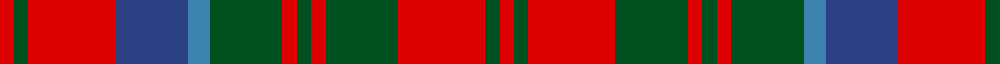

**Bands:** [RGRBBGRGRGRGR](/stripes/rgrbbgrgrgrgr/) · **Stripes:** [R DG R DB T DG R DG R DG R DG R](/stripes/stripes13/) R DG R DB T DG R DG R DG R DG R

This was sourced from register-of-tartans.  It is a [13 band tartan](/bands/bands13/).

Original link https://www.tartanregister.gov.uk/tartanDetails.aspx?ref=2854

## Register references

External register numbers recorded for this tartan.

- Scottish Register of Tartans: [2854](https://www.tartanregister.gov.uk/tartanDetails.aspx?ref=2854)
- Scottish Tartans World Register: 1499

## Thread count
R/4 G4 R24 Ba20 B6 G20 R4 G4 R4 G20 R24 G4 R/4

## Palette
Each colour and its ΔE from the base-6 reference it is a variant of.

| Colour | Shade | Base | ΔE (OKLab) |
|---|---|---|---|
| B | <code style="background-color:#3C82AF;">#3C82AF</code> `#3C82AF` | B <code style="background-color:#2A418A;">#2A418A</code> | 0.19 |
| Ba | <code style="background-color:#2C4084;">#2C4084</code> `#2C4084` | B <code style="background-color:#2A418A;">#2A418A</code> | 0.01 |
| G | <code style="background-color:#005020;">#005020</code> `#005020` | G <code style="background-color:#006100;">#006100</code> | 0.07 |
| R | <code style="background-color:#DC0000;">#DC0000</code> `#DC0000` | R <code style="background-color:#CC0000;">#CC0000</code> | 0.03 |

## Nearest tartans

The nearest existing variants by ΔTartan distance.

1. [MacQuarrie](/setts/s12/r1t1r6db3r1dg6r1dg6r6db1r1t1~x2/) — ΔT 0.28
1. [MacRae (Sample)](/setts/s12/dg21r5dg21r21dg5r4dg5r21w4r5db21r4/) — ΔT 0.48
1. [Grant of Ballindalloch (Personal)](/setts/s15/r5db3r3g16r3g3r3db5r3y5r12db5r3db3r5~x4/) — ΔT 0.57
1. [Matheson N](/setts/s13/r2dg2r12db10lb3dg10r2dg2r2dg10r12dg2r2/) — ΔT 0.71
1. [Matheson](/setts/s13/r2g2r12db10t3g10r2g2r2g10r12g2r2~x2/) — ΔT 0.73
1. [MacQuarrie 4](/setts/s12/r1t1r6db3r1g6r1g6r6db1r1t1~x2/) — ΔT 0.73
1. [MacQuarrie SM](/setts/s12/lb1r1db1r6dg6r1dg6r1db3r6lb1r1~x2/) — ΔT 0.74
1. [Grant of Ballindalloch Clan Tartan Tartan Number: 2149. Earliest known date: 1993 Grant of Ballindalloch tartan was designed during the refurbishment of Ballindalloch Castle. It is based on the Grant tartan recorded by Logan in 1831. The first samples produced by Johnstons of Elgin were woven in 'Antique' colours. See products available Copyright © Blair Urquhart, Comrie, 2015](/setts/s15/r5dt5r3g16r3g3r3dt10r3t5r12dt5r3dt3r5~x2/) — ΔT 0.76
1. [Sydney (Nova Scotia) #2](/setts/s14/o16k4w2k4o6o11o2o16o2o11o6k4w2k4~x2/) — ΔT 0.80
1. [Reid of Straloch (Personal)](/setts/s17/r1g1r6db2r1g1w1g6r2db6w1db1r1g2r6g1r1~x6/) — ΔT 0.82

## Neighbour map

Every grey dot is one of 14313 variants placed by the first two principal components of the ΔTartan feature space (44% of its variance). Red is this tartan; blue dots are its nearest — click one to open its page.

<svg viewBox="0 0 640 380" role="img" style="max-width:100%;height:auto;border:1px solid #e0e0e0;border-radius:4px;display:block" xmlns="http://www.w3.org/2000/svg"><image href="/nn/cloud.v1.png" width="640" height="380"/><a href="/setts/s12/r1t1r6db3r1dg6r1dg6r6db1r1t1~x2/"><circle cx="236.8" cy="195.8" r="4" fill="#3465a4"><title>MacQuarrie</title></circle></a><a href="/setts/s12/dg21r5dg21r21dg5r4dg5r21w4r5db21r4/"><circle cx="202.9" cy="206.9" r="4" fill="#3465a4"><title>MacRae (Sample)</title></circle></a><a href="/setts/s15/r5db3r3g16r3g3r3db5r3y5r12db5r3db3r5~x4/"><circle cx="216.5" cy="200.4" r="4" fill="#3465a4"><title>Grant of Ballindalloch (Personal)</title></circle></a><a href="/setts/s13/r2dg2r12db10lb3dg10r2dg2r2dg10r12dg2r2/"><circle cx="207.3" cy="190.5" r="4" fill="#3465a4"><title>Matheson N</title></circle></a><a href="/setts/s13/r2g2r12db10t3g10r2g2r2g10r12g2r2~x2/"><circle cx="226.7" cy="200.3" r="4" fill="#3465a4"><title>Matheson</title></circle></a><a href="/setts/s12/r1t1r6db3r1g6r1g6r6db1r1t1~x2/"><circle cx="240.3" cy="200.6" r="4" fill="#3465a4"><title>MacQuarrie 4</title></circle></a><a href="/setts/s12/lb1r1db1r6dg6r1dg6r1db3r6lb1r1~x2/"><circle cx="218.6" cy="188.9" r="4" fill="#3465a4"><title>MacQuarrie SM</title></circle></a><a href="/setts/s15/r5dt5r3g16r3g3r3dt10r3t5r12dt5r3dt3r5~x2/"><circle cx="193.9" cy="207.8" r="4" fill="#3465a4"><title>Grant of Ballindalloch Clan Tartan Tartan Number: 2149. Earliest known date: 1993 Grant of Ballindalloch tartan was designed during the refurbishment of Ballindalloch Castle. It is based on the Grant tartan recorded by Logan in 1831. The first samples produced by Johnstons of Elgin were woven in 'Antique' colours. See products available Copyright © Blair Urquhart, Comrie, 2015</title></circle></a><a href="/setts/s14/o16k4w2k4o6o11o2o16o2o11o6k4w2k4~x2/"><circle cx="204.0" cy="180.2" r="4" fill="#3465a4"><title>Sydney (Nova Scotia) #2</title></circle></a><a href="/setts/s17/r1g1r6db2r1g1w1g6r2db6w1db1r1g2r6g1r1~x6/"><circle cx="203.9" cy="170.1" r="4" fill="#3465a4"><title>Reid of Straloch (Personal)</title></circle></a><circle cx="224.4" cy="196.3" r="5" fill="#c00000"/></svg>

ID: /setts/s13/r2dg2r12db10t3dg10r2dg2r2dg10r12dg2r2~x2/
