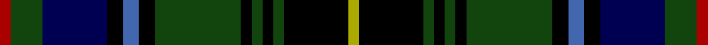

This page is one **sett** — a single exact thread-count. It belongs to the [tartan](/tartans/r2dg6db12k3b3k3dg16k2dg2k2dg2k12ly2/)
(the same proportion at any scale), whose colour order is pattern [RGBKBKGKGKGKY](/stripes/rgbkbkgkgkgky/).

Sourced from weddslist.  It is a [13 stripe tartan](/stripes/stripes13/).

Original link http://www.weddslist.com/cgi-bin/tartans/pg.pl?source=x

## Thread count
DR/2 DG6 DB12 K3 B3 K3 DG16 K2 DG2 K2 DG2 K12 LG/2

## Palette

Palette: <strong>Ingles Buchan</strong> <small style="color:#888">(1 of 6 colours)</small>
<table><thead><tr><th>Colour</th><th>Threads</th><th>Shade</th><th>Base</th><th>OKLCh</th></tr></thead><tbody><tr><td>DR/</td><td style="text-align:right;font-variant-numeric:tabular-nums">2</td><td><code style="background-color:#AA0000;">#AA0000</code> <small style="color:#888">#AA0000</small></td><td>R <code style="background-color:#CC0000;">#CC0000</code></td><td><small style="color:#888">oklch(46.3% 0.190 29.2)</small></td></tr><tr><td>DG</td><td style="text-align:right;font-variant-numeric:tabular-nums">6</td><td><code style="background-color:#11450D;">#11450D</code> <small style="color:#888">#11450D</small></td><td>G <code style="background-color:#006100;">#006100</code></td><td><small style="color:#888">oklch(34.4% 0.101 142.1)</small></td></tr><tr><td>DB</td><td style="text-align:right;font-variant-numeric:tabular-nums">12</td><td><code style="background-color:#000052;">#000052</code> <small style="color:#888">#000052</small></td><td>B <code style="background-color:#2A418A;">#2A418A</code></td><td><small style="color:#888">oklch(19.8% 0.137 264.1)</small></td></tr><tr><td>K</td><td style="text-align:right;font-variant-numeric:tabular-nums">3</td><td><code style="background-color:#000000;">#000000</code> <small style="color:#888">#000000</small></td><td>K <code style="background-color:#000000;">#000000</code></td><td><small style="color:#888">oklch(0.0% 0.000 0.0)</small></td></tr><tr><td>B</td><td style="text-align:right;font-variant-numeric:tabular-nums">3</td><td><code style="background-color:#4367AE;">#4367AE</code> <small style="color:#888">#4367AE</small></td><td>B <code style="background-color:#2A418A;">#2A418A</code></td><td><small style="color:#888">oklch(52.2% 0.120 262.7)</small></td></tr><tr><td>K</td><td style="text-align:right;font-variant-numeric:tabular-nums">3</td><td><code style="background-color:#000000;">#000000</code> <small style="color:#888">#000000</small></td><td>K <code style="background-color:#000000;">#000000</code></td><td><small style="color:#888">oklch(0.0% 0.000 0.0)</small></td></tr><tr><td>DG</td><td style="text-align:right;font-variant-numeric:tabular-nums">16</td><td><code style="background-color:#11450D;">#11450D</code> <small style="color:#888">#11450D</small></td><td>G <code style="background-color:#006100;">#006100</code></td><td><small style="color:#888">oklch(34.4% 0.101 142.1)</small></td></tr><tr><td>K</td><td style="text-align:right;font-variant-numeric:tabular-nums">2</td><td><code style="background-color:#000000;">#000000</code> <small style="color:#888">#000000</small></td><td>K <code style="background-color:#000000;">#000000</code></td><td><small style="color:#888">oklch(0.0% 0.000 0.0)</small></td></tr><tr><td>DG</td><td style="text-align:right;font-variant-numeric:tabular-nums">2</td><td><code style="background-color:#11450D;">#11450D</code> <small style="color:#888">#11450D</small></td><td>G <code style="background-color:#006100;">#006100</code></td><td><small style="color:#888">oklch(34.4% 0.101 142.1)</small></td></tr><tr><td>K</td><td style="text-align:right;font-variant-numeric:tabular-nums">2</td><td><code style="background-color:#000000;">#000000</code> <small style="color:#888">#000000</small></td><td>K <code style="background-color:#000000;">#000000</code></td><td><small style="color:#888">oklch(0.0% 0.000 0.0)</small></td></tr><tr><td>DG</td><td style="text-align:right;font-variant-numeric:tabular-nums">2</td><td><code style="background-color:#11450D;">#11450D</code> <small style="color:#888">#11450D</small></td><td>G <code style="background-color:#006100;">#006100</code></td><td><small style="color:#888">oklch(34.4% 0.101 142.1)</small></td></tr><tr><td>K</td><td style="text-align:right;font-variant-numeric:tabular-nums">12</td><td><code style="background-color:#000000;">#000000</code> <small style="color:#888">#000000</small></td><td>K <code style="background-color:#000000;">#000000</code></td><td><small style="color:#888">oklch(0.0% 0.000 0.0)</small></td></tr><tr><td>LG/</td><td style="text-align:right;font-variant-numeric:tabular-nums">2</td><td><code style="background-color:#AAAA00;">#AAAA00</code> <small style="color:#888">#AAAA00</small></td><td>Y <code style="background-color:#F2BF00;">#F2BF00</code></td><td><small style="color:#888">oklch(71.4% 0.156 109.8)</small></td></tr></tbody></table>

## Nearest tartans

The nearest existing variants by ΔTartan distance, with this tartan at the top so the swatches line up against it.

ΔTartan

Tartan

Sett

—

<a href="/ttd/edit/#slug=r2dg6db12k3b3k3dg16k2dg2k2dg2k12ly2">MacInnes</a> <a class="nn-out" href="/setts/s13/r2dg6db12k3b3k3dg16k2dg2k2dg2k12ly2/" title="open its dictionary page">↗</a>

0.00

<a href="/ttd/edit/#slug=r2dg6db12k3b3k3dg16k2dg2k2dg2k12ly2~x2">MacInnes</a> <a class="nn-out" href="/setts/s13/r2dg6db12k3b3k3dg16k2dg2k2dg2k12ly2~x2/" title="open its dictionary page">↗</a>

0.87

<a href="/ttd/edit/#slug=r2dg6db12k3lb3k3dg16k2dg2k2dg2k12ly2">MacInnes</a> <a class="nn-out" href="/setts/s13/r2dg6db12k3lb3k3dg16k2dg2k2dg2k12ly2/" title="open its dictionary page">↗</a>

0.89

<a href="/ttd/edit/#slug=db1r1db6k6dg6k1ly1k1lb1k1dg6k6db6r1">Malcolm</a> <a class="nn-out" href="/setts/s14/db1r1db6k6dg6k1ly1k1lb1k1dg6k6db6r1/" title="open its dictionary page">↗</a>

0.91

<a href="/ttd/edit/#slug=db1r1db6k6dg6k1ly1k1b1k1dg6k6db6r1~x2">Malcolm (a)</a> <a class="nn-out" href="/setts/s14/db1r1db6k6dg6k1ly1k1b1k1dg6k6db6r1~x2/" title="open its dictionary page">↗</a>

0.97

<a href="/ttd/edit/#slug=dg10k1lr1k1ly1k1dg10r3k10r3db10k1dg1k1dg1k1db10~x2">MacNicol Hunting</a> <a class="nn-out" href="/setts/s17/dg10k1lr1k1ly1k1dg10r3k10r3db10k1dg1k1dg1k1db10~x2/" title="open its dictionary page">↗</a>

1.05

<a href="/ttd/edit/#slug=dg10k1lb1k1ly1k1dg10r3k10r3db10k1dg1k1dg1k1db10">MacNicol Hunting</a> <a class="nn-out" href="/setts/s17/dg10k1lb1k1ly1k1dg10r3k10r3db10k1dg1k1dg1k1db10/" title="open its dictionary page">↗</a>

1.07

<a href="/ttd/edit/#slug=r2db4k1db1k1db1k8dg8ly2dg8k8db8k1r2~x2">Farquharson</a> <a class="nn-out" href="/setts/s14/r2db4k1db1k1db1k8dg8ly2dg8k8db8k1r2~x2/" title="open its dictionary page">↗</a>

1.07

<a href="/ttd/edit/#slug=dg17k2dg2k2dg2k15db15r7db15k15dg2k2dg2k2dg17lo2~x2">Thormanby Buccaneer Bay</a> <a class="nn-out" href="/setts/s16/dg17k2dg2k2dg2k15db15r7db15k15dg2k2dg2k2dg17lo2~x2/" title="open its dictionary page">↗</a>

1.15

<a href="/ttd/edit/#slug=k6k1k1k1k1k7g6lo1k1db1k1lo1g6k7k7k1k1~x4">Polaris (Military)</a> <a class="nn-out" href="/setts/s17/k6k1k1k1k1k7g6lo1k1db1k1lo1g6k7k7k1k1~x4/" title="open its dictionary page">↗</a>

1.16

<a href="/ttd/edit/#slug=r3k2g18k18db3k3db3k3db18ly2w3~x2">Tindal</a> <a class="nn-out" href="/setts/s11/r3k2g18k18db3k3db3k3db18ly2w3~x2/" title="open its dictionary page">↗</a>

## Neighbour map

Every grey dot is one of 14299 variants placed by the first two principal components of the ΔTartan feature space (44% of its variance). Red is this tartan; blue dots are its nearest — click one to open its page.

<svg viewBox="0 0 640 380" role="img" style="max-width:100%;height:auto;border:1px solid #e0e0e0;border-radius:4px;display:block" xmlns="http://www.w3.org/2000/svg"><image href="/nn/cloud.v1.png" width="640" height="380"/><a href="/setts/s13/r2dg6db12k3b3k3dg16k2dg2k2dg2k12ly2~x2/"><circle cx="149.5" cy="163.8" r="4" fill="#3465a4"><title>MacInnes</title></circle></a><a href="/setts/s13/r2dg6db12k3lb3k3dg16k2dg2k2dg2k12ly2/"><circle cx="124.7" cy="150.4" r="4" fill="#3465a4"><title>MacInnes</title></circle></a><a href="/setts/s14/db1r1db6k6dg6k1ly1k1lb1k1dg6k6db6r1/"><circle cx="97.0" cy="174.4" r="4" fill="#3465a4"><title>Malcolm</title></circle></a><a href="/setts/s14/db1r1db6k6dg6k1ly1k1b1k1dg6k6db6r1~x2/"><circle cx="114.2" cy="184.0" r="4" fill="#3465a4"><title>Malcolm (a)</title></circle></a><a href="/setts/s17/dg10k1lr1k1ly1k1dg10r3k10r3db10k1dg1k1dg1k1db10~x2/"><circle cx="138.5" cy="134.9" r="4" fill="#3465a4"><title>MacNicol Hunting</title></circle></a><a href="/setts/s17/dg10k1lb1k1ly1k1dg10r3k10r3db10k1dg1k1dg1k1db10/"><circle cx="123.4" cy="126.7" r="4" fill="#3465a4"><title>MacNicol Hunting</title></circle></a><a href="/setts/s14/r2db4k1db1k1db1k8dg8ly2dg8k8db8k1r2~x2/"><circle cx="136.3" cy="183.6" r="4" fill="#3465a4"><title>Farquharson</title></circle></a><a href="/setts/s16/dg17k2dg2k2dg2k15db15r7db15k15dg2k2dg2k2dg17lo2~x2/"><circle cx="153.6" cy="168.4" r="4" fill="#3465a4"><title>Thormanby Buccaneer Bay</title></circle></a><a href="/setts/s17/k6k1k1k1k1k7g6lo1k1db1k1lo1g6k7k7k1k1~x4/"><circle cx="163.6" cy="176.5" r="4" fill="#3465a4"><title>Polaris (Military)</title></circle></a><a href="/setts/s11/r3k2g18k18db3k3db3k3db18ly2w3~x2/"><circle cx="141.0" cy="153.9" r="4" fill="#3465a4"><title>Tindal</title></circle></a><circle cx="149.5" cy="163.8" r="5" fill="#c00000"/></svg>

ID: /setts/s13/r2dg6db12k3b3k3dg16k2dg2k2dg2k12ly2/
