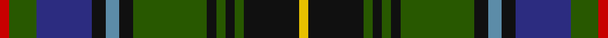

In pattern [RGBKBKGKGKGKY](/stripes/rgbkbkgkgkgky/).

This was sourced from register-of-tartans.  It is a [13 stripe tartan](/stripes/stripes13/).

Original link https://www.tartanregister.gov.uk/tartanDetails.aspx?ref=2471

## Attestations

This cloth appears in 2 source records; the oldest owns this page.

- 01/01/1908 — MacInnes (register-of-tartans, [record](https://www.tartanregister.gov.uk/tartanDetails.aspx?ref=2471))
- 1908 — MacInnes (Clan) (tartans-authority, [record](http://www.tartansauthority.com/tartan-ferret/display/1464/))

## Register references

External register numbers recorded for this tartan.

- Scottish Register of Tartans: [2471](https://www.tartanregister.gov.uk/tartanDetails.aspx?ref=2471)
- Scottish Tartans Authority (ITI): 1464
- Scottish Tartans World Register: 1464

## Thread count
R/4 G12 DB24 K6 B6 K6 G32 K4 G4 K4 G4 K24 Y/4

## Palette
Each colour and the base-6 reference it is a variant of.

| Colour | Shade | Base |
|---|---|---|
| B | <code style="background-color:#5C8CA8;">#5C8CA8</code> `oklch(61.7% 0.067 235.0)` <small>#5C8CA8</small> | B <code style="background-color:#2A418A;">#2A418A</code> |
| DB | <code style="background-color:#2C2C80;">#2C2C80</code> `oklch(35.0% 0.138 276.6)` <small>#2C2C80</small> | B <code style="background-color:#2A418A;">#2A418A</code> |
| G | <code style="background-color:#285800;">#285800</code> `oklch(41.0% 0.122 135.8)` <small>#285800</small> | G <code style="background-color:#006100;">#006100</code> |
| K | <code style="background-color:#101010;">#101010</code> `oklch(17.3% 0.000 89.9)` <small>#101010</small> | K <code style="background-color:#000000;">#000000</code> |
| R | <code style="background-color:#C80000;">#C80000</code> `oklch(52.3% 0.215 29.2)` <small>#C80000</small> | R <code style="background-color:#CC0000;">#CC0000</code> |
| Y | <code style="background-color:#E8C000;">#E8C000</code> `oklch(81.9% 0.168 93.7)` <small>#E8C000</small> | Y <code style="background-color:#F2BF00;">#F2BF00</code> |

## Nearest tartans

The nearest existing variants by ΔTartan distance.

1. [Wilson's No.225](/setts/s16/g16y2dp13t2k6ly2g16t2k12~x2/) — ΔT 0.72
1. [MacComb Family Tartan Tartan Number: 2340. Earliest known date: pre 1997 STS notes: Designed for a Mr McComb to play himself in as club captain of a golf club. It is the MacThomas with the over check changed to the clubs colours. Design by Donald Fraser (Oct 2002) of Berwick upon Tweed. See products available Copyright © Blair Urquhart, Comrie, 2015](/setts/s12/db3r2db18k6g18ly2g3~x2/) — ΔT 0.79
1. [Wojtek Memorial Trust](/setts/s11/w3db15r6db3r3db4dg11dg3dg3dg28lo3~x2/) — ΔT 0.82
1. [Gow Hunting Family Tartan Tartan Number: 1893. Earliest known date: pre 2003 MacDonells of Keppoch are an independant branch of Clan Donald. See products available Copyright © Blair Urquhart, Comrie, 2015](/setts/s14/k12g12k1r1k1g12k1ly3k1g12k12db12db3db12~x4/) — ΔT 0.87
1. [Big Rory (Corporate)](/setts/s10/n10w5n48k35g5k5g35r5g5dp5/) — ΔT 0.90
1. [Kelsey, William (Personal)](/setts/s12/g12r2g2r5g16db3o2k2o3db6k20ly3~x2/) — ΔT 0.93
1. [Malcolm](/setts/s14/k1ly1k1g6k6db6r1db1r1db6k6g6k1b1~x4/) — ΔT 0.96
1. [Tindal](/setts/s11/r3k2g18k18db3k3db3k3db18ly2w3~x2/) — ΔT 0.96
1. [Chinzei Keiai School](/setts/s9/r3m3dt16k2dt2g16r3g2w2~x2/) — ΔT 0.96
1. [Survivor (Fashion)](/setts/s13/k1r1k8g1k1g8ly1dt8k1dt1k8w1k1~x3/) — ΔT 0.98

## Neighbour map

Every grey dot is one of 14299 variants placed by the first two principal components of the ΔTartan feature space (44% of its variance). Red is this tartan; blue dots are its nearest — click one to open its page.

<svg viewBox="0 0 640 380" role="img" style="max-width:100%;height:auto;border:1px solid #e0e0e0;border-radius:4px;display:block" xmlns="http://www.w3.org/2000/svg"><image href="/nn/cloud.v1.png" width="640" height="380"/><a href="/setts/s16/g16y2dp13t2k6ly2g16t2k12~x2/"><circle cx="149.3" cy="157.8" r="4" fill="#3465a4"><title>Wilson's No.225</title></circle></a><a href="/setts/s12/db3r2db18k6g18ly2g3~x2/"><circle cx="170.8" cy="165.2" r="4" fill="#3465a4"><title>MacComb Family Tartan Tartan Number: 2340. Earliest known date: pre 1997 STS notes: Designed for a Mr McComb to play himself in as club captain of a golf club. It is the MacThomas with the over check changed to the clubs colours. Design by Donald Fraser (Oct 2002) of Berwick upon Tweed. See products available Copyright © Blair Urquhart, Comrie, 2015</title></circle></a><a href="/setts/s11/w3db15r6db3r3db4dg11dg3dg3dg28lo3~x2/"><circle cx="160.1" cy="154.1" r="4" fill="#3465a4"><title>Wojtek Memorial Trust</title></circle></a><a href="/setts/s14/k12g12k1r1k1g12k1ly3k1g12k12db12db3db12~x4/"><circle cx="161.8" cy="160.7" r="4" fill="#3465a4"><title>Gow Hunting Family Tartan Tartan Number: 1893. Earliest known date: pre 2003 MacDonells of Keppoch are an independant branch of Clan Donald. See products available Copyright © Blair Urquhart, Comrie, 2015</title></circle></a><a href="/setts/s10/n10w5n48k35g5k5g35r5g5dp5/"><circle cx="169.5" cy="161.9" r="4" fill="#3465a4"><title>Big Rory (Corporate)</title></circle></a><a href="/setts/s12/g12r2g2r5g16db3o2k2o3db6k20ly3~x2/"><circle cx="149.0" cy="144.6" r="4" fill="#3465a4"><title>Kelsey, William (Personal)</title></circle></a><a href="/setts/s14/k1ly1k1g6k6db6r1db1r1db6k6g6k1b1~x4/"><circle cx="118.3" cy="179.9" r="4" fill="#3465a4"><title>Malcolm</title></circle></a><a href="/setts/s11/r3k2g18k18db3k3db3k3db18ly2w3~x2/"><circle cx="141.0" cy="153.9" r="4" fill="#3465a4"><title>Tindal</title></circle></a><a href="/setts/s9/r3m3dt16k2dt2g16r3g2w2~x2/"><circle cx="169.9" cy="166.5" r="4" fill="#3465a4"><title>Chinzei Keiai School</title></circle></a><a href="/setts/s13/k1r1k8g1k1g8ly1dt8k1dt1k8w1k1~x3/"><circle cx="214.6" cy="155.8" r="4" fill="#3465a4"><title>Survivor (Fashion)</title></circle></a><circle cx="163.7" cy="165.1" r="5" fill="#c00000"/></svg>

ID: /setts/s13/r2dg6db12k3t3k3dg16k2dg2k2dg2k12ly2~x2/
