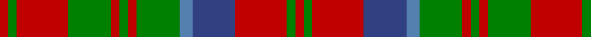

This page is one **sett** — a single exact thread-count. It belongs to the [tartan](/tartans/r2g2r12g10r2g2r2g10ba3b10r12g2r2/)
(the same proportion at any scale), whose colour order is pattern [RGRBBGRGRGRGR](/stripes/rgrbbgrgrgrgr/).

Sourced from weddslist.  It is a [13 stripe tartan](/stripes/stripes13/).

Original link http://www.weddslist.com/cgi-bin/tartans/pg.pl?source=sts

## Thread count
R/4 G4 R24 G20 R4 G4 R4 G20 Ba6 B20 R24 G4 R/4

## Palette
Each colour and the base-6 reference it is a variant of.

| Colour | Shade | Base |
|---|---|---|
| B | <code style="background-color:#304080;">#304080</code> `oklch(39.4% 0.109 270.2)` <small>#304080</small> | B <code style="background-color:#2A418A;">#2A418A</code> |
| Ba | <code style="background-color:#5480B0;">#5480B0</code> `oklch(58.8% 0.089 251.5)` <small>#5480B0</small> | B <code style="background-color:#2A418A;">#2A418A</code> |
| G | <code style="background-color:#008000;">#008000</code> `oklch(52.0% 0.177 142.5)` <small>#008000</small> | G <code style="background-color:#006100;">#006100</code> |
| R | <code style="background-color:#C00000;">#C00000</code> `oklch(50.7% 0.208 29.2)` <small>#C00000</small> | R <code style="background-color:#CC0000;">#CC0000</code> |

## Nearest tartans

The nearest existing variants by ΔTartan distance, with this tartan at the top so the swatches line up against it.

ΔTartan

Tartan

Sett

—

<a href="/ttd/edit/#slug=r2g2r12db10t3g10r2g2r2g10r12g2r2~x2">Matheson</a> <a class="nn-out" href="/setts/s13/r2g2r12db10t3g10r2g2r2g10r12g2r2~x2/" title="open its dictionary page">↗</a>

0.28

<a href="/ttd/edit/#slug=r1t1r6db3r1g6r1g6r6db1r1t1~x2">MacQuarrie 4</a> <a class="nn-out" href="/setts/s12/r1t1r6db3r1g6r1g6r6db1r1t1~x2/" title="open its dictionary page">↗</a>

0.50

<a href="/ttd/edit/#slug=g21r5g21r21g5r4g5r21w4r5db21r4">MacRae</a> <a class="nn-out" href="/setts/s12/g21r5g21r21g5r4g5r21w4r5db21r4/" title="open its dictionary page">↗</a>

0.73

<a href="/ttd/edit/#slug=r2dg2r12dg10r2dg2r2dg10t3db10r12dg2r2~x2">Matheson (Logan 1831)</a> <a class="nn-out" href="/setts/s13/r2dg2r12dg10r2dg2r2dg10t3db10r12dg2r2~x2/" title="open its dictionary page">↗</a>

0.81

<a href="/ttd/edit/#slug=r1t1r6db3r1dg6r1dg6r6db1r1t1~x2">MacQuarrie</a> <a class="nn-out" href="/setts/s12/r1t1r6db3r1dg6r1dg6r6db1r1t1~x2/" title="open its dictionary page">↗</a>

0.89

<a href="/ttd/edit/#slug=dg21r5dg21r21dg5r4dg5r21w4r5db21r4">MacRae (Sample)</a> <a class="nn-out" href="/setts/s12/dg21r5dg21r21dg5r4dg5r21w4r5db21r4/" title="open its dictionary page">↗</a>

0.93

<a href="/setts/s14/o16k4w2k4o6o11o2o16~x2/">Sydney (Nova Scotia) #2</a>

0.98

<a href="/ttd/edit/#slug=r5dt5r3g16r3g3r3dt10r3t5r12dt5r3dt3r5~x2">Grant of Ballindalloch Clan Tartan Tartan Number: 2149. Earliest known date: 1993 Grant of Ballindalloch tartan was designed during the refurbishment of Ballindalloch Castle. It is based on the Grant tartan recorded by Logan in 1831. The first samples produced by Johnstons of Elgin were woven in 'Antique' colours. See products available Copyright © Blair Urquhart, Comrie, 2015</a> <a class="nn-out" href="/setts/s15/r5dt5r3g16r3g3r3dt10r3t5r12dt5r3dt3r5~x2/" title="open its dictionary page">↗</a>

1.03

<a href="/ttd/edit/#slug=r5db3r3g16r3g3r3db5r3y5r12db5r3db3r5~x4">Grant of Ballindalloch (Personal)</a> <a class="nn-out" href="/setts/s15/r5db3r3g16r3g3r3db5r3y5r12db5r3db3r5~x4/" title="open its dictionary page">↗</a>

1.03

<a href="/ttd/edit/#slug=t2r3db3r5g14r3db2r5g2r3db14r5g3r3t2~x2">Glen Orchy</a> <a class="nn-out" href="/setts/s15/t2r3db3r5g14r3db2r5g2r3db14r5g3r3t2~x2/" title="open its dictionary page">↗</a>

1.05

<a href="/ttd/edit/#slug=p3r4g3db3r7g17r3db5g4r21g7p3r6w3~x2">MacKinnon 10</a> <a class="nn-out" href="/setts/s14/p3r4g3db3r7g17r3db5g4r21g7p3r6w3~x2/" title="open its dictionary page">↗</a>

## Neighbour map

Every grey dot is one of 14299 variants placed by the first two principal components of the ΔTartan feature space (44% of its variance). Red is this tartan; blue dots are its nearest — click one to open its page.

<svg viewBox="0 0 640 380" role="img" style="max-width:100%;height:auto;border:1px solid #e0e0e0;border-radius:4px;display:block" xmlns="http://www.w3.org/2000/svg"><image href="/nn/cloud.v1.png" width="640" height="380"/><a href="/setts/s12/r1t1r6db3r1g6r1g6r6db1r1t1~x2/"><circle cx="240.1" cy="200.6" r="4" fill="#3465a4"><title>MacQuarrie 4</title></circle></a><a href="/setts/s12/g21r5g21r21g5r4g5r21w4r5db21r4/"><circle cx="203.8" cy="210.3" r="4" fill="#3465a4"><title>MacRae</title></circle></a><a href="/setts/s13/r2dg2r12dg10r2dg2r2dg10t3db10r12dg2r2~x2/"><circle cx="224.2" cy="196.3" r="4" fill="#3465a4"><title>Matheson (Logan 1831)</title></circle></a><a href="/setts/s12/r1t1r6db3r1dg6r1dg6r6db1r1t1~x2/"><circle cx="236.6" cy="195.8" r="4" fill="#3465a4"><title>MacQuarrie</title></circle></a><a href="/setts/s12/dg21r5dg21r21dg5r4dg5r21w4r5db21r4/"><circle cx="202.7" cy="206.8" r="4" fill="#3465a4"><title>MacRae (Sample)</title></circle></a><a href="/setts/s14/o16k4w2k4o6o11o2o16~x2/"><circle cx="203.8" cy="180.2" r="4" fill="#3465a4"><title>Sydney (Nova Scotia) #2</title></circle></a><a href="/setts/s15/r5dt5r3g16r3g3r3dt10r3t5r12dt5r3dt3r5~x2/"><circle cx="193.8" cy="207.8" r="4" fill="#3465a4"><title>Grant of Ballindalloch Clan Tartan Tartan Number: 2149. Earliest known date: 1993 Grant of Ballindalloch tartan was designed during the refurbishment of Ballindalloch Castle. It is based on the Grant tartan recorded by Logan in 1831. The first samples produced by Johnstons of Elgin were woven in 'Antique' colours. See products available Copyright © Blair Urquhart, Comrie, 2015</title></circle></a><a href="/setts/s15/r5db3r3g16r3g3r3db5r3y5r12db5r3db3r5~x4/"><circle cx="216.3" cy="200.4" r="4" fill="#3465a4"><title>Grant of Ballindalloch (Personal)</title></circle></a><a href="/setts/s15/t2r3db3r5g14r3db2r5g2r3db14r5g3r3t2~x2/"><circle cx="195.1" cy="185.0" r="4" fill="#3465a4"><title>Glen Orchy</title></circle></a><a href="/setts/s14/p3r4g3db3r7g17r3db5g4r21g7p3r6w3~x2/"><circle cx="210.3" cy="162.7" r="4" fill="#3465a4"><title>MacKinnon 10</title></circle></a><circle cx="226.4" cy="200.3" r="5" fill="#c00000"/></svg>

ID: /setts/s13/r2g2r12db10t3g10r2g2r2g10r12g2r2~x2/
