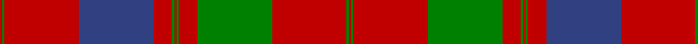

In pattern [RGRBRGRGRGRGR](/patterns/rgrbrgrgrgrgr/).

This was sourced from weddslist.  It is a [13 stripes tartan](/stripes/stripes13/).

Original link http://www.weddslist.com/cgi-bin/tartans/pg.pl?source=sts

## Thread count
R/2 G2 R64 B64 R16 G2 R2 G2 R16 G64 R64 G2 R/2

## Palette
Each colour and its ΔE from the base-6 reference it is a variant of.

| Colour | Shade | Base | ΔE (OKLab) |
|---|---|---|---|
| B | <code style="background-color:#304080;">#304080</code> `#304080` | B <code style="background-color:#2A418A;">#2A418A</code> | 0.02 |
| G | <code style="background-color:#008000;">#008000</code> `#008000` | G <code style="background-color:#006100;">#006100</code> | 0.10 |
| R | <code style="background-color:#C00000;">#C00000</code> `#C00000` | R <code style="background-color:#CC0000;">#CC0000</code> | 0.03 |

## Nearest tartans

The nearest existing variants by ΔTartan distance.

1. [Fraser, Wedding dress](/setts/s13/g4r6b4r96b120r42g4r42g120r96b4r6g4-b304080-g008000-rc00000/) — ΔT 0.37
1. [Grant of Rothiemurchus Artifact Tartan Tartan Number: 1496. Earliest known date: pre 2003 From a wedding plaid recorded by Miss M. MacDougall. See products available Copyright © Blair Urquhart, Comrie, 2015](/setts/s13/r2g2r64b64r16g2r2g2r16g64r64g2r2-b2c2c80-g006818-rc80000/) — ΔT 0.40
1. [Fraser, Isabella (Artefact)](/setts/s13/g2r3b2r48b60r21g2r21g60r48b2r3g2-b202060-g00643c-rc80000/) — ΔT 0.69
1. [Unnamed 18th century plaid from Rothiemurchus](/setts/s13/r2g2r64b64r16g2r2g2r16g64r64g2r2-b440044-g006818-rc80000/) — ΔT 0.75
1. [MacDonell of Glengarry #4](/setts/s11/g36r6g4r4b12r4g4r48g2r4g12-b2c4084-g005020-rdc0000/) — ΔT 0.88
1. [MacGillivray](/setts/s13/r8b2ba2r64b4r4ba24r4g32r8b2r8ba4-b5480b0-ba304080-g008000-rc00000/) — ΔT 0.97
1. [Unidentified Cant #14](/setts/s12/b80r56g3r56g88r64b3r4g3r4b3r64-b2c2c80-g285800-rc80000/) — ΔT 0.98
1. [MacAlister of Glenbarr](/setts/s14/g40r6g12r12g12r16b4r4g40r4b4r92b6r16-b440044-g006818-rc80000/) — ΔT 1.00
1. [Grant or Drummond Clan Tartan Tartan Number: 1384. Earliest known date: 1831 The usual design is sometimes called Drummond. It is recorded by Logan (1831), Smibert (1850), and Smith (1850). McIan's drawing of the Grant tartan is too roughly done to make out the pattern details. A certain difficulty arises in establishing a single Grant tartan to represent the clan, illustrated by the existance of ten Grant portraits at Cullen House in which each brother is wearing a different tartan, and where a coat or plaid is worn, these also differ. The chief of the Grants is Lord Strathspey. See products available Copyright © Blair Urquhart, Comrie, 2015](/setts/s15/r12b4r4g48r4g4r4b16r4ba4r64b4r4b2r12-b2c2c80-ba2888c4-g006818-rc80000/) — ΔT 1.04
1. [Drummond Clan Tartan Tartan Number: 457. Earliest known date: 1822 The sett closely resembles the pattern used by McIan for his Drummond figure, which Logan asserts is in fact a Grant tartan. Nevertheless it is established that the Drummonds wore this sett to meet George IV in Edinburgh in 1822. The illustration here come from a sample in the MacGregor-Hastie Collection. There is also a Drummond of Perth sett. See products available Copyright © Blair Urquhart, Comrie, 2015](/setts/s16/r12b2r4b4r56ba4r4b18r4g4r4g48r6b4r12b4-b2c2c80-ba5c8ca8-g006818-rc80000/) — ΔT 1.04

## Neighbour map

Every grey dot is one of 15726 variants placed by the first two principal components of the ΔTartan feature space (44% of its variance). Red is this tartan; blue dots are its nearest — click one to open its page.

<svg viewBox="0 0 640 380" role="img" style="max-width:100%;height:auto;border:1px solid #e0e0e0;border-radius:4px;display:block" xmlns="http://www.w3.org/2000/svg"><image href="/nn/cloud.v1.png" width="640" height="380"/><a href="/setts/s13/g4r6b4r96b120r42g4r42g120r96b4r6g4-b304080-g008000-rc00000/"><circle cx="365.1" cy="133.0" r="4" fill="#3465a4"><title>Fraser, Wedding dress</title></circle></a><a href="/setts/s13/r2g2r64b64r16g2r2g2r16g64r64g2r2-b2c2c80-g006818-rc80000/"><circle cx="385.6" cy="123.2" r="4" fill="#3465a4"><title>Grant of Rothiemurchus Artifact Tartan Tartan Number: 1496. Earliest known date: pre 2003 From a wedding plaid recorded by Miss M. MacDougall. See products available Copyright © Blair Urquhart, Comrie, 2015</title></circle></a><a href="/setts/s13/g2r3b2r48b60r21g2r21g60r48b2r3g2-b202060-g00643c-rc80000/"><circle cx="364.1" cy="131.8" r="4" fill="#3465a4"><title>Fraser, Isabella (Artefact)</title></circle></a><a href="/setts/s13/r2g2r64b64r16g2r2g2r16g64r64g2r2-b440044-g006818-rc80000/"><circle cx="391.4" cy="122.5" r="4" fill="#3465a4"><title>Unnamed 18th century plaid from Rothiemurchus</title></circle></a><a href="/setts/s11/g36r6g4r4b12r4g4r48g2r4g12-b2c4084-g005020-rdc0000/"><circle cx="359.5" cy="141.9" r="4" fill="#3465a4"><title>MacDonell of Glengarry #4</title></circle></a><a href="/setts/s13/r8b2ba2r64b4r4ba24r4g32r8b2r8ba4-b5480b0-ba304080-g008000-rc00000/"><circle cx="393.5" cy="101.3" r="4" fill="#3465a4"><title>MacGillivray</title></circle></a><a href="/setts/s12/b80r56g3r56g88r64b3r4g3r4b3r64-b2c2c80-g285800-rc80000/"><circle cx="393.8" cy="148.5" r="4" fill="#3465a4"><title>Unidentified Cant #14</title></circle></a><a href="/setts/s14/g40r6g12r12g12r16b4r4g40r4b4r92b6r16-b440044-g006818-rc80000/"><circle cx="408.1" cy="135.4" r="4" fill="#3465a4"><title>MacAlister of Glenbarr</title></circle></a><a href="/setts/s15/r12b4r4g48r4g4r4b16r4ba4r64b4r4b2r12-b2c2c80-ba2888c4-g006818-rc80000/"><circle cx="388.9" cy="91.5" r="4" fill="#3465a4"><title>Grant or Drummond Clan Tartan Tartan Number: 1384. Earliest known date: 1831 The usual design is sometimes called Drummond. It is recorded by Logan (1831), Smibert (1850), and Smith (1850). McIan's drawing of the Grant tartan is too roughly done to make out the pattern details. A certain difficulty arises in establishing a single Grant tartan to represent the clan, illustrated by the existance of ten Grant portraits at Cullen House in which each brother is wearing a different tartan, and where a coat or plaid is worn, these also differ. The chief of the Grants is Lord Strathspey. See products available Copyright © Blair Urquhart, Comrie, 2015</title></circle></a><a href="/setts/s16/r12b2r4b4r56ba4r4b18r4g4r4g48r6b4r12b4-b2c2c80-ba5c8ca8-g006818-rc80000/"><circle cx="357.4" cy="96.4" r="4" fill="#3465a4"><title>Drummond Clan Tartan Tartan Number: 457. Earliest known date: 1822 The sett closely resembles the pattern used by McIan for his Drummond figure, which Logan asserts is in fact a Grant tartan. Nevertheless it is established that the Drummonds wore this sett to meet George IV in Edinburgh in 1822. The illustration here come from a sample in the MacGregor-Hastie Collection. There is also a Drummond of Perth sett. See products available Copyright © Blair Urquhart, Comrie, 2015</title></circle></a><circle cx="388.1" cy="125.3" r="5" fill="#c00000"/></svg>

ID: /setts/s13/r2g2r64b64r16g2r2g2r16g64r64g2r2-b304080-g008000-rc00000/
