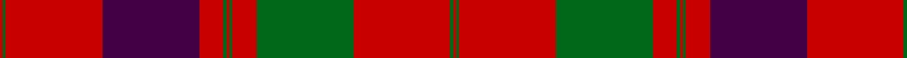

In pattern [RGRBRGRGRGRGR](/patterns/rgrbrgrgrgrgr/).

This was sourced from register-of-tartans.  It is a [13 stripes tartan](/stripes/stripes13/).

Original link https://www.tartanregister.gov.uk/tartanDetails.aspx?ref=1511

## Attestations

This cloth appears in 2 source records; the oldest owns this page.

- 01/01/1750 — Unnamed 18th century plaid from Rothiemurchus (register-of-tartans, [record](https://www.tartanregister.gov.uk/tartanDetails.aspx?ref=1511))
- 1750 — Grant of Rothiemurchus (Clan) (tartans-authority, [record](http://www.tartansauthority.com/tartan-ferret/display/1496/))

## Thread count
R/2 G2 R64 DP64 R16 G2 R2 G2 R16 G64 R64 G2 R/2

## Palette
Each colour and its ΔE from the base-6 reference it is a variant of.

| Colour | Shade | Base | ΔE (OKLab) |
|---|---|---|---|
| DG | <code style="background-color:#003820;">#003820</code> `#003820` | G <code style="background-color:#006100;">#006100</code> | 0.15 |
| DP | <code style="background-color:#440044;">#440044</code> `#440044` | B <code style="background-color:#2A418A;">#2A418A</code> | 0.18 |
| G | <code style="background-color:#006818;">#006818</code> `#006818` | G <code style="background-color:#006100;">#006100</code> | 0.02 |
| R | <code style="background-color:#C80000;">#C80000</code> `#C80000` | R <code style="background-color:#CC0000;">#CC0000</code> | 0.01 |

## Nearest tartans

The nearest existing variants by ΔTartan distance.

1. [Grant of Rothiemurchus Artifact Tartan Tartan Number: 1496. Earliest known date: pre 2003 From a wedding plaid recorded by Miss M. MacDougall. See products available Copyright © Blair Urquhart, Comrie, 2015](/setts/s13/r2g2r64b64r16g2r2g2r16g64r64g2r2-b2c2c80-g006818-rc80000/) — ΔT 0.54
1. [Fraser, Isabella (Artefact)](/setts/s13/g2r3b2r48b60r21g2r21g60r48b2r3g2-b202060-g00643c-rc80000/) — ΔT 0.74
1. [Grant of Rothiemurchus](/setts/s13/r2g2r64b64r16g2r2g2r16g64r64g2r2-b304080-g008000-rc00000/) — ΔT 0.75
1. [Unidentified Cant #14](/setts/s12/b80r56g3r56g88r64b3r4g3r4b3r64-b2c2c80-g285800-rc80000/) — ΔT 0.83
1. [Fraser, Wedding dress](/setts/s13/g4r6b4r96b120r42g4r42g120r96b4r6g4-b304080-g008000-rc00000/) — ΔT 0.91
1. [MacGillivray Clan Tartan Tartan Number: 446. Earliest known date: 1831 "A characteristic Clan Chattan tartan...", writes D.C.Stewart, with much in common with the setts of the neighbouring clans in Strathnairn and Morvern. Wilson produced this sett with a black stripe in the centre of the the red square. The chiefship of Clan MacGillivray is vacant and the 'Steward' of clan affairs, appointed by Lord Lyon, is Commander Colonel George Brown MacGillivray. See products available Copyright © Blair Urquhart, Comrie, 2015](/setts/s13/r8b2ba2r64b4r4ba24r4g32r8b2r8ba4-b5c8ca8-ba2c2c80-g006818-rc80000/) — ΔT 1.04
1. [MacDonald #7](/setts/s9/g4r4b2r48b12r6g24r8b2-b2c4084-g005020-rdc0000/) — ΔT 1.09
1. [Grant (Vestiarium Scoticum)](/setts/s13/r8b4r4b4r112b32r8g2r8g72r6g2r8-b2c4084-g005020-rdc0000/) — ΔT 1.10
1. [Drummond - 1819 (Clan)](/setts/s15/r12b4r4g48r4g4r4b16r4ba2r64b4r4b2r12-b440044-ba5c8ca8-g285800-rd40000/) — ΔT 1.11
1. [MacGillivray](/setts/s13/r8b2ba2r64b4r4ba24r4g32r8b2r8ba4-b5480b0-ba304080-g008000-rc00000/) — ΔT 1.13

## Neighbour map

Every grey dot is one of 15726 variants placed by the first two principal components of the ΔTartan feature space (44% of its variance). Red is this tartan; blue dots are its nearest — click one to open its page.

<svg viewBox="0 0 640 380" role="img" style="max-width:100%;height:auto;border:1px solid #e0e0e0;border-radius:4px;display:block" xmlns="http://www.w3.org/2000/svg"><image href="/nn/cloud.v1.png" width="640" height="380"/><a href="/setts/s13/r2g2r64b64r16g2r2g2r16g64r64g2r2-b2c2c80-g006818-rc80000/"><circle cx="385.6" cy="123.2" r="4" fill="#3465a4"><title>Grant of Rothiemurchus Artifact Tartan Tartan Number: 1496. Earliest known date: pre 2003 From a wedding plaid recorded by Miss M. MacDougall. See products available Copyright © Blair Urquhart, Comrie, 2015</title></circle></a><a href="/setts/s13/g2r3b2r48b60r21g2r21g60r48b2r3g2-b202060-g00643c-rc80000/"><circle cx="364.1" cy="131.8" r="4" fill="#3465a4"><title>Fraser, Isabella (Artefact)</title></circle></a><a href="/setts/s13/r2g2r64b64r16g2r2g2r16g64r64g2r2-b304080-g008000-rc00000/"><circle cx="388.1" cy="125.3" r="4" fill="#3465a4"><title>Grant of Rothiemurchus</title></circle></a><a href="/setts/s12/b80r56g3r56g88r64b3r4g3r4b3r64-b2c2c80-g285800-rc80000/"><circle cx="393.8" cy="148.5" r="4" fill="#3465a4"><title>Unidentified Cant #14</title></circle></a><a href="/setts/s13/g4r6b4r96b120r42g4r42g120r96b4r6g4-b304080-g008000-rc00000/"><circle cx="365.1" cy="133.0" r="4" fill="#3465a4"><title>Fraser, Wedding dress</title></circle></a><a href="/setts/s13/r8b2ba2r64b4r4ba24r4g32r8b2r8ba4-b5c8ca8-ba2c2c80-g006818-rc80000/"><circle cx="389.6" cy="98.5" r="4" fill="#3465a4"><title>MacGillivray Clan Tartan Tartan Number: 446. Earliest known date: 1831 &quot;A characteristic Clan Chattan tartan...&quot;, writes D.C.Stewart, with much in common with the setts of the neighbouring clans in Strathnairn and Morvern. Wilson produced this sett with a black stripe in the centre of the the red square. The chiefship of Clan MacGillivray is vacant and the 'Steward' of clan affairs, appointed by Lord Lyon, is Commander Colonel George Brown MacGillivray. See products available Copyright © Blair Urquhart, Comrie, 2015</title></circle></a><a href="/setts/s9/g4r4b2r48b12r6g24r8b2-b2c4084-g005020-rdc0000/"><circle cx="414.6" cy="147.5" r="4" fill="#3465a4"><title>MacDonald #7</title></circle></a><a href="/setts/s13/r8b4r4b4r112b32r8g2r8g72r6g2r8-b2c4084-g005020-rdc0000/"><circle cx="432.9" cy="86.3" r="4" fill="#3465a4"><title>Grant (Vestiarium Scoticum)</title></circle></a><a href="/setts/s15/r12b4r4g48r4g4r4b16r4ba2r64b4r4b2r12-b440044-ba5c8ca8-g285800-rd40000/"><circle cx="400.6" cy="88.3" r="4" fill="#3465a4"><title>Drummond - 1819 (Clan)</title></circle></a><a href="/setts/s13/r8b2ba2r64b4r4ba24r4g32r8b2r8ba4-b5480b0-ba304080-g008000-rc00000/"><circle cx="393.5" cy="101.3" r="4" fill="#3465a4"><title>MacGillivray</title></circle></a><circle cx="391.4" cy="122.5" r="5" fill="#c00000"/></svg>

ID: /setts/s13/r2g2r64b64r16g2r2g2r16g64r64g2r2-b440044-g006818-rc80000/
