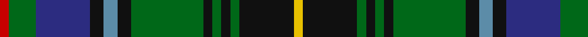

In pattern [RGBKBKGKGKGKY](/patterns/rgbkbkgkgkgky/).

This was sourced from house-of-tartan.  It is a [13 stripes tartan](/stripes/stripes13/).

Original link http://www.house-of-tartan.scotland.net/house/TartanViewjs.asp?colr=Def&tnam=1464

## Thread count
R/4 G12 DB24 K6 B6 K6 G32 K4 G4 K4 G4 K24 Y/4

## Palette
Each colour and its ΔE from the base-6 reference it is a variant of.

| Colour | Shade | Base | ΔE (OKLab) |
|---|---|---|---|
| B | <code style="background-color:#5C8CA8;">#5C8CA8</code> `#5C8CA8` | B <code style="background-color:#2A418A;">#2A418A</code> | 0.23 |
| DB | <code style="background-color:#2C2C80;">#2C2C80</code> `#2C2C80` | B <code style="background-color:#2A418A;">#2A418A</code> | 0.06 |
| G | <code style="background-color:#006818;">#006818</code> `#006818` | G <code style="background-color:#006100;">#006100</code> | 0.02 |
| K | <code style="background-color:#101010;">#101010</code> `#101010` | K <code style="background-color:#000000;">#000000</code> | 0.17 |
| R | <code style="background-color:#C80000;">#C80000</code> `#C80000` | R <code style="background-color:#CC0000;">#CC0000</code> | 0.01 |
| Y | <code style="background-color:#E8C000;">#E8C000</code> `#E8C000` | Y <code style="background-color:#F2BF00;">#F2BF00</code> | 0.02 |

## Nearest tartans

The nearest existing variants by ΔTartan distance.

1. [MacInnes](/setts/s13/r2g6b12k3ba3k3g16k2g2k2g2k12y2~b2c2c80-ba5c8ca8-g285800-k101010-rc80000-ye8c000~x2/) — ΔT 0.39
1. [Wilson's No.225](/setts/s16/g16ga2b13ba2k6y2g16ba2k12ba2g16y2k6ba2b13ga2~b440044-ba5c8ca8-g006818-ga5c6428-k101010-ye8c000~x2/) — ΔT 0.69
1. [MacComb Family Tartan Tartan Number: 2340. Earliest known date: pre 1997 STS notes: Designed for a Mr McComb to play himself in as club captain of a golf club. It is the MacThomas with the over check changed to the clubs colours. Design by Donald Fraser (Oct 2002) of Berwick upon Tweed. See products available Copyright © Blair Urquhart, Comrie, 2015](/setts/s12/b3r2b18k6g18y2ga3y2g18k6b18r2~b2c2c80-g006818-ga408060-k101010-rc80000-ye8c000~x2/) — ΔT 0.73
1. [Kelsey, William (Personal)](/setts/s12/g12r2g2r5g16b3ra2k2ra3b6k20y3~b2c2c80-g006818-k101010-rc80000-ra888888-yfccc00~x2/) — ΔT 0.79
1. [Paisley District Tartan Tartan Number: 640. Earliest known date: 1952 This design won a first prize at Kelso Highland Show for designer, Allan Drennan, in 1952. He regarded it as having 'a motif of the Clan Donald'. It is also worn by members of the Paisley & Allied Families Society and the '100 Pipers' pipe band (in ancient colours). See products available Copyright © Blair Urquhart, Comrie, 2015](/setts/s12/b7w2g3b18y2k15y2g17r5g3r2g7~b2c2c80-g006818-k101010-rc80000-we0e0e0-ye8c000~x2/) — ΔT 0.80
1. [Gow Hunting Family Tartan Tartan Number: 1893. Earliest known date: pre 2003 MacDonells of Keppoch are an independant branch of Clan Donald. See products available Copyright © Blair Urquhart, Comrie, 2015](/setts/s14/b12ba3b12k12g12k1y3k1g12k1r1k1g12k12~b2c2c80-ba202060-g006818-k101010-rc80000-ye8c000~x4/) — ΔT 0.88
1. [Stephenson Clan Tartan Tartan Number: 517. Earliest known date: (1870) 1975 Based on an old and un-named sett in the records of Messrs Bolingbroke and Jones of Norwich (No. 38), prior to 1870. Designed by Jack Dalgety of Forfar and R C Stephenson of Dundee c. 1975. See 1077 See products available Copyright © Blair Urquhart, Comrie, 2015](/setts/s11/k6g20b2r5b2k20y3ba20g26r3ba5~b5c8ca8-ba2c2c80-g006818-k101010-rc80000-ye8c000~x2/) — ΔT 0.88
1. [Big Rory (Corporate)](/setts/s10/b10w5b48k35g5k5g35r5g5ba5~b2c607c-ba780078-g006818-k101010-rc80000-we0e0e0/) — ΔT 0.89
1. [Wojtek Memorial Trust](/setts/s11/w3b15r6b3r3b4g11ga3g3ga28y3~b202060-g003820-ga005020-rdc0000-wffffff-ya08858~x2/) — ΔT 0.91
1. [Tindal](/setts/s11/r3k2g18k18b3k3b3k3b18y2w3~b202060-g006818-k101010-rc80000-we0e0e0-ye8c000~x2/) — ΔT 0.95

## Neighbour map

Every grey dot is one of 15726 variants placed by the first two principal components of the ΔTartan feature space (44% of its variance). Red is this tartan; blue dots are its nearest — click one to open its page.

<svg viewBox="0 0 640 380" role="img" style="max-width:100%;height:auto;border:1px solid #e0e0e0;border-radius:4px;display:block" xmlns="http://www.w3.org/2000/svg"><image href="/nn/cloud.v1.png" width="640" height="380"/><a href="/setts/s13/r2g6b12k3ba3k3g16k2g2k2g2k12y2~b2c2c80-ba5c8ca8-g285800-k101010-rc80000-ye8c000~x2/"><circle cx="160.5" cy="158.9" r="4" fill="#3465a4"><title>MacInnes</title></circle></a><a href="/setts/s16/g16ga2b13ba2k6y2g16ba2k12ba2g16y2k6ba2b13ga2~b440044-ba5c8ca8-g006818-ga5c6428-k101010-ye8c000~x2/"><circle cx="146.2" cy="152.4" r="4" fill="#3465a4"><title>Wilson's No.225</title></circle></a><a href="/setts/s12/b3r2b18k6g18y2ga3y2g18k6b18r2~b2c2c80-g006818-ga408060-k101010-rc80000-ye8c000~x2/"><circle cx="167.4" cy="159.5" r="4" fill="#3465a4"><title>MacComb Family Tartan Tartan Number: 2340. Earliest known date: pre 1997 STS notes: Designed for a Mr McComb to play himself in as club captain of a golf club. It is the MacThomas with the over check changed to the clubs colours. Design by Donald Fraser (Oct 2002) of Berwick upon Tweed. See products available Copyright © Blair Urquhart, Comrie, 2015</title></circle></a><a href="/setts/s12/g12r2g2r5g16b3ra2k2ra3b6k20y3~b2c2c80-g006818-k101010-rc80000-ra888888-yfccc00~x2/"><circle cx="145.9" cy="140.8" r="4" fill="#3465a4"><title>Kelsey, William (Personal)</title></circle></a><a href="/setts/s12/b7w2g3b18y2k15y2g17r5g3r2g7~b2c2c80-g006818-k101010-rc80000-we0e0e0-ye8c000~x2/"><circle cx="121.5" cy="149.4" r="4" fill="#3465a4"><title>Paisley District Tartan Tartan Number: 640. Earliest known date: 1952 This design won a first prize at Kelso Highland Show for designer, Allan Drennan, in 1952. He regarded it as having 'a motif of the Clan Donald'. It is also worn by members of the Paisley &amp; Allied Families Society and the '100 Pipers' pipe band (in ancient colours). See products available Copyright © Blair Urquhart, Comrie, 2015</title></circle></a><a href="/setts/s14/b12ba3b12k12g12k1y3k1g12k1r1k1g12k12~b2c2c80-ba202060-g006818-k101010-rc80000-ye8c000~x4/"><circle cx="158.3" cy="154.0" r="4" fill="#3465a4"><title>Gow Hunting Family Tartan Tartan Number: 1893. Earliest known date: pre 2003 MacDonells of Keppoch are an independant branch of Clan Donald. See products available Copyright © Blair Urquhart, Comrie, 2015</title></circle></a><a href="/setts/s11/k6g20b2r5b2k20y3ba20g26r3ba5~b5c8ca8-ba2c2c80-g006818-k101010-rc80000-ye8c000~x2/"><circle cx="170.5" cy="147.6" r="4" fill="#3465a4"><title>Stephenson Clan Tartan Tartan Number: 517. Earliest known date: (1870) 1975 Based on an old and un-named sett in the records of Messrs Bolingbroke and Jones of Norwich (No. 38), prior to 1870. Designed by Jack Dalgety of Forfar and R C Stephenson of Dundee c. 1975. See 1077 See products available Copyright © Blair Urquhart, Comrie, 2015</title></circle></a><a href="/setts/s10/b10w5b48k35g5k5g35r5g5ba5~b2c607c-ba780078-g006818-k101010-rc80000-we0e0e0/"><circle cx="166.1" cy="155.5" r="4" fill="#3465a4"><title>Big Rory (Corporate)</title></circle></a><a href="/setts/s11/w3b15r6b3r3b4g11ga3g3ga28y3~b202060-g003820-ga005020-rdc0000-wffffff-ya08858~x2/"><circle cx="157.0" cy="148.0" r="4" fill="#3465a4"><title>Wojtek Memorial Trust</title></circle></a><a href="/setts/s11/r3k2g18k18b3k3b3k3b18y2w3~b202060-g006818-k101010-rc80000-we0e0e0-ye8c000~x2/"><circle cx="137.3" cy="149.2" r="4" fill="#3465a4"><title>Tindal</title></circle></a><circle cx="150.4" cy="155.9" r="5" fill="#c00000"/></svg>

ID: /setts/s13/r2g6b12k3ba3k3g16k2g2k2g2k12y2~b2c2c80-ba5c8ca8-g006818-k101010-rc80000-ye8c000~x2/
