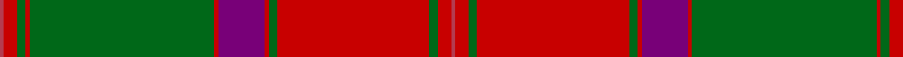

In pattern [RRGRGRBRGRGRR](/patterns/rrgrgrbrgrgrr/).

This was sourced from register-of-tartans.  It is a [13 stripes tartan](/stripes/stripes13/).

Original link https://www.tartanregister.gov.uk/tartanDetails.aspx?ref=803

## Attestations

This cloth appears in 2 source records; the oldest owns this page.

- 01/01/1797 — Crieff (register-of-tartans, [record](https://www.tartanregister.gov.uk/tartanDetails.aspx?ref=803))
- 1797 — Crieff (District) (tartans-authority, [record](http://www.tartansauthority.com/tartan-ferret/display/1636/))

## Register references

External register numbers recorded for this tartan.

- Scottish Register of Tartans: [803](https://www.tartanregister.gov.uk/tartanDetails.aspx?ref=803)
- Scottish Tartans Authority (ITI): 1636
- Scottish Tartans World Register: 1636

## Thread count
R/2 Ra6 G4 Ra2 G85 Ra2 P21 Ra2 G4 Ra70 G4 Ra6 R/2

## Palette
Each colour and its ΔE from the base-6 reference it is a variant of.

| Colour | Shade | Base | ΔE (OKLab) |
|---|---|---|---|
| G | <code style="background-color:#006818;">#006818</code> `#006818` | G <code style="background-color:#006100;">#006100</code> | 0.02 |
| P | <code style="background-color:#780078;">#780078</code> `#780078` | B <code style="background-color:#2A418A;">#2A418A</code> | 0.17 |
| R | <code style="background-color:#B43C50;">#B43C50</code> `#B43C50` | R <code style="background-color:#CC0000;">#CC0000</code> | 0.08 |
| Ra | <code style="background-color:#C80000;">#C80000</code> `#C80000` | R <code style="background-color:#CC0000;">#CC0000</code> | 0.01 |

## Nearest tartans

The nearest existing variants by ΔTartan distance.

1. [Drummond of Megginch - 1849 Kilt (faded)](/setts/s15/r7b1r2b2r35w2r2b10r2g2r2g37r3b2r6~b0f2b5b-g3a7728-rc13828-w93b7d1~x2/) — ΔT 0.74
1. [Bruce - 1819 (New)](/setts/s15/r15b1r2b2r78w1r2b21r3g2r3g89r2b2r10~b280034-g006818-rc80000-w00dcdc/) — ΔT 0.76
1. [Drummond of Megginch - 2023 BertieLexa](/setts/s15/r7b1r2b2r35w2r2b10r2g2r2g37r3b2r6~b003a70-g49762a-rc23c33-wa4c7e2~x2/) — ΔT 0.98
1. [Drummond of Megginch - 2022 Proposal](/setts/s15/r7b1r2b2r35w2r2b10r2g2r2g37r3b2r6~b003a70-g4a7729-rbe3a34-wa4c8e1~x2/) — ΔT 1.01
1. [Connacht](/setts/s10/r64g4ga1g4ga1g4ga64gb2ga2gb8~g005020-ga503c14-gb2a2303-rc87814/) — ΔT 1.02
1. [Unidentified Cant #12](/setts/s12/r60b2g24r8b2ba3b2ba3b2r8g24b2~b2c2c80-ba2888c4-g006818-rc80000/) — ΔT 1.05
1. [Gudbrandsdalen Mannsdrakt District Tartan Tartan Number: 2081. Earliest known date: 18th Century Sample is an off cut of hard tartan woven in plain weave - from fabric used to make a true copy of the original jacket in the possession of Bjornsgaard Farm, Dovre, Norway. Part of the collection of Norwegian district tartans presented to the Scottish Tartans Society by Erik Paulsen in 1992. Scottish-Norwegian connections are explored in a research report available from the Society. See products available Copyright © Blair Urquhart, Comrie, 2015](/setts/s16/g44r2k5g4r2k1g2r10g2k1r2g4k5r2w1r44~g003820-k101010-rc80000-we0e0e0~x2/) — ΔT 1.09
1. [Hay](/setts/s14/r6g4y2g36r2g2r2g12r48g4r2k1r2ya6~g11450d-k000000-raa0000-yaaaa00-yaaaaaaa~x2/) — ΔT 1.09
1. [MacDonell of Keppoch](/setts/s11/r6b1r1g28r4b8w1r32g1r4g2~b304080-g008000-rc00000-we0e0e0~x2/) — ΔT 1.09
1. [Strang (Personal)](/setts/s14/r36g18r4g6k1w2k1g2k1w2k1g6r4g18~g146400-k000000-rb00000-wc8c8c8~x2/) — ΔT 1.10

## Neighbour map

Every grey dot is one of 15726 variants placed by the first two principal components of the ΔTartan feature space (44% of its variance). Red is this tartan; blue dots are its nearest — click one to open its page.

<svg viewBox="0 0 640 380" role="img" style="max-width:100%;height:auto;border:1px solid #e0e0e0;border-radius:4px;display:block" xmlns="http://www.w3.org/2000/svg"><image href="/nn/cloud.v1.png" width="640" height="380"/><a href="/setts/s15/r7b1r2b2r35w2r2b10r2g2r2g37r3b2r6~b0f2b5b-g3a7728-rc13828-w93b7d1~x2/"><circle cx="381.8" cy="90.4" r="4" fill="#3465a4"><title>Drummond of Megginch - 1849 Kilt (faded)</title></circle></a><a href="/setts/s15/r15b1r2b2r78w1r2b21r3g2r3g89r2b2r10~b280034-g006818-rc80000-w00dcdc/"><circle cx="385.7" cy="61.4" r="4" fill="#3465a4"><title>Bruce - 1819 (New)</title></circle></a><a href="/setts/s15/r7b1r2b2r35w2r2b10r2g2r2g37r3b2r6~b003a70-g49762a-rc23c33-wa4c7e2~x2/"><circle cx="390.5" cy="93.3" r="4" fill="#3465a4"><title>Drummond of Megginch - 2023 BertieLexa</title></circle></a><a href="/setts/s15/r7b1r2b2r35w2r2b10r2g2r2g37r3b2r6~b003a70-g4a7729-rbe3a34-wa4c8e1~x2/"><circle cx="391.8" cy="94.1" r="4" fill="#3465a4"><title>Drummond of Megginch - 2022 Proposal</title></circle></a><a href="/setts/s10/r64g4ga1g4ga1g4ga64gb2ga2gb8~g005020-ga503c14-gb2a2303-rc87814/"><circle cx="381.2" cy="97.8" r="4" fill="#3465a4"><title>Connacht</title></circle></a><a href="/setts/s12/r60b2g24r8b2ba3b2ba3b2r8g24b2~b2c2c80-ba2888c4-g006818-rc80000/"><circle cx="386.2" cy="105.6" r="4" fill="#3465a4"><title>Unidentified Cant #12</title></circle></a><a href="/setts/s16/g44r2k5g4r2k1g2r10g2k1r2g4k5r2w1r44~g003820-k101010-rc80000-we0e0e0~x2/"><circle cx="372.8" cy="69.1" r="4" fill="#3465a4"><title>Gudbrandsdalen Mannsdrakt District Tartan Tartan Number: 2081. Earliest known date: 18th Century Sample is an off cut of hard tartan woven in plain weave - from fabric used to make a true copy of the original jacket in the possession of Bjornsgaard Farm, Dovre, Norway. Part of the collection of Norwegian district tartans presented to the Scottish Tartans Society by Erik Paulsen in 1992. Scottish-Norwegian connections are explored in a research report available from the Society. See products available Copyright © Blair Urquhart, Comrie, 2015</title></circle></a><a href="/setts/s14/r6g4y2g36r2g2r2g12r48g4r2k1r2ya6~g11450d-k000000-raa0000-yaaaa00-yaaaaaaa~x2/"><circle cx="380.9" cy="71.7" r="4" fill="#3465a4"><title>Hay</title></circle></a><a href="/setts/s11/r6b1r1g28r4b8w1r32g1r4g2~b304080-g008000-rc00000-we0e0e0~x2/"><circle cx="378.1" cy="110.3" r="4" fill="#3465a4"><title>MacDonell of Keppoch</title></circle></a><a href="/setts/s14/r36g18r4g6k1w2k1g2k1w2k1g6r4g18~g146400-k000000-rb00000-wc8c8c8~x2/"><circle cx="359.1" cy="99.4" r="4" fill="#3465a4"><title>Strang (Personal)</title></circle></a><circle cx="376.6" cy="82.5" r="5" fill="#c00000"/></svg>

ID: /setts/s13/r2ra6g4ra70g4ra2b21ra2g85ra2g4ra6r2~b780078-g006818-rb43c50-rac80000/
