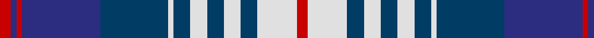

In pattern [RBRBBWBWBWBWR](/patterns/rbrbbwbwbwbwr/).

This was sourced from tartans-authority.  It is a [13 stripes tartan](/stripes/stripes13/).

Original link http://www.tartansauthority.com/tartan-ferret/display/2621/

## Thread count
R/4 DB2 R2 DB28 DBa24 LN2 DBa6 LN6 DBa6 LN6 DBa6 LN14 R/4

## Palette
Each colour and its ΔE from the base-6 reference it is a variant of.

| Colour | Shade | Base | ΔE (OKLab) |
|---|---|---|---|
| DB | <code style="background-color:#2C2C80;">#2C2C80</code> `#2C2C80` | B <code style="background-color:#2A418A;">#2A418A</code> | 0.06 |
| DBa | <code style="background-color:#003C64;">#003C64</code> `#003C64` | B <code style="background-color:#2A418A;">#2A418A</code> | 0.08 |
| LN | <code style="background-color:#E0E0E0;">#E0E0E0</code> `#E0E0E0` | W <code style="background-color:#F7F7F7;">#F7F7F7</code> | 0.07 |
| R | <code style="background-color:#C80000;">#C80000</code> `#C80000` | R <code style="background-color:#CC0000;">#CC0000</code> | 0.01 |

## Nearest tartans

The nearest existing variants by ΔTartan distance.

1. [Knights Templar St Andrews Corporate Tartan Tartan Number: 559. Earliest known date: 1989 An Order of Chivalry serving God and Scotland.' Correct name is 'Scottish Knights Templar of Militi Scotia, St Andrews.' One of three similar designs which were designed by Capt T.S. Davidson* in 1978. All were ratified and approved by the Grand Conclave of the Militi Scotia S.M.O.T.J* in Perth - 28 Mar 1998. Stuart Davidson started the Scottish Tartan Society in 1966. There are slight differences between each one which dictates which 'branch' of the order is entitled to wear it. * Supreme Military Order of the Temple of Jeruslalem See products available Copyright © Blair Urquhart, Comrie, 2015](/setts/s12/w4r1b18k6w5k4w4k4w3k2r1b2x2~b2c2c80-k101010-rc80000-we0e0e0/) — ΔT 0.80
1. [Highlands Country Club](/setts/s12/b15w11wa2w1wa1g4wa1w1wa2w11b15g5x4~b1c0070-g006818-wa8ace8-wac0c0c0/) — ΔT 0.90
1. [Scottish Knights Templar St. A (Corp](/setts/s12/w4r1b20k6w5k4w4k4w3k2r1b2x2~b2c2c80-k101010-rc80000-wc0c0c0/) — ΔT 0.93
1. [Trillard (Personal)](/setts/s12/b4r3k3r6k8b10w8k12w8b24k2b2x2~b1474b4-k101010-rc80000-wfcfcfc/) — ΔT 1.03
1. [Knights Templar St Andrews Corporate Tartan Tartan Number: 561. Earliest known date: 1989 See products available Copyright © Blair Urquhart, Comrie, 2015](/setts/s10/w4r2b20k6w5k4w3k2r2b2x2~b2c2c80-k101010-rc80000-we0e0e0/) — ΔT 1.13
1. [Scottish Knights Templar MTS (Corp)](/setts/s10/w4r2b20k6w5k4w3k2r2b2x2~b2c2c80-k101010-rc80000-wc0c0c0/) — ΔT 1.17
1. [MacKellar Royal Blue Dress Tartan Tartan Number: 8181. Earliest known date: Threadcount and colours aren't 100% original. Generated manually. See products available Copyright © Blair Urquhart, Comrie, 2015](/setts/s11/b23w2b3ba4b3w2b5k11bb2w23k3x2~b2c2c80-ba2888c4-bb8c008c-k101010-we0e0e0/) — ΔT 1.17
1. [(1) Abercrombie](/setts/s9/b27w2b14k14y4k4y4k4y27~b868aff-k000000-wffffff-y86ae9a/) — ΔT 1.18
1. [Tommy](/setts/s13/r4k1r5k4b11w2b11k4w2r2w15k2w3x2~b202060-k101010-rb84c00-we0e0e0/) — ΔT 1.19
1. [Bannockbane Silver](/setts/s8/b3ba2b18ba1w10r18ba2r3x2~b202060-ba480800-r888888-we0e0e0/) — ΔT 1.19

## Neighbour map

Every grey dot is one of 15726 variants placed by the first two principal components of the ΔTartan feature space (44% of its variance). Red is this tartan; blue dots are its nearest — click one to open its page.

<svg viewBox="0 0 640 380" role="img" style="max-width:100%;height:auto;border:1px solid #e0e0e0;border-radius:4px;display:block" xmlns="http://www.w3.org/2000/svg"><image href="/nn/cloud.v1.png" width="640" height="380"/><a href="/setts/s12/w4r1b18k6w5k4w4k4w3k2r1b2x2~b2c2c80-k101010-rc80000-we0e0e0/"><circle cx="178.8" cy="132.2" r="4" fill="#3465a4"><title>Knights Templar St Andrews Corporate Tartan Tartan Number: 559. Earliest known date: 1989 An Order of Chivalry serving God and Scotland.' Correct name is 'Scottish Knights Templar of Militi Scotia, St Andrews.' One of three similar designs which were designed by Capt T.S. Davidson* in 1978. All were ratified and approved by the Grand Conclave of the Militi Scotia S.M.O.T.J* in Perth - 28 Mar 1998. Stuart Davidson started the Scottish Tartan Society in 1966. There are slight differences between each one which dictates which 'branch' of the order is entitled to wear it. * Supreme Military Order of the Temple of Jeruslalem See products available Copyright © Blair Urquhart, Comrie, 2015</title></circle></a><a href="/setts/s12/b15w11wa2w1wa1g4wa1w1wa2w11b15g5x4~b1c0070-g006818-wa8ace8-wac0c0c0/"><circle cx="205.3" cy="146.2" r="4" fill="#3465a4"><title>Highlands Country Club</title></circle></a><a href="/setts/s12/w4r1b20k6w5k4w4k4w3k2r1b2x2~b2c2c80-k101010-rc80000-wc0c0c0/"><circle cx="208.9" cy="129.4" r="4" fill="#3465a4"><title>Scottish Knights Templar St. A (Corp</title></circle></a><a href="/setts/s12/b4r3k3r6k8b10w8k12w8b24k2b2x2~b1474b4-k101010-rc80000-wfcfcfc/"><circle cx="173.2" cy="161.2" r="4" fill="#3465a4"><title>Trillard (Personal)</title></circle></a><a href="/setts/s10/w4r2b20k6w5k4w3k2r2b2x2~b2c2c80-k101010-rc80000-we0e0e0/"><circle cx="194.5" cy="157.4" r="4" fill="#3465a4"><title>Knights Templar St Andrews Corporate Tartan Tartan Number: 561. Earliest known date: 1989 See products available Copyright © Blair Urquhart, Comrie, 2015</title></circle></a><a href="/setts/s10/w4r2b20k6w5k4w3k2r2b2x2~b2c2c80-k101010-rc80000-wc0c0c0/"><circle cx="205.8" cy="162.8" r="4" fill="#3465a4"><title>Scottish Knights Templar MTS (Corp)</title></circle></a><a href="/setts/s11/b23w2b3ba4b3w2b5k11bb2w23k3x2~b2c2c80-ba2888c4-bb8c008c-k101010-we0e0e0/"><circle cx="169.8" cy="128.5" r="4" fill="#3465a4"><title>MacKellar Royal Blue Dress Tartan Tartan Number: 8181. Earliest known date: Threadcount and colours aren't 100% original. Generated manually. See products available Copyright © Blair Urquhart, Comrie, 2015</title></circle></a><a href="/setts/s9/b27w2b14k14y4k4y4k4y27~b868aff-k000000-wffffff-y86ae9a/"><circle cx="181.2" cy="162.0" r="4" fill="#3465a4"><title>(1) Abercrombie</title></circle></a><a href="/setts/s13/r4k1r5k4b11w2b11k4w2r2w15k2w3x2~b202060-k101010-rb84c00-we0e0e0/"><circle cx="135.1" cy="138.8" r="4" fill="#3465a4"><title>Tommy</title></circle></a><a href="/setts/s8/b3ba2b18ba1w10r18ba2r3x2~b202060-ba480800-r888888-we0e0e0/"><circle cx="199.1" cy="153.3" r="4" fill="#3465a4"><title>Bannockbane Silver</title></circle></a><circle cx="174.5" cy="141.5" r="5" fill="#c00000"/></svg>

ID: /setts/s13/r2w7b3w3b3w3b3w1b12ba14r1ba1r2x2~b003c64-ba2c2c80-rc80000-we0e0e0/
