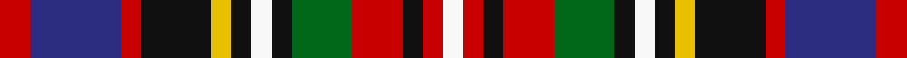

In pattern [RBRKYKWKGRKRW](/stripes/rbrkykwkgrkrw/).

This was sourced from register-of-tartans.  It is a [13 stripe tartan](/stripes/stripes13/).

Original link https://www.tartanregister.gov.uk/tartanDetails.aspx?ref=3386

## Also known as

This cloth is also recorded under:

- Prince Albert #3

## Attestations

This cloth appears in 2 source records; the oldest owns this page.

- 01/01/1847 — Prince Albert #3 (register-of-tartans, [record](https://www.tartanregister.gov.uk/tartanDetails.aspx?ref=3386))
- 1847 — Prince Albert (Fashion) (tartans-authority, [record](http://www.tartansauthority.com/tartan-ferret/display/6847/))

## Register references

External register numbers recorded for this tartan.

- Scottish Register of Tartans: [3386](https://www.tartanregister.gov.uk/tartanDetails.aspx?ref=3386)
- Scottish Tartans Authority (ITI): 6847

## Thread count
R/12 DB36 R8 K28 Y8 K8 W8 K8 G24 R20 K8 R8 W/8

## Palette
Each colour and the base-6 reference it is a variant of.

| Colour | Shade | Base |
|---|---|---|
| DB | <code style="background-color:#2C2C80;">#2C2C80</code> `oklch(35.0% 0.138 276.6)` <small>#2C2C80</small> | B <code style="background-color:#2A418A;">#2A418A</code> |
| G | <code style="background-color:#006818;">#006818</code> `oklch(45.0% 0.142 145.0)` <small>#006818</small> | G <code style="background-color:#006100;">#006100</code> |
| K | <code style="background-color:#101010;">#101010</code> `oklch(17.3% 0.000 89.9)` <small>#101010</small> | K <code style="background-color:#000000;">#000000</code> |
| R | <code style="background-color:#C80000;">#C80000</code> `oklch(52.3% 0.215 29.2)` <small>#C80000</small> | R <code style="background-color:#CC0000;">#CC0000</code> |
| W | <code style="background-color:#F8F8F8;">#F8F8F8</code> `oklch(97.9% 0.000 89.9)` <small>#F8F8F8</small> | W <code style="background-color:#F7F7F7;">#F7F7F7</code> |
| Y | <code style="background-color:#E8C000;">#E8C000</code> `oklch(81.9% 0.168 93.7)` <small>#E8C000</small> | Y <code style="background-color:#F2BF00;">#F2BF00</code> |

## Nearest tartans

The nearest existing variants by ΔTartan distance.

1. [Prince Albert #2](/setts/s13/r3db9r2k7ly2k2w2k2dg6r5k2r2w2~x2/) — ΔT 0.14
1. [Prince Albert](/setts/s13/r3db9r2k7ly2k2w2k2g6r5k2r2w2~x2/) — ΔT 0.55
1. [Buchanan, Incorrect](/setts/s16/db3g1k3db3k3g1db3g1r6w1r6db4ly5db1ly5g1~x4/) — ΔT 0.91
1. [Unnamed C19th (Silk Sash)](/setts/s11/db7lr2dp5ly2dg7ly2r5lr2r5ly2db7~x2/) — ΔT 0.96
1. [Victoria](/setts/s13/r6k2r12g10k3w2k3ly2k8w4db6w12r4/) — ΔT 0.97
1. [Buchanan Incorrect](/setts/s16/db3dg1k3db3k3dg1db3dg1r6w1r6db4ly5db1ly5dg1~x4/) — ΔT 0.98
1. [Dykes, of Perthshire](/setts/s13/t3k3t21k12r12ly3k4w3dg20r8k3r6w3~x2/) — ΔT 1.01
1. [Bhutan](/setts/s9/m3lb2db6lb2dr8lo2g6lo2m2~x2/) — ΔT 1.03
1. [Victoria (Patons)](/setts/s13/r6k2r12dg10k3w2k3ly2k8w4db6w12r4/) — ΔT 1.05
1. [Kinloch Anderson, dress](/setts/s12/r4o14w2o4w2k6o3k6db14r2db4r4~x2/) — ΔT 1.07

## Neighbour map

Every grey dot is one of 14299 variants placed by the first two principal components of the ΔTartan feature space (44% of its variance). Red is this tartan; blue dots are its nearest — click one to open its page.

<svg viewBox="0 0 640 380" role="img" style="max-width:100%;height:auto;border:1px solid #e0e0e0;border-radius:4px;display:block" xmlns="http://www.w3.org/2000/svg"><image href="/nn/cloud.v1.png" width="640" height="380"/><a href="/setts/s13/r3db9r2k7ly2k2w2k2dg6r5k2r2w2~x2/"><circle cx="22.5" cy="170.9" r="4" fill="#3465a4"><title>Prince Albert #2</title></circle></a><a href="/setts/s13/r3db9r2k7ly2k2w2k2g6r5k2r2w2~x2/"><circle cx="14.0" cy="168.0" r="4" fill="#3465a4"><title>Prince Albert</title></circle></a><a href="/setts/s16/db3g1k3db3k3g1db3g1r6w1r6db4ly5db1ly5g1~x4/"><circle cx="22.7" cy="150.0" r="4" fill="#3465a4"><title>Buchanan, Incorrect</title></circle></a><a href="/setts/s11/db7lr2dp5ly2dg7ly2r5lr2r5ly2db7~x2/"><circle cx="14.0" cy="201.9" r="4" fill="#3465a4"><title>Unnamed C19th (Silk Sash)</title></circle></a><a href="/setts/s13/r6k2r12g10k3w2k3ly2k8w4db6w12r4/"><circle cx="17.7" cy="151.1" r="4" fill="#3465a4"><title>Victoria</title></circle></a><a href="/setts/s16/db3dg1k3db3k3dg1db3dg1r6w1r6db4ly5db1ly5dg1~x4/"><circle cx="30.7" cy="152.2" r="4" fill="#3465a4"><title>Buchanan Incorrect</title></circle></a><a href="/setts/s13/t3k3t21k12r12ly3k4w3dg20r8k3r6w3~x2/"><circle cx="42.4" cy="140.6" r="4" fill="#3465a4"><title>Dykes, of Perthshire</title></circle></a><a href="/setts/s9/m3lb2db6lb2dr8lo2g6lo2m2~x2/"><circle cx="14.0" cy="199.0" r="4" fill="#3465a4"><title>Bhutan</title></circle></a><a href="/setts/s13/r6k2r12dg10k3w2k3ly2k8w4db6w12r4/"><circle cx="25.9" cy="151.7" r="4" fill="#3465a4"><title>Victoria (Patons)</title></circle></a><a href="/setts/s12/r4o14w2o4w2k6o3k6db14r2db4r4~x2/"><circle cx="45.5" cy="153.8" r="4" fill="#3465a4"><title>Kinloch Anderson, dress</title></circle></a><circle cx="18.9" cy="170.0" r="5" fill="#c00000"/></svg>

ID: /setts/s13/r3db9r2k7ly2k2w2k2g6r5k2r2w2~x4/
