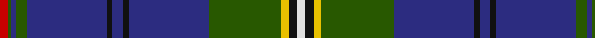

In pattern [RGBGBKBKBGYKW](/stripes/rgbgbkbkbgykw/).

This was sourced from tartans-authority.  It is a [13 stripe tartan](/stripes/stripes13/).

Original link http://www.tartansauthority.com/tartan-ferret/display/2598/

## Thread count
R/6 G2 DB4 G8 DB60 K4 DB8 K4 DB60 G54 Y6 K6 LN/6

## Palette
Each colour and the base-6 reference it is a variant of.

| Colour | Shade | Base |
|---|---|---|
| DB | <code style="background-color:#2C2C80;">#2C2C80</code> `oklch(35.0% 0.138 276.6)` <small>#2C2C80</small> | B <code style="background-color:#2A418A;">#2A418A</code> |
| G | <code style="background-color:#285800;">#285800</code> `oklch(41.0% 0.122 135.8)` <small>#285800</small> | G <code style="background-color:#006100;">#006100</code> |
| K | <code style="background-color:#101010;">#101010</code> `oklch(17.3% 0.000 89.9)` <small>#101010</small> | K <code style="background-color:#000000;">#000000</code> |
| LN | <code style="background-color:#E0E0E0;">#E0E0E0</code> `oklch(90.7% 0.000 89.9)` <small>#E0E0E0</small> | W <code style="background-color:#F7F7F7;">#F7F7F7</code> |
| R | <code style="background-color:#C80000;">#C80000</code> `oklch(52.3% 0.215 29.2)` <small>#C80000</small> | R <code style="background-color:#CC0000;">#CC0000</code> |
| Y | <code style="background-color:#E8C000;">#E8C000</code> `oklch(81.9% 0.168 93.7)` <small>#E8C000</small> | Y <code style="background-color:#F2BF00;">#F2BF00</code> |

## Nearest tartans

The nearest existing variants by ΔTartan distance, with this tartan at the top so the swatches line up against it.

ΔTartan

Tartan

Sett

—

<a href="/ttd/edit/#slug=r3dg1db2dg4db30k2db4k2db30dg27ly3k3w3~x2">Joss (Clan)</a> <a class="nn-out" href="/setts/s13/r3dg1db2dg4db30k2db4k2db30dg27ly3k3w3~x2/" title="open its dictionary page">↗</a>

0.77

<a href="/ttd/edit/#slug=db76p6k6db24g17k4r10k4g17db4k2w6">Scottish Heritage Society (Corporate</a> <a class="nn-out" href="/setts/s12/db76p6k6db24g17k4r10k4g17db4k2w6/" title="open its dictionary page">↗</a>

0.83

<a href="/ttd/edit/#slug=db40g10lo1g5r5w1r2w1r5g5lo1g10db40ly2~x2">St. Andrew Quebec City</a> <a class="nn-out" href="/setts/s14/db40g10lo1g5r5w1r2w1r5g5lo1g10db40ly2~x2/" title="open its dictionary page">↗</a>

0.92

<a href="/ttd/edit/#slug=o2dt1b2dt2r1b12dt2r1r10dt28b1dt3b2dt3w1~x2">Northfield Academy</a> <a class="nn-out" href="/setts/s15/o2dt1b2dt2r1b12dt2r1r10dt28b1dt3b2dt3w1~x2/" title="open its dictionary page">↗</a>

0.96

<a href="/ttd/edit/#slug=g10db9dp4r2dp4g6k10w4g24db60k4">Huaum, Patrick Antoine (Personal))</a> <a class="nn-out" href="/setts/s11/g10db9dp4r2dp4g6k10w4g24db60k4/" title="open its dictionary page">↗</a>

1.00

<a href="/ttd/edit/#slug=db25w2k2db15lo2db1lo2db15k2w2dg16r1~x2">Quigley of Knockcroghery (Modern)</a> <a class="nn-out" href="/setts/s12/db25w2k2db15lo2db1lo2db15k2w2dg16r1~x2/" title="open its dictionary page">↗</a>

1.00

<a href="/ttd/edit/#slug=db23g4db1w1db3g5db1dp4db3ly1g3w1g4~x4">Riyadh Caledonian (Corporate)</a> <a class="nn-out" href="/setts/s13/db23g4db1w1db3g5db1dp4db3ly1g3w1g4~x4/" title="open its dictionary page">↗</a>

1.01

<a href="/ttd/edit/#slug=db60lo2db10k9lb2k2r2k2g28lo3~x2">Wcwm 9275-1510-1</a> <a class="nn-out" href="/setts/s10/db60lo2db10k9lb2k2r2k2g28lo3~x2/" title="open its dictionary page">↗</a>

1.02

<a href="/ttd/edit/#slug=r3g1db2g4db30k2db4k2db30g27ly3k3w3~x2">Joss</a> <a class="nn-out" href="/setts/s13/r3g1db2g4db30k2db4k2db30g27ly3k3w3~x2/" title="open its dictionary page">↗</a>

1.07

<a href="/ttd/edit/#slug=k2o4dt27ly3dt12o2k2r7k2o1dt1k2dt2~x2">Brough from Orkney (Name)</a> <a class="nn-out" href="/setts/s13/k2o4dt27ly3dt12o2k2r7k2o1dt1k2dt2~x2/" title="open its dictionary page">↗</a>

1.11

<a href="/ttd/edit/#slug=db25w2k2db15lo2db1lo2db15k2w2g16r1~x2">Quigley of Knockcroghery (Pers)</a> <a class="nn-out" href="/setts/s12/db25w2k2db15lo2db1lo2db15k2w2g16r1~x2/" title="open its dictionary page">↗</a>

## Neighbour map

Every grey dot is one of 14299 variants placed by the first two principal components of the ΔTartan feature space (44% of its variance). Red is this tartan; blue dots are its nearest — click one to open its page.

<svg viewBox="0 0 640 380" role="img" style="max-width:100%;height:auto;border:1px solid #e0e0e0;border-radius:4px;display:block" xmlns="http://www.w3.org/2000/svg"><image href="/nn/cloud.v1.png" width="640" height="380"/><a href="/setts/s12/db76p6k6db24g17k4r10k4g17db4k2w6/"><circle cx="352.3" cy="87.2" r="4" fill="#3465a4"><title>Scottish Heritage Society (Corporate</title></circle></a><a href="/setts/s14/db40g10lo1g5r5w1r2w1r5g5lo1g10db40ly2~x2/"><circle cx="387.1" cy="74.4" r="4" fill="#3465a4"><title>St. Andrew Quebec City</title></circle></a><a href="/setts/s15/o2dt1b2dt2r1b12dt2r1r10dt28b1dt3b2dt3w1~x2/"><circle cx="315.5" cy="74.0" r="4" fill="#3465a4"><title>Northfield Academy</title></circle></a><a href="/setts/s11/g10db9dp4r2dp4g6k10w4g24db60k4/"><circle cx="304.1" cy="105.1" r="4" fill="#3465a4"><title>Huaum, Patrick Antoine (Personal))</title></circle></a><a href="/setts/s12/db25w2k2db15lo2db1lo2db15k2w2dg16r1~x2/"><circle cx="370.4" cy="117.2" r="4" fill="#3465a4"><title>Quigley of Knockcroghery (Modern)</title></circle></a><a href="/setts/s13/db23g4db1w1db3g5db1dp4db3ly1g3w1g4~x4/"><circle cx="353.0" cy="117.0" r="4" fill="#3465a4"><title>Riyadh Caledonian (Corporate)</title></circle></a><a href="/setts/s10/db60lo2db10k9lb2k2r2k2g28lo3~x2/"><circle cx="349.0" cy="97.6" r="4" fill="#3465a4"><title>Wcwm 9275-1510-1</title></circle></a><a href="/setts/s13/r3g1db2g4db30k2db4k2db30g27ly3k3w3~x2/"><circle cx="321.0" cy="87.4" r="4" fill="#3465a4"><title>Joss</title></circle></a><a href="/setts/s13/k2o4dt27ly3dt12o2k2r7k2o1dt1k2dt2~x2/"><circle cx="373.1" cy="106.4" r="4" fill="#3465a4"><title>Brough from Orkney (Name)</title></circle></a><a href="/setts/s12/db25w2k2db15lo2db1lo2db15k2w2g16r1~x2/"><circle cx="375.8" cy="117.1" r="4" fill="#3465a4"><title>Quigley of Knockcroghery (Pers)</title></circle></a><circle cx="343.5" cy="97.8" r="5" fill="#c00000"/></svg>

ID: /setts/s13/r3dg1db2dg4db30k2db4k2db30dg27ly3k3w3~x2/
