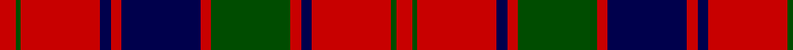

In pattern [RGRBRBRGRBRGR](/patterns/rgrbrbrgrbrgr/).

This was sourced from weddslist.  It is a [13 stripes tartan](/stripes/stripes13/).

Original link http://www.weddslist.com/cgi-bin/tartans/pg.pl?source=rb

## Thread count
R/6 G2 R30 DB4 R4 DB30 R4 G30 R4 DB4 R30 G2 R/6

## Palette
Each colour and its ΔE from the base-6 reference it is a variant of.

| Colour | Shade | Base | ΔE (OKLab) |
|---|---|---|---|
| DB | <code style="background-color:#00004C;">#00004C</code> `#00004C` | B <code style="background-color:#2A418A;">#2A418A</code> | 0.21 |
| G | <code style="background-color:#004C00;">#004C00</code> `#004C00` | G <code style="background-color:#006100;">#006100</code> | 0.07 |
| R | <code style="background-color:#C80000;">#C80000</code> `#C80000` | R <code style="background-color:#CC0000;">#CC0000</code> | 0.01 |

## Nearest tartans

The nearest existing variants by ΔTartan distance.

1. [Robertson D](/setts/s13/r5g2r30b3r3b30r3g30r3b3r30g2r5~b000052-g11450d-raa0000~x2/) — ΔT 0.80
1. [Robertson D](/setts/s13/r5g2r30b3r3b30r3g30r3b3r30g2r5~b000052-g11450d-raa0000/) — ΔT 0.80
1. [Robertson](/setts/s13/r1g1r9b1r1g9r1b9r1g1r9g1r1~b000064-g004c00-rc80000/) — ΔT 0.87
1. [Robertson 1819](/setts/s13/r3g3r35b3r3b35r3g35r3b3r35g3r3~b202060-g006818-rc80000~x2/) — ΔT 0.93
1. [Robertson #5](/setts/s12/r28g2r5g2r28b3r3g24r3b24r3b3~b2c4084-g005020-rdc0000~x2/) — ΔT 0.98
1. [Walkers Shortbread (Corporate)](/setts/s15/r5k1r2k2r16b2r2k9r2k2r2k13r2k2r4~b5c8ca8-k101010-rc80000~x2/) — ΔT 1.01
1. [Harry/Parry](/setts/s10/k6r3k3r15ra7k7ra5k17ra46r4~k000028-rbe7832-rac80028/) — ΔT 1.02
1. [Murray of Tullibardine - Artefact](/setts/s21/k4r3k3r4k22r4k3r3g4r3k3r44k30r10g10r40g30r27k10r14g3~g003820-k00002c-rc80000~x2/) — ΔT 1.08
1. [Harry (Welsh Name)](/setts/s10/b6r3b3r15ra7b7ra5b17ra46r4~b002c48-r888888-rac80000/) — ΔT 1.09
1. [Drummond of Megginch - 1969 Carpet](/setts/s15/r12b3r4b4r36w6r4b18r4g2r4g36r4b4r8~b000064-g004c00-rc80000-w98c8e8/) — ΔT 1.09

## Neighbour map

Every grey dot is one of 15726 variants placed by the first two principal components of the ΔTartan feature space (44% of its variance). Red is this tartan; blue dots are its nearest — click one to open its page.

<svg viewBox="0 0 640 380" role="img" style="max-width:100%;height:auto;border:1px solid #e0e0e0;border-radius:4px;display:block" xmlns="http://www.w3.org/2000/svg"><image href="/nn/cloud.v1.png" width="640" height="380"/><a href="/setts/s13/r5g2r30b3r3b30r3g30r3b3r30g2r5~b000052-g11450d-raa0000~x2/"><circle cx="338.7" cy="164.0" r="4" fill="#3465a4"><title>Robertson D</title></circle></a><a href="/setts/s13/r5g2r30b3r3b30r3g30r3b3r30g2r5~b000052-g11450d-raa0000/"><circle cx="338.7" cy="164.0" r="4" fill="#3465a4"><title>Robertson D</title></circle></a><a href="/setts/s13/r1g1r9b1r1g9r1b9r1g1r9g1r1~b000064-g004c00-rc80000/"><circle cx="292.4" cy="173.5" r="4" fill="#3465a4"><title>Robertson</title></circle></a><a href="/setts/s13/r3g3r35b3r3b35r3g35r3b3r35g3r3~b202060-g006818-rc80000~x2/"><circle cx="318.7" cy="161.8" r="4" fill="#3465a4"><title>Robertson 1819</title></circle></a><a href="/setts/s12/r28g2r5g2r28b3r3g24r3b24r3b3~b2c4084-g005020-rdc0000~x2/"><circle cx="343.4" cy="165.1" r="4" fill="#3465a4"><title>Robertson #5</title></circle></a><a href="/setts/s15/r5k1r2k2r16b2r2k9r2k2r2k13r2k2r4~b5c8ca8-k101010-rc80000~x2/"><circle cx="351.6" cy="153.0" r="4" fill="#3465a4"><title>Walkers Shortbread (Corporate)</title></circle></a><a href="/setts/s10/k6r3k3r15ra7k7ra5k17ra46r4~k000028-rbe7832-rac80028/"><circle cx="314.9" cy="154.1" r="4" fill="#3465a4"><title>Harry/Parry</title></circle></a><a href="/setts/s21/k4r3k3r4k22r4k3r3g4r3k3r44k30r10g10r40g30r27k10r14g3~g003820-k00002c-rc80000~x2/"><circle cx="318.9" cy="138.4" r="4" fill="#3465a4"><title>Murray of Tullibardine - Artefact</title></circle></a><a href="/setts/s10/b6r3b3r15ra7b7ra5b17ra46r4~b002c48-r888888-rac80000/"><circle cx="338.1" cy="164.7" r="4" fill="#3465a4"><title>Harry (Welsh Name)</title></circle></a><a href="/setts/s15/r12b3r4b4r36w6r4b18r4g2r4g36r4b4r8~b000064-g004c00-rc80000-w98c8e8/"><circle cx="288.1" cy="120.9" r="4" fill="#3465a4"><title>Drummond of Megginch - 1969 Carpet</title></circle></a><circle cx="320.3" cy="158.8" r="5" fill="#c00000"/></svg>

ID: /setts/s13/r3g1r15b2r2b15r2g15r2b2r15g1r3~b00004c-g004c00-rc80000~x2/
