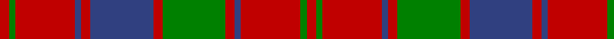

This page is one **sett** — a single exact thread-count. It belongs to the [tartan](/tartans/r3g2r19db2r3db20r3g20r3db2r19g2r3/)
(the same proportion at any scale), whose colour order is pattern [RGRBRBRGRBRGR](/stripes/rgrbrbrgrbrgr/).

Sourced from weddslist.  It is a [13 stripe tartan](/stripes/stripes13/).

Original link http://www.weddslist.com/cgi-bin/tartans/pg.pl?source=sts

## Thread count
R/12 G8 R76 B8 R12 G80 R12 B80 R12 B8 R76 G8 R/12

## Palette

Palette: <strong>custom</strong>
<table><thead><tr><th>Colour</th><th>Threads</th><th>Shade</th><th>Base</th><th>OKLCh</th></tr></thead><tbody><tr><td>R/</td><td style="text-align:right;font-variant-numeric:tabular-nums">12</td><td><code style="background-color:#C00000;">#C00000</code> <small style="color:#888">#C00000</small></td><td>R <code style="background-color:#CC0000;">#CC0000</code></td><td><small style="color:#888">oklch(50.7% 0.208 29.2)</small></td></tr><tr><td>G</td><td style="text-align:right;font-variant-numeric:tabular-nums">8</td><td><code style="background-color:#008000;">#008000</code> <small style="color:#888">#008000</small></td><td>G <code style="background-color:#006100;">#006100</code></td><td><small style="color:#888">oklch(52.0% 0.177 142.5)</small></td></tr><tr><td>R</td><td style="text-align:right;font-variant-numeric:tabular-nums">76</td><td><code style="background-color:#C00000;">#C00000</code> <small style="color:#888">#C00000</small></td><td>R <code style="background-color:#CC0000;">#CC0000</code></td><td><small style="color:#888">oklch(50.7% 0.208 29.2)</small></td></tr><tr><td>B</td><td style="text-align:right;font-variant-numeric:tabular-nums">8</td><td><code style="background-color:#304080;">#304080</code> <small style="color:#888">#304080</small></td><td>B <code style="background-color:#2A418A;">#2A418A</code></td><td><small style="color:#888">oklch(39.4% 0.109 270.2)</small></td></tr><tr><td>R</td><td style="text-align:right;font-variant-numeric:tabular-nums">12</td><td><code style="background-color:#C00000;">#C00000</code> <small style="color:#888">#C00000</small></td><td>R <code style="background-color:#CC0000;">#CC0000</code></td><td><small style="color:#888">oklch(50.7% 0.208 29.2)</small></td></tr><tr><td>G</td><td style="text-align:right;font-variant-numeric:tabular-nums">80</td><td><code style="background-color:#008000;">#008000</code> <small style="color:#888">#008000</small></td><td>G <code style="background-color:#006100;">#006100</code></td><td><small style="color:#888">oklch(52.0% 0.177 142.5)</small></td></tr><tr><td>R</td><td style="text-align:right;font-variant-numeric:tabular-nums">12</td><td><code style="background-color:#C00000;">#C00000</code> <small style="color:#888">#C00000</small></td><td>R <code style="background-color:#CC0000;">#CC0000</code></td><td><small style="color:#888">oklch(50.7% 0.208 29.2)</small></td></tr><tr><td>B</td><td style="text-align:right;font-variant-numeric:tabular-nums">80</td><td><code style="background-color:#304080;">#304080</code> <small style="color:#888">#304080</small></td><td>B <code style="background-color:#2A418A;">#2A418A</code></td><td><small style="color:#888">oklch(39.4% 0.109 270.2)</small></td></tr><tr><td>R</td><td style="text-align:right;font-variant-numeric:tabular-nums">12</td><td><code style="background-color:#C00000;">#C00000</code> <small style="color:#888">#C00000</small></td><td>R <code style="background-color:#CC0000;">#CC0000</code></td><td><small style="color:#888">oklch(50.7% 0.208 29.2)</small></td></tr><tr><td>B</td><td style="text-align:right;font-variant-numeric:tabular-nums">8</td><td><code style="background-color:#304080;">#304080</code> <small style="color:#888">#304080</small></td><td>B <code style="background-color:#2A418A;">#2A418A</code></td><td><small style="color:#888">oklch(39.4% 0.109 270.2)</small></td></tr><tr><td>R</td><td style="text-align:right;font-variant-numeric:tabular-nums">76</td><td><code style="background-color:#C00000;">#C00000</code> <small style="color:#888">#C00000</small></td><td>R <code style="background-color:#CC0000;">#CC0000</code></td><td><small style="color:#888">oklch(50.7% 0.208 29.2)</small></td></tr><tr><td>G</td><td style="text-align:right;font-variant-numeric:tabular-nums">8</td><td><code style="background-color:#008000;">#008000</code> <small style="color:#888">#008000</small></td><td>G <code style="background-color:#006100;">#006100</code></td><td><small style="color:#888">oklch(52.0% 0.177 142.5)</small></td></tr><tr><td>R/</td><td style="text-align:right;font-variant-numeric:tabular-nums">12</td><td><code style="background-color:#C00000;">#C00000</code> <small style="color:#888">#C00000</small></td><td>R <code style="background-color:#CC0000;">#CC0000</code></td><td><small style="color:#888">oklch(50.7% 0.208 29.2)</small></td></tr></tbody></table>

## Nearest tartans

The nearest existing variants by ΔTartan distance, with this tartan at the top so the swatches line up against it.

ΔTartan

Tartan

Sett

—

<a href="/ttd/edit/#slug=r3g2r19db2r3db20r3g20r3db2r19g2r3~x4">Robertson, Curtain</a> <a class="nn-out" href="/setts/s13/r3g2r19db2r3db20r3g20r3db2r19g2r3~x4/" title="open its dictionary page">↗</a>

0.30

<a href="/ttd/edit/#slug=r1g1r9db1r1g9r1db9r1g1r9g1r1~x4">Robertson 3</a> <a class="nn-out" href="/setts/s13/r1g1r9db1r1g9r1db9r1g1r9g1r1~x4/" title="open its dictionary page">↗</a>

0.53

<a href="/ttd/edit/#slug=r1dg1r9dg1r1db9r1dg9r1db1r9dg1r1~x4">Robertson #3</a> <a class="nn-out" href="/setts/s13/r1dg1r9dg1r1db9r1dg9r1db1r9dg1r1~x4/" title="open its dictionary page">↗</a>

0.56

<a href="/ttd/edit/#slug=r3dg2r19db2r3dg20r3db20r3db2r19dg2r3~x4">Robertson Curtain</a> <a class="nn-out" href="/setts/s13/r3dg2r19db2r3dg20r3db20r3db2r19dg2r3~x4/" title="open its dictionary page">↗</a>

0.60

<a href="/ttd/edit/#slug=r45db4r4dg48r4db4r4db15r4db4r40dg4r4dg30">Bruce Old</a> <a class="nn-out" href="/setts/s14/r45db4r4dg48r4db4r4db15r4db4r40dg4r4dg30/" title="open its dictionary page">↗</a>

0.64

<a href="/ttd/edit/#slug=r45dp4r4g48r4dp4r4dp15r4dp4r40g4r4g30">Bruce Old Clan Tartan Tartan Number: 876. Earliest known date: 1797 An order dated 1797 in the Wilson's of Bannockburn papers requests '50 Ells Bruce sett tartan'. As no distinction is made between 'old' and 'new' we assume that the 'new' sett, which has much in common with this one, had not been introduced. (Reduced in proportion for illustration.) See products available Copyright © Blair Urquhart, Comrie, 2015</a> <a class="nn-out" href="/setts/s14/r45dp4r4g48r4dp4r4dp15r4dp4r40g4r4g30/" title="open its dictionary page">↗</a>

0.67

<a href="/ttd/edit/#slug=r4g4r35dp4r4dp35r4g35r4dp4r35g4r4">Robertson 1</a> <a class="nn-out" href="/setts/s13/r4g4r35dp4r4dp35r4g35r4dp4r35g4r4/" title="open its dictionary page">↗</a>

0.68

<a href="/ttd/edit/#slug=r3g3r35db3r3db35r3g35r3db3r35g3r3~x2">Robertson 1819</a> <a class="nn-out" href="/setts/s13/r3g3r35db3r3db35r3g35r3db3r35g3r3~x2/" title="open its dictionary page">↗</a>

0.72

<a href="/ttd/edit/#slug=db3r23db3r26db3r3db25r3g24r3~x2">Unidentified, Early 18th C</a> <a class="nn-out" href="/setts/s10/db3r23db3r26db3r3db25r3g24r3~x2/" title="open its dictionary page">↗</a>

0.88

<a href="/ttd/edit/#slug=r28dg2r5dg2r28db3r3dg24r3db24r3db3~x2">Robertson #5</a> <a class="nn-out" href="/setts/s12/r28dg2r5dg2r28db3r3dg24r3db24r3db3~x2/" title="open its dictionary page">↗</a>

0.92

<a href="/ttd/edit/#slug=r6g28r6dp2r6dp19r6dp2r6g28r6dp2~x2">Wilson's No.119</a> <a class="nn-out" href="/setts/s12/r6g28r6dp2r6dp19r6dp2r6g28r6dp2~x2/" title="open its dictionary page">↗</a>

## Neighbour map

Every grey dot is one of 14359 variants placed by the first two principal components of the ΔTartan feature space (44% of its variance). Red is this tartan; blue dots are its nearest — click one to open its page.

<svg viewBox="0 0 640 380" role="img" style="max-width:100%;height:auto;border:1px solid #e0e0e0;border-radius:4px;display:block" xmlns="http://www.w3.org/2000/svg"><image href="/nn/cloud.v1.png" width="640" height="380"/><a href="/setts/s13/r1g1r9db1r1g9r1db9r1g1r9g1r1~x4/"><circle cx="310.8" cy="179.1" r="4" fill="#3465a4"><title>Robertson 3</title></circle></a><a href="/setts/s13/r1dg1r9dg1r1db9r1dg9r1db1r9dg1r1~x4/"><circle cx="306.9" cy="173.9" r="4" fill="#3465a4"><title>Robertson #3</title></circle></a><a href="/setts/s13/r3dg2r19db2r3dg20r3db20r3db2r19dg2r3~x4/"><circle cx="314.4" cy="173.7" r="4" fill="#3465a4"><title>Robertson Curtain</title></circle></a><a href="/setts/s14/r45db4r4dg48r4db4r4db15r4db4r40dg4r4dg30/"><circle cx="318.5" cy="161.1" r="4" fill="#3465a4"><title>Bruce Old</title></circle></a><a href="/setts/s14/r45dp4r4g48r4dp4r4dp15r4dp4r40g4r4g30/"><circle cx="330.8" cy="165.8" r="4" fill="#3465a4"><title>Bruce Old Clan Tartan Tartan Number: 876. Earliest known date: 1797 An order dated 1797 in the Wilson's of Bannockburn papers requests '50 Ells Bruce sett tartan'. As no distinction is made between 'old' and 'new' we assume that the 'new' sett, which has much in common with this one, had not been introduced. (Reduced in proportion for illustration.) See products available Copyright © Blair Urquhart, Comrie, 2015</title></circle></a><a href="/setts/s13/r4g4r35dp4r4dp35r4g35r4dp4r35g4r4/"><circle cx="307.9" cy="175.3" r="4" fill="#3465a4"><title>Robertson 1</title></circle></a><a href="/setts/s13/r3g3r35db3r3db35r3g35r3db3r35g3r3~x2/"><circle cx="318.7" cy="161.2" r="4" fill="#3465a4"><title>Robertson 1819</title></circle></a><a href="/setts/s10/db3r23db3r26db3r3db25r3g24r3~x2/"><circle cx="300.9" cy="203.4" r="4" fill="#3465a4"><title>Unidentified, Early 18th C</title></circle></a><a href="/setts/s12/r28dg2r5dg2r28db3r3dg24r3db24r3db3~x2/"><circle cx="342.6" cy="163.6" r="4" fill="#3465a4"><title>Robertson #5</title></circle></a><a href="/setts/s12/r6g28r6dp2r6dp19r6dp2r6g28r6dp2~x2/"><circle cx="304.5" cy="180.0" r="4" fill="#3465a4"><title>Wilson's No.119</title></circle></a><circle cx="319.4" cy="179.4" r="5" fill="#c00000"/></svg>

ID: /setts/s13/r3g2r19db2r3db20r3g20r3db2r19g2r3~x4/
