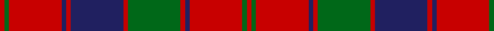

**Bands:** [RGRBRGRBRBRGR](/stripes/rgrbrgrbrbrgr/) · **Stripes:** [R G R DB R G R DB R DB R G R](/stripes/stripes13/) R G R DB R G R DB R DB R G R

This was sourced from register-of-tartans.  It is a [13 band tartan](/bands/bands13/).

Original link https://www.tartanregister.gov.uk/tartanDetails.aspx?ref=3527

## Also known as

This cloth is also recorded under:

- Robertson 1819

## Attestations

This cloth appears in 2 source records; the oldest owns this page.

- 01/01/1819 — Robertson 1819 (register-of-tartans, [record](https://www.tartanregister.gov.uk/tartanDetails.aspx?ref=3527))
- 1819 — Robertson - 1819 (Clan) (tartans-authority, [record](http://www.tartansauthority.com/tartan-ferret/display/1501/))

## Register references

External register numbers recorded for this tartan.

- Scottish Register of Tartans: [3527](https://www.tartanregister.gov.uk/tartanDetails.aspx?ref=3527)
- Scottish Tartans Authority (ITI): 1501
- Scottish Tartans World Register: 1501

## Variants

Other setts woven to the same stripe pattern.

- [Robertson, Curtain](/setts/s13/r3g2r19db2r3db20r3g20r3db2r19g2r3~x4/)

## Thread count
R/6 G6 R70 DB6 R6 DB70 R6 G70 R6 DB6 R70 G6 R/6

## Palette
Each colour and its ΔE from the base-6 reference it is a variant of.

| Colour | Shade | Base | ΔE (OKLab) |
|---|---|---|---|
| DB | <code style="background-color:#202060;">#202060</code> `#202060` | B <code style="background-color:#2A418A;">#2A418A</code> | 0.11 |
| G | <code style="background-color:#006818;">#006818</code> `#006818` | G <code style="background-color:#006100;">#006100</code> | 0.02 |
| R | <code style="background-color:#C80000;">#C80000</code> `#C80000` | R <code style="background-color:#CC0000;">#CC0000</code> | 0.01 |

## Nearest tartans

The nearest existing variants by ΔTartan distance.

1. [Bruce Old](/setts/s14/r45db4r4dg48r4db4r4db15r4db4r40dg4r4dg30/) — ΔT 0.51
1. [Robertson #3](/setts/s13/r1dg1r9dg1r1db9r1dg9r1db1r9dg1r1~x4/) — ΔT 0.54
1. [Robertson Curtain](/setts/s13/r3dg2r19db2r3dg20r3db20r3db2r19dg2r3~x4/) — ΔT 0.61
1. [Robertson 1](/setts/s13/r4g4r35dp4r4dp35r4g35r4dp4r35g4r4/) — ΔT 0.65
1. [Robertson, Curtain](/setts/s13/r3g2r19db2r3db20r3g20r3db2r19g2r3~x4/) — ΔT 0.68
1. [Robertson](/setts/s13/r1dg1r9dg1r1db9r1dg9r1db1r9dg1r1/) — ΔT 0.72
1. [Robertson 3](/setts/s13/r1g1r9db1r1g9r1db9r1g1r9g1r1~x4/) — ΔT 0.73
1. [Robertson #5](/setts/s12/r28dg2r5dg2r28db3r3dg24r3db24r3db3~x2/) — ΔT 0.78
1. [Bruce Old Clan Tartan Tartan Number: 876. Earliest known date: 1797 An order dated 1797 in the Wilson's of Bannockburn papers requests '50 Ells Bruce sett tartan'. As no distinction is made between 'old' and 'new' we assume that the 'new' sett, which has much in common with this one, had not been introduced. (Reduced in proportion for illustration.) See products available Copyright © Blair Urquhart, Comrie, 2015](/setts/s14/r45dp4r4g48r4dp4r4dp15r4dp4r40g4r4g30/) — ΔT 0.81
1. [Harry (Welsh Name)](/setts/s10/dt6o3dt3o15r7dt7r5dt17r46o4/) — ΔT 0.84

## Neighbour map

Every grey dot is one of 14299 variants placed by the first two principal components of the ΔTartan feature space (44% of its variance). Red is this tartan; blue dots are its nearest — click one to open its page.

<svg viewBox="0 0 640 380" role="img" style="max-width:100%;height:auto;border:1px solid #e0e0e0;border-radius:4px;display:block" xmlns="http://www.w3.org/2000/svg"><image href="/nn/cloud.v1.png" width="640" height="380"/><a href="/setts/s14/r45db4r4dg48r4db4r4db15r4db4r40dg4r4dg30/"><circle cx="319.3" cy="160.5" r="4" fill="#3465a4"><title>Bruce Old</title></circle></a><a href="/setts/s13/r1dg1r9dg1r1db9r1dg9r1db1r9dg1r1~x4/"><circle cx="307.8" cy="173.2" r="4" fill="#3465a4"><title>Robertson #3</title></circle></a><a href="/setts/s13/r3dg2r19db2r3dg20r3db20r3db2r19dg2r3~x4/"><circle cx="315.3" cy="172.9" r="4" fill="#3465a4"><title>Robertson Curtain</title></circle></a><a href="/setts/s13/r4g4r35dp4r4dp35r4g35r4dp4r35g4r4/"><circle cx="308.8" cy="174.6" r="4" fill="#3465a4"><title>Robertson 1</title></circle></a><a href="/setts/s13/r3g2r19db2r3db20r3g20r3db2r19g2r3~x4/"><circle cx="320.2" cy="178.8" r="4" fill="#3465a4"><title>Robertson, Curtain</title></circle></a><a href="/setts/s13/r1dg1r9dg1r1db9r1dg9r1db1r9dg1r1/"><circle cx="293.6" cy="171.0" r="4" fill="#3465a4"><title>Robertson</title></circle></a><a href="/setts/s13/r1g1r9db1r1g9r1db9r1g1r9g1r1~x4/"><circle cx="311.6" cy="178.4" r="4" fill="#3465a4"><title>Robertson 3</title></circle></a><a href="/setts/s12/r28dg2r5dg2r28db3r3dg24r3db24r3db3~x2/"><circle cx="343.6" cy="163.0" r="4" fill="#3465a4"><title>Robertson #5</title></circle></a><a href="/setts/s14/r45dp4r4g48r4dp4r4dp15r4dp4r40g4r4g30/"><circle cx="331.7" cy="165.3" r="4" fill="#3465a4"><title>Bruce Old Clan Tartan Tartan Number: 876. Earliest known date: 1797 An order dated 1797 in the Wilson's of Bannockburn papers requests '50 Ells Bruce sett tartan'. As no distinction is made between 'old' and 'new' we assume that the 'new' sett, which has much in common with this one, had not been introduced. (Reduced in proportion for illustration.) See products available Copyright © Blair Urquhart, Comrie, 2015</title></circle></a><a href="/setts/s10/dt6o3dt3o15r7dt7r5dt17r46o4/"><circle cx="338.5" cy="162.9" r="4" fill="#3465a4"><title>Harry (Welsh Name)</title></circle></a><circle cx="319.5" cy="160.5" r="5" fill="#c00000"/></svg>

ID: /setts/s13/r3g3r35db3r3db35r3g35r3db3r35g3r3~x2/
