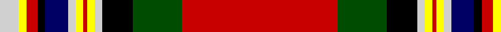

**Bands:** [RGKWYRYWBKRYW](/stripes/rgkwyrywbkryw/) · **Stripes:** [R DG K LB LY R LY LB DB K R LY LB](/stripes/stripes13/) R DG K LB LY R LY LB DB K R LY LB

This was sourced from weddslist.  It is a [13 band tartan](/bands/bands13/).

Original link http://www.weddslist.com/cgi-bin/tartans/pg.pl?source=rb

## Register references

External register numbers recorded for this tartan.

- Scottish Register of Tartans: [2540](https://www.tartanregister.gov.uk/tartanDetails.aspx?ref=2540)
- Scottish Register of Tartans: [2666](https://www.tartanregister.gov.uk/tartanDetails.aspx?ref=2666)
- Scottish Register of Tartans: [3808](https://www.tartanregister.gov.uk/tartanDetails.aspx?ref=3808)
- Scottish Tartans Authority (ITI): 218
- Scottish Tartans World Register: 1010
- Scottish Tartans World Register: 1585
- Scottish Tartans World Register: 218

## Thread count
N/10 Y4 R6 K4 DB12 N4 Y4 R2 Y4 N4 K16 G26 R/82

## Palette
Each colour and its ΔE from the base-6 reference it is a variant of.

| Colour | Shade | Base | ΔE (OKLab) |
|---|---|---|---|
| DB | <code style="background-color:#000064;">#000064</code> `#000064` | B <code style="background-color:#2A418A;">#2A418A</code> | 0.18 |
| G | <code style="background-color:#004C00;">#004C00</code> `#004C00` | G <code style="background-color:#006100;">#006100</code> | 0.07 |
| K | <code style="background-color:#000000;">#000000</code> `#000000` | K <code style="background-color:#000000;">#000000</code> | 0.00 |
| N | <code style="background-color:#D0D0D0;">#D0D0D0</code> `#D0D0D0` | W <code style="background-color:#F7F7F7;">#F7F7F7</code> | 0.12 |
| R | <code style="background-color:#C80000;">#C80000</code> `#C80000` | R <code style="background-color:#CC0000;">#CC0000</code> | 0.01 |
| Y | <code style="background-color:#FFFF00;">#FFFF00</code> `#FFFF00` | Y <code style="background-color:#F2BF00;">#F2BF00</code> | 0.16 |

## Nearest tartans

The nearest existing variants by ΔTartan distance.

1. [Celtic Nations](/setts/s12/db3r2db2r35ly2db3k2db5k4g13k1w3~x2/) — ΔT 0.84
1. [Chattan, Clan](/setts/s16/r120k4w2g32w4k7r7k2r7k7w4t32k8r8k12w4/) — ΔT 0.89
1. [MacGill](/setts/s13/r28g10k7w2ly2r1ly2w2db5k2r2ly2w3~x4/) — ΔT 0.98
1. [MacGill](/setts/s13/r48g16k8w3ly3r2o3w3db8k1r4ly4w3~x2/) — ΔT 1.00
1. [Celtic Nations (Fashion)](/setts/s12/db3r2db2r35lo2db3k2db5k4g13k1w3~x2/) — ΔT 1.03
1. [Royal Stewart](/setts/s11/r64t12k16ly2k4w3dg32r8k4r3w2~x2/) — ΔT 1.04
1. [MacGill Clan Tartan Tartan Number: 1487. Earliest known date: pre 1745 This sample comes from the MacGregor-Hastie collection which forms the basis of the cloth archive of the Scottish Tartans Society. One can assume that the sample dates between 1930 and 1950. The family tartan, which originated with the MacGills of Jura, was in use before 1745 but when tartan was proscribed the sett seemed to have been lost until a piece was discovered in Kintyre. It is now in the Museum of Antiquities, Edinburgh. The current version, which first appeared in 1930, is known as the MacGill Society tartan. See products available Copyright © Blair Urquhart, Comrie, 2015](/setts/s13/r47g16k8w3ly3r2ly3w3db6k3r4ly4w3~x2/) — ΔT 1.08
1. [Hawick (Trade Sett)](/setts/s20/w2k2w3g4r2k2ly2k3b2r32b2k3ly2k2r2g4w3k2w2r1~x2/) — ΔT 1.10
1. [Drummond, Relic](/setts/s12/r26w1k8ly1g13k1w4k1ly2k4t3r8~x4/) — ΔT 1.13
1. [Drummond Relic](/setts/s12/r26w1k8ly1dg13k1w4k1ly2k4t3r8~x4/) — ΔT 1.14

## Neighbour map

Every grey dot is one of 14313 variants placed by the first two principal components of the ΔTartan feature space (44% of its variance). Red is this tartan; blue dots are its nearest — click one to open its page.

<svg viewBox="0 0 640 380" role="img" style="max-width:100%;height:auto;border:1px solid #e0e0e0;border-radius:4px;display:block" xmlns="http://www.w3.org/2000/svg"><image href="/nn/cloud.v1.png" width="640" height="380"/><a href="/setts/s12/db3r2db2r35ly2db3k2db5k4g13k1w3~x2/"><circle cx="256.4" cy="33.9" r="4" fill="#3465a4"><title>Celtic Nations</title></circle></a><a href="/setts/s16/r120k4w2g32w4k7r7k2r7k7w4t32k8r8k12w4/"><circle cx="313.1" cy="14.0" r="4" fill="#3465a4"><title>Chattan, Clan</title></circle></a><a href="/setts/s13/r28g10k7w2ly2r1ly2w2db5k2r2ly2w3~x4/"><circle cx="220.1" cy="49.5" r="4" fill="#3465a4"><title>MacGill</title></circle></a><a href="/setts/s13/r48g16k8w3ly3r2o3w3db8k1r4ly4w3~x2/"><circle cx="261.4" cy="14.0" r="4" fill="#3465a4"><title>MacGill</title></circle></a><a href="/setts/s12/db3r2db2r35lo2db3k2db5k4g13k1w3~x2/"><circle cx="280.6" cy="50.3" r="4" fill="#3465a4"><title>Celtic Nations (Fashion)</title></circle></a><a href="/setts/s11/r64t12k16ly2k4w3dg32r8k4r3w2~x2/"><circle cx="266.7" cy="60.7" r="4" fill="#3465a4"><title>Royal Stewart</title></circle></a><a href="/setts/s13/r47g16k8w3ly3r2ly3w3db6k3r4ly4w3~x2/"><circle cx="254.9" cy="51.5" r="4" fill="#3465a4"><title>MacGill Clan Tartan Tartan Number: 1487. Earliest known date: pre 1745 This sample comes from the MacGregor-Hastie collection which forms the basis of the cloth archive of the Scottish Tartans Society. One can assume that the sample dates between 1930 and 1950. The family tartan, which originated with the MacGills of Jura, was in use before 1745 but when tartan was proscribed the sett seemed to have been lost until a piece was discovered in Kintyre. It is now in the Museum of Antiquities, Edinburgh. The current version, which first appeared in 1930, is known as the MacGill Society tartan. See products available Copyright © Blair Urquhart, Comrie, 2015</title></circle></a><a href="/setts/s20/w2k2w3g4r2k2ly2k3b2r32b2k3ly2k2r2g4w3k2w2r1~x2/"><circle cx="242.5" cy="14.0" r="4" fill="#3465a4"><title>Hawick (Trade Sett)</title></circle></a><a href="/setts/s12/r26w1k8ly1g13k1w4k1ly2k4t3r8~x4/"><circle cx="217.1" cy="65.6" r="4" fill="#3465a4"><title>Drummond, Relic</title></circle></a><a href="/setts/s12/r26w1k8ly1dg13k1w4k1ly2k4t3r8~x4/"><circle cx="230.0" cy="67.5" r="4" fill="#3465a4"><title>Drummond Relic</title></circle></a><circle cx="263.2" cy="24.7" r="5" fill="#c00000"/></svg>

ID: /setts/s13/r41dg13k8lb2ly2r1ly2lb2db6k2r3ly2lb5~x2/
