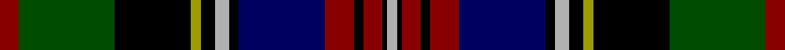

In pattern [RGKYKYKBRKRKY](/stripes/rgkykykbrkrky/).

This was sourced from register-of-tartans.  It is a [13 stripe tartan](/stripes/stripes13/).

Original link https://www.tartanregister.gov.uk/tartanDetails.aspx?ref=1307

## Attestations

This cloth appears in 2 source records; the oldest owns this page.

- 01/01/2002 — Galt, Alexander, Sir (register-of-tartans, [record](https://www.tartanregister.gov.uk/tartanDetails.aspx?ref=1307))
- pre 2002 — Galt, Alexander, Sir (Commemorative) (tartans-authority, [record](http://www.tartansauthority.com/tartan-ferret/display/1482/))

## Register references

External register numbers recorded for this tartan.

- Scottish Register of Tartans: [1307](https://www.tartanregister.gov.uk/tartanDetails.aspx?ref=1307)
- Scottish Tartans Authority (ITI): 1482
- Scottish Tartans World Register: 1482

## Thread count
DR/16 G80 K64 LG8 K12 N12 K8 DB72 DR24 K8 DR16 K4 N/8

## Palette
Each colour and the base-6 reference it is a variant of.

| Colour | Shade | Base |
|---|---|---|
| DB | <code style="background-color:#000060;">#000060</code> `oklch(22.1% 0.153 264.1)` <small>#000060</small> | B <code style="background-color:#2A418A;">#2A418A</code> |
| DR | <code style="background-color:#880000;">#880000</code> `oklch(39.4% 0.162 29.2)` <small>#880000</small> | R <code style="background-color:#CC0000;">#CC0000</code> |
| G | <code style="background-color:#004C00;">#004C00</code> `oklch(36.1% 0.123 142.5)` <small>#004C00</small> | G <code style="background-color:#006100;">#006100</code> |
| K | <code style="background-color:#000000;">#000000</code> `oklch(0.0% 0.000 0.0)` <small>#000000</small> | K <code style="background-color:#000000;">#000000</code> |
| LG | <code style="background-color:#9C9C00;">#9C9C00</code> `oklch(67.1% 0.146 109.8)` <small>#9C9C00</small> | Y <code style="background-color:#F2BF00;">#F2BF00</code> |
| N | <code style="background-color:#B0B0B0;">#B0B0B0</code> `oklch(75.7% 0.000 89.9)` <small>#B0B0B0</small> | Y <code style="background-color:#F2BF00;">#F2BF00</code> |

## Nearest tartans

The nearest existing variants by ΔTartan distance, with this tartan at the top so the swatches line up against it.

ΔTartan

Tartan

Sett

—

<a href="/ttd/edit/#slug=r4dg20k16ly2k3lr3k2db18r6k2r4k1lr2~x4">Galt, Alexander, Sir</a> <a class="nn-out" href="/setts/s13/r4dg20k16ly2k3lr3k2db18r6k2r4k1lr2~x4/" title="open its dictionary page">↗</a>

0.69

<a href="/ttd/edit/#slug=r4dg20k16ly2k3lb3k2n18r6k2r4k1lb2~x4">Tilley, Sir Samuel Leonard</a> <a class="nn-out" href="/setts/s13/r4dg20k16ly2k3lb3k2n18r6k2r4k1lb2~x4/" title="open its dictionary page">↗</a>

1.03

<a href="/ttd/edit/#slug=dg19k20m1db8b8dg8db3m1lb12k8m1lb1~x2">Vine (2015)</a> <a class="nn-out" href="/setts/s12/dg19k20m1db8b8dg8db3m1lb12k8m1lb1~x2/" title="open its dictionary page">↗</a>

1.17

<a href="/ttd/edit/#slug=w3db3r1db3r1db15r1db2g15lo1g2k20lo1k2lo2~x2">Linn (Personal)</a> <a class="nn-out" href="/setts/s15/w3db3r1db3r1db15r1db2g15lo1g2k20lo1k2lo2~x2/" title="open its dictionary page">↗</a>

1.21

<a href="/ttd/edit/#slug=dg16r2dg2r7dg31lb3k32r2db31r7db2r2db16~x2">Clanranald, MacDonald of</a> <a class="nn-out" href="/setts/s13/dg16r2dg2r7dg31lb3k32r2db31r7db2r2db16~x2/" title="open its dictionary page">↗</a>

1.23

<a href="/ttd/edit/#slug=r4g22k16ly2k3w3k2db20r8k2r4k1w2~x2">Galt, Sir Alexander..</a> <a class="nn-out" href="/setts/s13/r4g22k16ly2k3w3k2db20r8k2r4k1w2~x2/" title="open its dictionary page">↗</a>

1.23

<a href="/ttd/edit/#slug=r6db3r2db2r2db16k12dg16r1dg1ly2~x2">Logan and MacLennan</a> <a class="nn-out" href="/setts/s11/r6db3r2db2r2db16k12dg16r1dg1ly2~x2/" title="open its dictionary page">↗</a>

1.23

<a href="/ttd/edit/#slug=dg8r1dg1r3dg16k16r1db16r3db8ly2">Cameron of Erracht</a> <a class="nn-out" href="/setts/s11/dg8r1dg1r3dg16k16r1db16r3db8ly2/" title="open its dictionary page">↗</a>

1.25

<a href="/ttd/edit/#slug=db2r2db2r2db20k24g12ly1k2g2t2~x2">Unidentified 26</a> <a class="nn-out" href="/setts/s11/db2r2db2r2db20k24g12ly1k2g2t2~x2/" title="open its dictionary page">↗</a>

1.25

<a href="/ttd/edit/#slug=k4r1k3r2ly3k12dg10dg18db3o3db3~x2">Blake, William &amp; Agnes (Australia)</a> <a class="nn-out" href="/setts/s11/k4r1k3r2ly3k12dg10dg18db3o3db3~x2/" title="open its dictionary page">↗</a>

1.25

<a href="/ttd/edit/#slug=r5dg30k6ly2k3b5k12r8k3r3lr3~x2">King George (Nash)</a> <a class="nn-out" href="/setts/s11/r5dg30k6ly2k3b5k12r8k3r3lr3~x2/" title="open its dictionary page">↗</a>

## Neighbour map

Every grey dot is one of 14299 variants placed by the first two principal components of the ΔTartan feature space (44% of its variance). Red is this tartan; blue dots are its nearest — click one to open its page.

<svg viewBox="0 0 640 380" role="img" style="max-width:100%;height:auto;border:1px solid #e0e0e0;border-radius:4px;display:block" xmlns="http://www.w3.org/2000/svg"><image href="/nn/cloud.v1.png" width="640" height="380"/><a href="/setts/s13/r4dg20k16ly2k3lb3k2n18r6k2r4k1lb2~x4/"><circle cx="112.5" cy="101.3" r="4" fill="#3465a4"><title>Tilley, Sir Samuel Leonard</title></circle></a><a href="/setts/s12/dg19k20m1db8b8dg8db3m1lb12k8m1lb1~x2/"><circle cx="102.7" cy="117.1" r="4" fill="#3465a4"><title>Vine (2015)</title></circle></a><a href="/setts/s15/w3db3r1db3r1db15r1db2g15lo1g2k20lo1k2lo2~x2/"><circle cx="159.2" cy="90.4" r="4" fill="#3465a4"><title>Linn (Personal)</title></circle></a><a href="/setts/s13/dg16r2dg2r7dg31lb3k32r2db31r7db2r2db16~x2/"><circle cx="168.2" cy="143.4" r="4" fill="#3465a4"><title>Clanranald, MacDonald of</title></circle></a><a href="/setts/s13/r4g22k16ly2k3w3k2db20r8k2r4k1w2~x2/"><circle cx="99.4" cy="87.4" r="4" fill="#3465a4"><title>Galt, Sir Alexander..</title></circle></a><a href="/setts/s11/r6db3r2db2r2db16k12dg16r1dg1ly2~x2/"><circle cx="147.9" cy="135.5" r="4" fill="#3465a4"><title>Logan and MacLennan</title></circle></a><a href="/setts/s11/dg8r1dg1r3dg16k16r1db16r3db8ly2/"><circle cx="159.7" cy="153.9" r="4" fill="#3465a4"><title>Cameron of Erracht</title></circle></a><a href="/setts/s11/db2r2db2r2db20k24g12ly1k2g2t2~x2/"><circle cx="183.5" cy="95.0" r="4" fill="#3465a4"><title>Unidentified 26</title></circle></a><a href="/setts/s11/k4r1k3r2ly3k12dg10dg18db3o3db3~x2/"><circle cx="91.6" cy="110.1" r="4" fill="#3465a4"><title>Blake, William &amp; Agnes (Australia)</title></circle></a><a href="/setts/s11/r5dg30k6ly2k3b5k12r8k3r3lr3~x2/"><circle cx="160.2" cy="120.9" r="4" fill="#3465a4"><title>King George (Nash)</title></circle></a><circle cx="120.8" cy="108.7" r="5" fill="#c00000"/></svg>

ID: /setts/s13/r4dg20k16ly2k3lr3k2db18r6k2r4k1lr2~x4/
