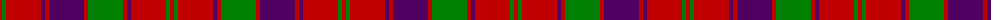

In pattern [RGRBRBRGRBRGR](/patterns/rgrbrbrgrbrgr/).

This was sourced from weddslist.  It is a [13 stripes tartan](/stripes/stripes13/).

Original link http://www.weddslist.com/cgi-bin/tartans/pg.pl?source=sts

## Thread count
R/4 G4 R35 DP4 R4 DP35 R4 G35 R4 DP4 R35 G4 R/4

## Palette
Each colour and its ΔE from the base-6 reference it is a variant of.

| Colour | Shade | Base | ΔE (OKLab) |
|---|---|---|---|
| DP | <code style="background-color:#500060;">#500060</code> `#500060` | B <code style="background-color:#2C4084;">#2C4084</code> | 0.14 |
| G | <code style="background-color:#008000;">#008000</code> `#008000` | G <code style="background-color:#006400;">#006400</code> | 0.09 |
| R | <code style="background-color:#C00000;">#C00000</code> `#C00000` | R <code style="background-color:#C80000;">#C80000</code> | 0.02 |

ID: /setts/s13/r4g4r35b4r4b35r4g35r4b4r35g4r4-b500060-g008000-rc00000/
