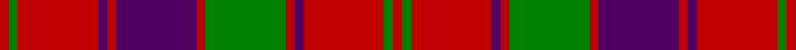

In pattern [RGRBRBRGRBRGR](/stripes/rgrbrbrgrbrgr/).

This was sourced from weddslist.  It is a [13 stripe tartan](/stripes/stripes13/).

Original link http://www.weddslist.com/cgi-bin/tartans/pg.pl?source=sts

## Thread count
R/4 G4 R35 DP4 R4 DP35 R4 G35 R4 DP4 R35 G4 R/4

## Palette
Each colour and the base-6 reference it is a variant of.

| Colour | Shade | Base |
|---|---|---|
| DP | <code style="background-color:#500060;">#500060</code> `oklch(31.5% 0.152 319.4)` <small>#500060</small> | B <code style="background-color:#2A418A;">#2A418A</code> |
| G | <code style="background-color:#008000;">#008000</code> `oklch(52.0% 0.177 142.5)` <small>#008000</small> | G <code style="background-color:#006100;">#006100</code> |
| R | <code style="background-color:#C00000;">#C00000</code> `oklch(50.7% 0.208 29.2)` <small>#C00000</small> | R <code style="background-color:#CC0000;">#CC0000</code> |

## Nearest tartans

The nearest existing variants by ΔTartan distance, with this tartan at the top so the swatches line up against it.

ΔTartan

Tartan

Sett

—

<a href="/ttd/edit/#slug=r4g4r35dp4r4dp35r4g35r4dp4r35g4r4">Robertson 1</a> <a class="nn-out" href="/setts/s13/r4g4r35dp4r4dp35r4g35r4dp4r35g4r4/" title="open its dictionary page">↗</a>

0.28

<a href="/ttd/edit/#slug=r1dg1r9dg1r1db9r1dg9r1db1r9dg1r1~x4">Robertson #3</a> <a class="nn-out" href="/setts/s13/r1dg1r9dg1r1db9r1dg9r1db1r9dg1r1~x4/" title="open its dictionary page">↗</a>

0.37

<a href="/ttd/edit/#slug=r3dg2r19db2r3dg20r3db20r3db2r19dg2r3~x4">Robertson Curtain</a> <a class="nn-out" href="/setts/s13/r3dg2r19db2r3dg20r3db20r3db2r19dg2r3~x4/" title="open its dictionary page">↗</a>

0.65

<a href="/ttd/edit/#slug=r3g3r35db3r3db35r3g35r3db3r35g3r3~x2">Robertson 1819</a> <a class="nn-out" href="/setts/s13/r3g3r35db3r3db35r3g35r3db3r35g3r3~x2/" title="open its dictionary page">↗</a>

0.67

<a href="/ttd/edit/#slug=r3g2r19db2r3db20r3g20r3db2r19g2r3~x4">Robertson, Curtain</a> <a class="nn-out" href="/setts/s13/r3g2r19db2r3db20r3g20r3db2r19g2r3~x4/" title="open its dictionary page">↗</a>

0.74

<a href="/ttd/edit/#slug=r1g1r9db1r1g9r1db9r1g1r9g1r1~x4">Robertson 3</a> <a class="nn-out" href="/setts/s13/r1g1r9db1r1g9r1db9r1g1r9g1r1~x4/" title="open its dictionary page">↗</a>

0.78

<a href="/ttd/edit/#slug=r45db4r4dg48r4db4r4db15r4db4r40dg4r4dg30">Bruce Old</a> <a class="nn-out" href="/setts/s14/r45db4r4dg48r4db4r4db15r4db4r40dg4r4dg30/" title="open its dictionary page">↗</a>

0.83

<a href="/ttd/edit/#slug=db3r23db3r26db3r3db25r3dg24r3~x2">Unidentified Early 18th Centuary</a> <a class="nn-out" href="/setts/s10/db3r23db3r26db3r3db25r3dg24r3~x2/" title="open its dictionary page">↗</a>

0.84

<a href="/ttd/edit/#slug=r28dg2r5dg2r28db3r3dg24r3db24r3db3~x2">Robertson #5</a> <a class="nn-out" href="/setts/s12/r28dg2r5dg2r28db3r3dg24r3db24r3db3~x2/" title="open its dictionary page">↗</a>

0.88

<a href="/ttd/edit/#slug=r45dp4r4g48r4dp4r4dp15r4dp4r40g4r4g30">Bruce Old Clan Tartan Tartan Number: 876. Earliest known date: 1797 An order dated 1797 in the Wilson's of Bannockburn papers requests '50 Ells Bruce sett tartan'. As no distinction is made between 'old' and 'new' we assume that the 'new' sett, which has much in common with this one, had not been introduced. (Reduced in proportion for illustration.) See products available Copyright © Blair Urquhart, Comrie, 2015</a> <a class="nn-out" href="/setts/s14/r45dp4r4g48r4dp4r4dp15r4dp4r40g4r4g30/" title="open its dictionary page">↗</a>

0.89

<a href="/ttd/edit/#slug=r1dg1r9dg1r1db9r1dg9r1db1r9dg1r1">Robertson</a> <a class="nn-out" href="/setts/s13/r1dg1r9dg1r1db9r1dg9r1db1r9dg1r1/" title="open its dictionary page">↗</a>

## Neighbour map

Every grey dot is one of 14299 variants placed by the first two principal components of the ΔTartan feature space (44% of its variance). Red is this tartan; blue dots are its nearest — click one to open its page.

<svg viewBox="0 0 640 380" role="img" style="max-width:100%;height:auto;border:1px solid #e0e0e0;border-radius:4px;display:block" xmlns="http://www.w3.org/2000/svg"><image href="/nn/cloud.v1.png" width="640" height="380"/><a href="/setts/s13/r1dg1r9dg1r1db9r1dg9r1db1r9dg1r1~x4/"><circle cx="307.8" cy="173.2" r="4" fill="#3465a4"><title>Robertson #3</title></circle></a><a href="/setts/s13/r3dg2r19db2r3dg20r3db20r3db2r19dg2r3~x4/"><circle cx="315.3" cy="172.9" r="4" fill="#3465a4"><title>Robertson Curtain</title></circle></a><a href="/setts/s13/r3g3r35db3r3db35r3g35r3db3r35g3r3~x2/"><circle cx="319.5" cy="160.5" r="4" fill="#3465a4"><title>Robertson 1819</title></circle></a><a href="/setts/s13/r3g2r19db2r3db20r3g20r3db2r19g2r3~x4/"><circle cx="320.2" cy="178.8" r="4" fill="#3465a4"><title>Robertson, Curtain</title></circle></a><a href="/setts/s13/r1g1r9db1r1g9r1db9r1g1r9g1r1~x4/"><circle cx="311.6" cy="178.4" r="4" fill="#3465a4"><title>Robertson 3</title></circle></a><a href="/setts/s14/r45db4r4dg48r4db4r4db15r4db4r40dg4r4dg30/"><circle cx="319.3" cy="160.5" r="4" fill="#3465a4"><title>Bruce Old</title></circle></a><a href="/setts/s10/db3r23db3r26db3r3db25r3dg24r3~x2/"><circle cx="296.2" cy="196.7" r="4" fill="#3465a4"><title>Unidentified Early 18th Centuary</title></circle></a><a href="/setts/s12/r28dg2r5dg2r28db3r3dg24r3db24r3db3~x2/"><circle cx="343.6" cy="163.0" r="4" fill="#3465a4"><title>Robertson #5</title></circle></a><a href="/setts/s14/r45dp4r4g48r4dp4r4dp15r4dp4r40g4r4g30/"><circle cx="331.7" cy="165.3" r="4" fill="#3465a4"><title>Bruce Old Clan Tartan Tartan Number: 876. Earliest known date: 1797 An order dated 1797 in the Wilson's of Bannockburn papers requests '50 Ells Bruce sett tartan'. As no distinction is made between 'old' and 'new' we assume that the 'new' sett, which has much in common with this one, had not been introduced. (Reduced in proportion for illustration.) See products available Copyright © Blair Urquhart, Comrie, 2015</title></circle></a><a href="/setts/s13/r1dg1r9dg1r1db9r1dg9r1db1r9dg1r1/"><circle cx="293.6" cy="171.0" r="4" fill="#3465a4"><title>Robertson</title></circle></a><circle cx="308.8" cy="174.6" r="5" fill="#c00000"/></svg>

ID: /setts/s13/r4g4r35dp4r4dp35r4g35r4dp4r35g4r4/
