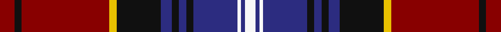

This page is one **sett** — a single exact thread-count. It belongs to the [tartan](/tartans/dr4k2dr24y2k12db3k2db2k2db12w1db1w3/)
(the same proportion at any scale), whose colour order is pattern [RKRYKBKBKBWBW](/stripes/rkrykbkbkbwbw/).

Sourced from register-of-tartans.  It is a [13 stripe tartan](/stripes/stripes13/).

Original link https://www.tartanregister.gov.uk/tartanDetails.aspx?ref=222

## Also known as

This cloth is also recorded under:

- Baron of Greencastle Dress #2

2 attestations — the source records this cloth was collapsed from (oldest owns this page)

<ul>
<li>01/01/2005 — Baron of Greencastle Dress #2 (Personal) (register-of-tartans, <a href="https://www.tartanregister.gov.uk/tartanDetails.aspx?ref=222">record</a>)</li>
<li>pre 2005 — Baron of Greencastle Dress (Personal (tartans-authority, <a href="http://www.tartansauthority.com/tartan-ferret/display/6667/">record</a>)</li>
</ul>

## Register references

External register numbers recorded for this tartan.

- Scottish Register of Tartans: [222](https://www.tartanregister.gov.uk/tartanDetails.aspx?ref=222)
- Scottish Tartans Authority (ITI): 6667

## Thread count
DR/8 K4 DR48 Y4 K24 DB6 K4 DB4 K4 DB24 W2 DB2 W/6

## Palette
Each colour and the base-6 reference it is a variant of.

| Colour | Shade | Base |
|---|---|---|
| DB | <code style="background-color:#2C2C80;">#2C2C80</code> `oklch(35.0% 0.138 276.6)` <small>#2C2C80</small> | B <code style="background-color:#2A418A;">#2A418A</code> |
| DR | <code style="background-color:#880000;">#880000</code> `oklch(39.4% 0.162 29.2)` <small>#880000</small> | R <code style="background-color:#CC0000;">#CC0000</code> |
| K | <code style="background-color:#101010;">#101010</code> `oklch(17.3% 0.000 89.9)` <small>#101010</small> | K <code style="background-color:#000000;">#000000</code> |
| O | <code style="background-color:#D87C00;">#D87C00</code> `oklch(67.3% 0.155 61.8)` <small>#D87C00</small> | Y <code style="background-color:#F2BF00;">#F2BF00</code> |
| Oa | <code style="background-color:#E86000;">#E86000</code> `oklch(65.3% 0.187 44.9)` <small>#E86000</small> | R <code style="background-color:#CC0000;">#CC0000</code> |
| W | <code style="background-color:#F8F8F8;">#F8F8F8</code> `oklch(97.9% 0.000 89.9)` <small>#F8F8F8</small> | W <code style="background-color:#F7F7F7;">#F7F7F7</code> |
| Y | <code style="background-color:#E8C000;">#E8C000</code> `oklch(81.9% 0.168 93.7)` <small>#E8C000</small> | Y <code style="background-color:#F2BF00;">#F2BF00</code> |

## Nearest tartans

The nearest existing variants by ΔTartan distance, with this tartan at the top so the swatches line up against it.

ΔTartan

Tartan

Sett

—

<a href="/ttd/edit/#slug=r4k2r24ly2k12db3k2db2k2db12w1db1w3~x2">Baron of Greencastle Dress #2 (Personal)</a> <a class="nn-out" href="/setts/s13/r4k2r24ly2k12db3k2db2k2db12w1db1w3~x2/" title="open its dictionary page">↗</a>

0.66

<a href="/ttd/edit/#slug=r4k1db8k1lo3k2db4lo6db4w3k2db20k4r21k1lo3~x2">Westmeath County Crest (Fashion)</a> <a class="nn-out" href="/setts/s16/r4k1db8k1lo3k2db4lo6db4w3k2db20k4r21k1lo3~x2/" title="open its dictionary page">↗</a>

0.81

<a href="/ttd/edit/#slug=w2db2r18db2dg20r2db40r2dg12db3r9ly2~x2">Kormylo (Personal)</a> <a class="nn-out" href="/setts/s12/w2db2r18db2dg20r2db40r2dg12db3r9ly2~x2/" title="open its dictionary page">↗</a>

0.87

<a href="/ttd/edit/#slug=o48k10db12k2o3k2db12k10o10k2ly3~x2">Brooks Brothers (Corporate)</a> <a class="nn-out" href="/setts/s11/o48k10db12k2o3k2db12k10o10k2ly3~x2/" title="open its dictionary page">↗</a>

0.87

<a href="/ttd/edit/#slug=w3lo8dp2lo8dp11dp2lo4o4dp27dp1dp2dp2dp2dp13dp2~x2">Strathdon</a> <a class="nn-out" href="/setts/s15/w3lo8dp2lo8dp11dp2lo4o4dp27dp1dp2dp2dp2dp13dp2~x2/" title="open its dictionary page">↗</a>

0.89

<a href="/ttd/edit/#slug=db49k2g2k2g2k10r38db5r4k4lr10~x2">Porsche Bank Austria</a> <a class="nn-out" href="/setts/s11/db49k2g2k2g2k10r38db5r4k4lr10~x2/" title="open its dictionary page">↗</a>

0.95

<a href="/ttd/edit/#slug=r22k3lo1k1w3k3db1k3db8k19lo4k2lo1k7lo3~x2">Ruxton</a> <a class="nn-out" href="/setts/s15/r22k3lo1k1w3k3db1k3db8k19lo4k2lo1k7lo3~x2/" title="open its dictionary page">↗</a>

1.04

<a href="/ttd/edit/#slug=k5r1w2r1k26r3lo1dt10w1r3w1dt10w1r3~x2">El Dorado Hills Firefighters Pipes and Drums</a> <a class="nn-out" href="/setts/s14/k5r1w2r1k26r3lo1dt10w1r3w1dt10w1r3~x2/" title="open its dictionary page">↗</a>

1.08

<a href="/ttd/edit/#slug=k5k5k2r47k18w2k5dg9k7w3~x2">Rikaco Holiday</a> <a class="nn-out" href="/setts/s10/k5k5k2r47k18w2k5dg9k7w3~x2/" title="open its dictionary page">↗</a>

1.08

<a href="/ttd/edit/#slug=k5r1w2r1k26r3lo1n10w1r3w1n10w1r3~x2">El Dorado Hills P &amp; D (Corporate)</a> <a class="nn-out" href="/setts/s14/k5r1w2r1k26r3lo1n10w1r3w1n10w1r3~x2/" title="open its dictionary page">↗</a>

1.08

<a href="/ttd/edit/#slug=r4k4r28dp4g4k10g4dp4g4dp8k1w3~x2">Kelly of Sleat (Name)</a> <a class="nn-out" href="/setts/s12/r4k4r28dp4g4k10g4dp4g4dp8k1w3~x2/" title="open its dictionary page">↗</a>

## Neighbour map

Every grey dot is one of 14299 variants placed by the first two principal components of the ΔTartan feature space (44% of its variance). Red is this tartan; blue dots are its nearest — click one to open its page.

<svg viewBox="0 0 640 380" role="img" style="max-width:100%;height:auto;border:1px solid #e0e0e0;border-radius:4px;display:block" xmlns="http://www.w3.org/2000/svg"><image href="/nn/cloud.v1.png" width="640" height="380"/><a href="/setts/s16/r4k1db8k1lo3k2db4lo6db4w3k2db20k4r21k1lo3~x2/"><circle cx="224.0" cy="106.1" r="4" fill="#3465a4"><title>Westmeath County Crest (Fashion)</title></circle></a><a href="/setts/s12/w2db2r18db2dg20r2db40r2dg12db3r9ly2~x2/"><circle cx="249.3" cy="120.2" r="4" fill="#3465a4"><title>Kormylo (Personal)</title></circle></a><a href="/setts/s11/o48k10db12k2o3k2db12k10o10k2ly3~x2/"><circle cx="259.4" cy="112.4" r="4" fill="#3465a4"><title>Brooks Brothers (Corporate)</title></circle></a><a href="/setts/s15/w3lo8dp2lo8dp11dp2lo4o4dp27dp1dp2dp2dp2dp13dp2~x2/"><circle cx="244.9" cy="99.0" r="4" fill="#3465a4"><title>Strathdon</title></circle></a><a href="/setts/s11/db49k2g2k2g2k10r38db5r4k4lr10~x2/"><circle cx="256.8" cy="95.1" r="4" fill="#3465a4"><title>Porsche Bank Austria</title></circle></a><a href="/setts/s15/r22k3lo1k1w3k3db1k3db8k19lo4k2lo1k7lo3~x2/"><circle cx="247.2" cy="99.1" r="4" fill="#3465a4"><title>Ruxton</title></circle></a><a href="/setts/s14/k5r1w2r1k26r3lo1dt10w1r3w1dt10w1r3~x2/"><circle cx="271.4" cy="90.6" r="4" fill="#3465a4"><title>El Dorado Hills Firefighters Pipes and Drums</title></circle></a><a href="/setts/s10/k5k5k2r47k18w2k5dg9k7w3~x2/"><circle cx="278.6" cy="115.4" r="4" fill="#3465a4"><title>Rikaco Holiday</title></circle></a><a href="/setts/s14/k5r1w2r1k26r3lo1n10w1r3w1n10w1r3~x2/"><circle cx="254.8" cy="81.2" r="4" fill="#3465a4"><title>El Dorado Hills P &amp; D (Corporate)</title></circle></a><a href="/setts/s12/r4k4r28dp4g4k10g4dp4g4dp8k1w3~x2/"><circle cx="247.2" cy="112.9" r="4" fill="#3465a4"><title>Kelly of Sleat (Name)</title></circle></a><circle cx="231.3" cy="98.5" r="5" fill="#c00000"/></svg>

ID: /setts/s13/r4k2r24ly2k12db3k2db2k2db12w1db1w3~x2/
