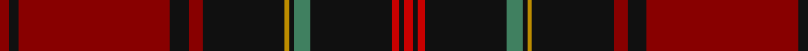

In pattern [RKRKGKYKRKRKR](/patterns/rkrkgkykrkrkr/).

This was sourced from register-of-tartans.  It is a [13 stripes tartan](/stripes/stripes13/).

Original link https://www.tartanregister.gov.uk/tartanDetails.aspx?ref=1189

## Attestations

This cloth appears in 2 source records; the oldest owns this page.

- 01/07/2007 — Firefighters' Memorial (register-of-tartans, [record](https://www.tartanregister.gov.uk/tartanDetails.aspx?ref=1189))
- July 2007 — Firefighters' Memorial (Corporate) (tartans-authority, [record](http://www.tartansauthority.com/tartan-ferret/display/7339/))

## Thread count
DR/4 K4 DR65 K8 DR6 K35 DY2 K2 G7 K35 R3 K2 R/4

## Palette
Each colour and its ΔE from the base-6 reference it is a variant of.

| Colour | Shade | Base | ΔE (OKLab) |
|---|---|---|---|
| DR | <code style="background-color:#880000;">#880000</code> `#880000` | R <code style="background-color:#C80000;">#C80000</code> | 0.14 |
| DY | <code style="background-color:#BC8C00;">#BC8C00</code> `#BC8C00` | Y <code style="background-color:#E8C000;">#E8C000</code> | 0.16 |
| G | <code style="background-color:#408060;">#408060</code> `#408060` | G <code style="background-color:#006400;">#006400</code> | 0.13 |
| K | <code style="background-color:#101010;">#101010</code> `#101010` | K <code style="background-color:#000000;">#000000</code> | 0.17 |
| R | <code style="background-color:#C80000;">#C80000</code> `#C80000` | R <code style="background-color:#C80000;">#C80000</code> | 0.00 |

## Nearest tartans

The nearest existing variants by ΔTartan distance.

1. [German Heritage](/setts/s14/y4k2r8k4r4k63ra5r64k4r3k4r8k2y4-k101010-r880000-rac80000-ybc8c00/) — ΔT 1.03
1. [Dalzell](/setts/s17/r48y2b4r8g64r8b4y2r8b12r8y2b4r64g4ba6g12-b000052-ba59110d-g11450d-raa0000-yaaaaaa/) — ΔT 1.24
1. [Dalzell](/setts/s17/r24y1b2r4g32r4b2y1r4b6r4y1b2r32g2ba3g6-b000052-ba59110d-g11450d-raa0000-yaaaaaa/) — ΔT 1.24
1. [MacDonald of Glencoe #2](/setts/s13/r10y2b4r4g60r10b20ba2r84g4r8y2g8-b2c4084-ba3c82af-g005020-r960028-ye8c000/) — ΔT 1.27
1. [German American](/setts/s12/r4k4y3k4r54ra5k54r4k3b9k2w4-b2c2c80-k101010-r880000-rac80000-wf8f4d8-ybc8c00/) — ΔT 1.29
1. [Chisholm, Christopher (Personal)](/setts/s14/r4b4r2b4r2b56k12r4ba2r4ba2r48k2ra2-b003c64-ba3474fc-k101010-r960000-raff0000/) — ΔT 1.37
1. [Chisholm VS](/setts/s10/r12y2r48b12g4k2g4k2g24r2-b000052-g11450d-k000000-raa0000-yaaaaaa/) — ΔT 1.37
1. [Tyrone Irish County Tartan Tartan Number: 2264. Earliest known date: 1993 One of a series of Irish District tartans designed by Polly Wittering of the House of Edgar, with colours reminiscent of the Country with soft warm colours dominating. See products available Copyright © Blair Urquhart, Comrie, 2015](/setts/s12/b100r12ba14g4ba4y4ba4r28b16ba4b18g6-b5c0014-ba28200c-g005448-r9c7c28-yc4c4a4/) — ΔT 1.38
1. [Arbroath Smokie](/setts/s9/y2r90b46w2b12ra4y2ra4y2-b14283c-r880000-rac80000-we0e0e0-ybc8c00/) — ΔT 1.40
1. [MacAlister of Skye (Clan?)](/setts/s9/r8k10y2r52w2k60y2k2y8-k101010-r880000-wc0c0c0-yd09800/) — ΔT 1.41

## Neighbour map

Every grey dot is one of 15726 variants placed by the first two principal components of the ΔTartan feature space (44% of its variance). Red is this tartan; blue dots are its nearest — click one to open its page.

<svg viewBox="0 0 640 380" role="img" style="max-width:100%;height:auto;border:1px solid #e0e0e0;border-radius:4px;display:block" xmlns="http://www.w3.org/2000/svg"><image href="/nn/cloud.v1.png" width="640" height="380"/><a href="/setts/s14/y4k2r8k4r4k63ra5r64k4r3k4r8k2y4-k101010-r880000-rac80000-ybc8c00/"><circle cx="395.7" cy="99.6" r="4" fill="#3465a4"><title>German Heritage</title></circle></a><a href="/setts/s17/r48y2b4r8g64r8b4y2r8b12r8y2b4r64g4ba6g12-b000052-ba59110d-g11450d-raa0000-yaaaaaa/"><circle cx="368.1" cy="81.9" r="4" fill="#3465a4"><title>Dalzell</title></circle></a><a href="/setts/s17/r24y1b2r4g32r4b2y1r4b6r4y1b2r32g2ba3g6-b000052-ba59110d-g11450d-raa0000-yaaaaaa/"><circle cx="368.1" cy="81.9" r="4" fill="#3465a4"><title>Dalzell</title></circle></a><a href="/setts/s13/r10y2b4r4g60r10b20ba2r84g4r8y2g8-b2c4084-ba3c82af-g005020-r960028-ye8c000/"><circle cx="396.7" cy="88.3" r="4" fill="#3465a4"><title>MacDonald of Glencoe #2</title></circle></a><a href="/setts/s12/r4k4y3k4r54ra5k54r4k3b9k2w4-b2c2c80-k101010-r880000-rac80000-wf8f4d8-ybc8c00/"><circle cx="297.3" cy="78.4" r="4" fill="#3465a4"><title>German American</title></circle></a><a href="/setts/s14/r4b4r2b4r2b56k12r4ba2r4ba2r48k2ra2-b003c64-ba3474fc-k101010-r960000-raff0000/"><circle cx="338.4" cy="91.5" r="4" fill="#3465a4"><title>Chisholm, Christopher (Personal)</title></circle></a><a href="/setts/s10/r12y2r48b12g4k2g4k2g24r2-b000052-g11450d-k000000-raa0000-yaaaaaa/"><circle cx="347.6" cy="114.3" r="4" fill="#3465a4"><title>Chisholm VS</title></circle></a><a href="/setts/s12/b100r12ba14g4ba4y4ba4r28b16ba4b18g6-b5c0014-ba28200c-g005448-r9c7c28-yc4c4a4/"><circle cx="422.1" cy="110.3" r="4" fill="#3465a4"><title>Tyrone Irish County Tartan Tartan Number: 2264. Earliest known date: 1993 One of a series of Irish District tartans designed by Polly Wittering of the House of Edgar, with colours reminiscent of the Country with soft warm colours dominating. See products available Copyright © Blair Urquhart, Comrie, 2015</title></circle></a><a href="/setts/s9/y2r90b46w2b12ra4y2ra4y2-b14283c-r880000-rac80000-we0e0e0-ybc8c00/"><circle cx="430.3" cy="95.9" r="4" fill="#3465a4"><title>Arbroath Smokie</title></circle></a><a href="/setts/s9/r8k10y2r52w2k60y2k2y8-k101010-r880000-wc0c0c0-yd09800/"><circle cx="362.1" cy="125.5" r="4" fill="#3465a4"><title>MacAlister of Skye (Clan?)</title></circle></a><circle cx="364.1" cy="101.0" r="5" fill="#c00000"/></svg>

ID: /setts/s13/r4k4r65k8r6k35y2k2g7k35ra3k2ra4-g408060-k101010-r880000-rac80000-ybc8c00/
