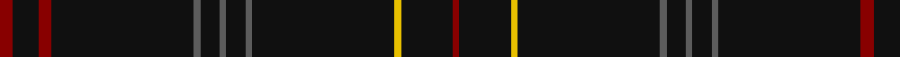

In pattern [RKRKBKBKBKYKR](/patterns/rkrkbkbkbkykr/).

This was sourced from tartans-authority.  It is a [13 stripes tartan](/stripes/stripes13/).

Original link http://www.tartansauthority.com/tartan-ferret/display/7958/

## Thread count
DR/4 K8 DR4 K44 N2 K6 N2 K6 N2 K44 Y2 K16 DR/2

## Palette
Each colour and its ΔE from the base-6 reference it is a variant of.

| Colour | Shade | Base | ΔE (OKLab) |
|---|---|---|---|
| DR | <code style="background-color:#880000;">#880000</code> `#880000` | R <code style="background-color:#CC0000;">#CC0000</code> | 0.15 |
| K | <code style="background-color:#101010;">#101010</code> `#101010` | K <code style="background-color:#000000;">#000000</code> | 0.17 |
| N | <code style="background-color:#5C5C5C;">#5C5C5C</code> `#5C5C5C` | B <code style="background-color:#2A418A;">#2A418A</code> | 0.15 |
| Y | <code style="background-color:#E8C000;">#E8C000</code> `#E8C000` | Y <code style="background-color:#F2BF00;">#F2BF00</code> | 0.02 |

## Nearest tartans

The nearest existing variants by ΔTartan distance.

1. [Pisniak (Personal)](/setts/s7/b80g6ba8b56y4ya4b14-b1c1c1c-ba440044-g003820-ybc8c00-yab8b8b8/) — ΔT 1.77
1. [Scotland's Lionheart](/setts/s9/k156g32k4b4k4g4k6r4k20-b4c4c4c-g686868-k101010-rac0034/) — ΔT 1.79
1. [Chafyn House (School)](/setts/s7/k72r3k11b9k11r3k37-b2888c4-k101010-rc80000/) — ΔT 1.83
1. [Clan Inebriated (Corporate)](/setts/s9/k150b12r4k4r4b12k24ba4r4-b780078-ba1c0070-k101010-r888888/) — ΔT 1.86
1. [Dickie (Glasgow)](/setts/s17/k20b4k4ba4k12ba4k4b4k12b4k4g4k64g4k4ba4k8-b000080-ba2f4f4f-g006400-k101010/) — ΔT 1.98
1. [Renwick](/setts/s10/k6g4k40r4k24g4k8g4k12g4-g006818-k101010-rc80000/) — ΔT 2.01
1. [Selkirk Silver Band (Corporate)](/setts/s10/k150r2k8b30k4b2k6ba2k4r2-b5c5c5c-ba1c0070-k101010-r880000/) — ΔT 2.02
1. [Grassi (2009)](/setts/s14/k140b4k6b24k2r6k2b24k6b4k120r4b4ba6-b505050-ba780078-k101010-r888888/) — ΔT 2.05
1. [Auld Bernensis](/setts/s8/k124r6k6y6k6r6k18ra10-k101010-rc80000-ra888888-yd09800/) — ΔT 2.06
1. [GOLF (Corporate)](/setts/s15/k30b4ba2r2bb2k30r2ba4k30bb2k30b8ba4bb2k30-b440044-ba14283c-bb2888c4-k101010-rc80000/) — ΔT 2.09

## Neighbour map

Every grey dot is one of 15726 variants placed by the first two principal components of the ΔTartan feature space (44% of its variance). Red is this tartan; blue dots are its nearest — click one to open its page.

<svg viewBox="0 0 640 380" role="img" style="max-width:100%;height:auto;border:1px solid #e0e0e0;border-radius:4px;display:block" xmlns="http://www.w3.org/2000/svg"><image href="/nn/cloud.v1.png" width="640" height="380"/><a href="/setts/s7/b80g6ba8b56y4ya4b14-b1c1c1c-ba440044-g003820-ybc8c00-yab8b8b8/"><circle cx="626.0" cy="197.5" r="4" fill="#3465a4"><title>Pisniak (Personal)</title></circle></a><a href="/setts/s9/k156g32k4b4k4g4k6r4k20-b4c4c4c-g686868-k101010-rac0034/"><circle cx="626.0" cy="132.6" r="4" fill="#3465a4"><title>Scotland's Lionheart</title></circle></a><a href="/setts/s7/k72r3k11b9k11r3k37-b2888c4-k101010-rc80000/"><circle cx="626.0" cy="210.3" r="4" fill="#3465a4"><title>Chafyn House (School)</title></circle></a><a href="/setts/s9/k150b12r4k4r4b12k24ba4r4-b780078-ba1c0070-k101010-r888888/"><circle cx="626.0" cy="130.7" r="4" fill="#3465a4"><title>Clan Inebriated (Corporate)</title></circle></a><a href="/setts/s17/k20b4k4ba4k12ba4k4b4k12b4k4g4k64g4k4ba4k8-b000080-ba2f4f4f-g006400-k101010/"><circle cx="602.9" cy="174.1" r="4" fill="#3465a4"><title>Dickie (Glasgow)</title></circle></a><a href="/setts/s10/k6g4k40r4k24g4k8g4k12g4-g006818-k101010-rc80000/"><circle cx="562.0" cy="232.3" r="4" fill="#3465a4"><title>Renwick</title></circle></a><a href="/setts/s10/k150r2k8b30k4b2k6ba2k4r2-b5c5c5c-ba1c0070-k101010-r880000/"><circle cx="626.0" cy="121.0" r="4" fill="#3465a4"><title>Selkirk Silver Band (Corporate)</title></circle></a><a href="/setts/s14/k140b4k6b24k2r6k2b24k6b4k120r4b4ba6-b505050-ba780078-k101010-r888888/"><circle cx="615.0" cy="113.9" r="4" fill="#3465a4"><title>Grassi (2009)</title></circle></a><a href="/setts/s8/k124r6k6y6k6r6k18ra10-k101010-rc80000-ra888888-yd09800/"><circle cx="597.9" cy="150.3" r="4" fill="#3465a4"><title>Auld Bernensis</title></circle></a><a href="/setts/s15/k30b4ba2r2bb2k30r2ba4k30bb2k30b8ba4bb2k30-b440044-ba14283c-bb2888c4-k101010-rc80000/"><circle cx="579.7" cy="189.5" r="4" fill="#3465a4"><title>GOLF (Corporate)</title></circle></a><circle cx="626.0" cy="167.2" r="5" fill="#c00000"/></svg>

ID: /setts/s13/r4k8r4k44b2k6b2k6b2k44y2k16r2-b5c5c5c-k101010-r880000-ye8c000/
