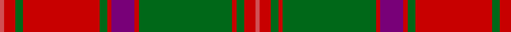

**Bands:** [RRGRGRBRGRGRR](/stripes/rrgrgrbrgrgrr/) · **Stripes:** [R R G R G R DP R G R G R R](/stripes/stripes13/) R R G R G R DP R G R G R R

This was sourced from house-of-tartan.  It is a [13 band tartan](/bands/bands13/).

Original link http://www.house-of-tartan.scotland.net/house/TartanViewjs.asp?colr=Def&tnam=1636

## Variants

Other setts woven to the same stripe pattern.

- [Crieff](/setts/s13/r2r6g4r70g4r2dp21r2g85r2g4r6r2/)

## Thread count
DO/4 R10 G7 R70 G7 R4 P21 R4 G85 R4 G7 R10 DO/4

## Palette
Each colour and its ΔE from the base-6 reference it is a variant of.

| Colour | Shade | Base | ΔE (OKLab) |
|---|---|---|---|
| DO | <code style="background-color:#D05054;">#D05054</code> `#D05054` | R <code style="background-color:#CC0000;">#CC0000</code> | 0.09 |
| G | <code style="background-color:#006818;">#006818</code> `#006818` | G <code style="background-color:#006100;">#006100</code> | 0.02 |
| P | <code style="background-color:#780078;">#780078</code> `#780078` | B <code style="background-color:#2A418A;">#2A418A</code> | 0.17 |
| R | <code style="background-color:#C80000;">#C80000</code> `#C80000` | R <code style="background-color:#CC0000;">#CC0000</code> | 0.01 |

## Nearest tartans

The nearest existing variants by ΔTartan distance.

1. [Crieff](/setts/s13/r4r10g7r70g7r4p21r4g85r4g7r10r4/) — ΔT 0.45
1. [Stewart of Appin - 1906](/setts/s16/r3db2t1r2g24r4g2r2db8r2g2r24db2t1r2g2~x2/) — ΔT 0.70
1. [MacLintock](/setts/s12/g38r3g3r3db9r3t2r40db3r3db2r6~x2/) — ΔT 0.83
1. [Unidentified, coat](/setts/s14/g6r2g2r24t1db1r2db12r2db1t1r2g24r2~x2/) — ΔT 0.88
1. [MacLintock - 1880 (Clan)](/setts/s12/g36r3g3r3db9r3t2r40db3r3db2r6~x2/) — ΔT 0.89
1. [Unidentified Coat](/setts/s14/dg6r2dg2r24t1db1r2db12r2db1t1r2dg24r2~x2/) — ΔT 0.92
1. [MacDonald of Glenaladale](/setts/s12/r7r2db2r2g32r6db12r41g2r5r2g5~x2/) — ΔT 0.93
1. [Hayes (Fashion)](/setts/s14/r2dg1ly1dg12r1dg1r1dg4r17dg3r2dg1r2lr2~x4/) — ΔT 0.94
1. [Drummond](/setts/s16/r6db1r2db2r28t2r2db9r2g2r2g24r3db2r6db2~x2/) — ΔT 1.01
1. [Unidentified Cant #12](/setts/s12/r60db2g24r8db2t3db2/) — ΔT 1.02

## Neighbour map

Every grey dot is one of 14299 variants placed by the first two principal components of the ΔTartan feature space (44% of its variance). Red is this tartan; blue dots are its nearest — click one to open its page.

<svg viewBox="0 0 640 380" role="img" style="max-width:100%;height:auto;border:1px solid #e0e0e0;border-radius:4px;display:block" xmlns="http://www.w3.org/2000/svg"><image href="/nn/cloud.v1.png" width="640" height="380"/><a href="/setts/s13/r4r10g7r70g7r4p21r4g85r4g7r10r4/"><circle cx="327.9" cy="114.5" r="4" fill="#3465a4"><title>Crieff</title></circle></a><a href="/setts/s16/r3db2t1r2g24r4g2r2db8r2g2r24db2t1r2g2~x2/"><circle cx="326.7" cy="101.9" r="4" fill="#3465a4"><title>Stewart of Appin - 1906</title></circle></a><a href="/setts/s12/g38r3g3r3db9r3t2r40db3r3db2r6~x2/"><circle cx="337.8" cy="116.7" r="4" fill="#3465a4"><title>MacLintock</title></circle></a><a href="/setts/s14/g6r2g2r24t1db1r2db12r2db1t1r2g24r2~x2/"><circle cx="298.3" cy="111.5" r="4" fill="#3465a4"><title>Unidentified, coat</title></circle></a><a href="/setts/s12/g36r3g3r3db9r3t2r40db3r3db2r6~x2/"><circle cx="340.8" cy="116.9" r="4" fill="#3465a4"><title>MacLintock - 1880 (Clan)</title></circle></a><a href="/setts/s14/dg6r2dg2r24t1db1r2db12r2db1t1r2dg24r2~x2/"><circle cx="298.1" cy="108.8" r="4" fill="#3465a4"><title>Unidentified Coat</title></circle></a><a href="/setts/s12/r7r2db2r2g32r6db12r41g2r5r2g5~x2/"><circle cx="351.2" cy="134.9" r="4" fill="#3465a4"><title>MacDonald of Glenaladale</title></circle></a><a href="/setts/s14/r2dg1ly1dg12r1dg1r1dg4r17dg3r2dg1r2lr2~x4/"><circle cx="347.1" cy="124.4" r="4" fill="#3465a4"><title>Hayes (Fashion)</title></circle></a><a href="/setts/s16/r6db1r2db2r28t2r2db9r2g2r2g24r3db2r6db2~x2/"><circle cx="360.9" cy="99.6" r="4" fill="#3465a4"><title>Drummond</title></circle></a><a href="/setts/s12/r60db2g24r8db2t3db2/"><circle cx="386.5" cy="105.3" r="4" fill="#3465a4"><title>Unidentified Cant #12</title></circle></a><circle cx="336.0" cy="117.9" r="5" fill="#c00000"/></svg>

ID: /setts/s13/r4r10g7r70g7r4dp21r4g85r4g7r10r4/
