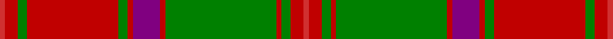

In pattern [RRGRGRBRGRGRR](/stripes/rrgrgrbrgrgrr/).

This was sourced from weddslist.  It is a [13 stripe tartan](/stripes/stripes13/).

Original link http://www.weddslist.com/cgi-bin/tartans/pg.pl?source=sts

## Thread count
R/4 Ra10 G7 Ra70 G7 Ra4 P21 Ra4 G85 Ra4 G7 Ra10 R/4

## Palette
Each colour and the base-6 reference it is a variant of.

| Colour | Shade | Base |
|---|---|---|
| G | <code style="background-color:#008000;">#008000</code> `oklch(52.0% 0.177 142.5)` <small>#008000</small> | G <code style="background-color:#006100;">#006100</code> |
| P | <code style="background-color:#800080;">#800080</code> `oklch(42.1% 0.193 328.4)` <small>#800080</small> | B <code style="background-color:#2A418A;">#2A418A</code> |
| R | <code style="background-color:#D03030;">#D03030</code> `oklch(56.4% 0.196 26.2)` <small>#D03030</small> | R <code style="background-color:#CC0000;">#CC0000</code> |
| Ra | <code style="background-color:#C00000;">#C00000</code> `oklch(50.7% 0.208 29.2)` <small>#C00000</small> | R <code style="background-color:#CC0000;">#CC0000</code> |

## Nearest tartans

The nearest existing variants by ΔTartan distance.

1. [Crieff District Tartan Tartan Number: 1636. Earliest known date: 1793 Wilson's accounts of 1793 mention the Crieff tartan with no details. A manuscript dated 1800 gives details of colour but it is not until the publication of the Key Pattern Book of 1819 that this sett is revealed in full. Crieff in Perthshire was the most famous of the cattle drovers 'trysts' prior to 1700. It is a very large sett which has been proportionately reduced for this illustration. The full threadcount: Light Red 4, Red 12, Green 8, R 140, G 8, R 4, Purple 42, R 4, G 170, R 4, G 8, R 12, LR 4. See products available Copyright © Blair Urquhart, Comrie, 2015](/setts/s13/r4r10g7r70g7r4dp21r4g85r4g7r10r4/) — ΔT 0.45
1. [Unidentified, coat](/setts/s14/g6r2g2r24t1db1r2db12r2db1t1r2g24r2~x2/) — ΔT 0.79
1. [Stewart of Appin - 1906](/setts/s16/r3db2t1r2g24r4g2r2db8r2g2r24db2t1r2g2~x2/) — ΔT 0.88
1. [Hayes (Fashion)](/setts/s14/r2dg1ly1dg12r1dg1r1dg4r17dg3r2dg1r2lr2~x4/) — ΔT 0.95
1. [MacLintock](/setts/s12/g38r3g3r3db9r3t2r40db3r3db2r6~x2/) — ΔT 0.96
1. [MacLintock - 1880 (Clan)](/setts/s12/g36r3g3r3db9r3t2r40db3r3db2r6~x2/) — ΔT 1.03
1. [MacDonell of Keppoch](/setts/s11/r6db1r1g28r4db8w1r32g1r4g2~x2/) — ΔT 1.07
1. [Hay - 1842 (Clan)](/setts/s14/r3dg2ly1dg18r1dg1r1dg6r24dg2r1k1r1w3~x2/) — ΔT 1.08
1. [MacQuarrie 3](/setts/s13/g2r3g2r52g2r2db28r2g42r2g2r3g2~x2/) — ΔT 1.09
1. [Unidentified Coat](/setts/s14/dg6r2dg2r24t1db1r2db12r2db1t1r2dg24r2~x2/) — ΔT 1.10

## Neighbour map

Every grey dot is one of 14299 variants placed by the first two principal components of the ΔTartan feature space (44% of its variance). Red is this tartan; blue dots are its nearest — click one to open its page.

<svg viewBox="0 0 640 380" role="img" style="max-width:100%;height:auto;border:1px solid #e0e0e0;border-radius:4px;display:block" xmlns="http://www.w3.org/2000/svg"><image href="/nn/cloud.v1.png" width="640" height="380"/><a href="/setts/s13/r4r10g7r70g7r4dp21r4g85r4g7r10r4/"><circle cx="336.0" cy="117.9" r="4" fill="#3465a4"><title>Crieff District Tartan Tartan Number: 1636. Earliest known date: 1793 Wilson's accounts of 1793 mention the Crieff tartan with no details. A manuscript dated 1800 gives details of colour but it is not until the publication of the Key Pattern Book of 1819 that this sett is revealed in full. Crieff in Perthshire was the most famous of the cattle drovers 'trysts' prior to 1700. It is a very large sett which has been proportionately reduced for this illustration. The full threadcount: Light Red 4, Red 12, Green 8, R 140, G 8, R 4, Purple 42, R 4, G 170, R 4, G 8, R 12, LR 4. See products available Copyright © Blair Urquhart, Comrie, 2015</title></circle></a><a href="/setts/s14/g6r2g2r24t1db1r2db12r2db1t1r2g24r2~x2/"><circle cx="298.3" cy="111.5" r="4" fill="#3465a4"><title>Unidentified, coat</title></circle></a><a href="/setts/s16/r3db2t1r2g24r4g2r2db8r2g2r24db2t1r2g2~x2/"><circle cx="326.7" cy="101.9" r="4" fill="#3465a4"><title>Stewart of Appin - 1906</title></circle></a><a href="/setts/s14/r2dg1ly1dg12r1dg1r1dg4r17dg3r2dg1r2lr2~x4/"><circle cx="347.1" cy="124.4" r="4" fill="#3465a4"><title>Hayes (Fashion)</title></circle></a><a href="/setts/s12/g38r3g3r3db9r3t2r40db3r3db2r6~x2/"><circle cx="337.8" cy="116.7" r="4" fill="#3465a4"><title>MacLintock</title></circle></a><a href="/setts/s12/g36r3g3r3db9r3t2r40db3r3db2r6~x2/"><circle cx="340.8" cy="116.9" r="4" fill="#3465a4"><title>MacLintock - 1880 (Clan)</title></circle></a><a href="/setts/s11/r6db1r1g28r4db8w1r32g1r4g2~x2/"><circle cx="378.5" cy="109.6" r="4" fill="#3465a4"><title>MacDonell of Keppoch</title></circle></a><a href="/setts/s14/r3dg2ly1dg18r1dg1r1dg6r24dg2r1k1r1w3~x2/"><circle cx="335.0" cy="84.9" r="4" fill="#3465a4"><title>Hay - 1842 (Clan)</title></circle></a><a href="/setts/s13/g2r3g2r52g2r2db28r2g42r2g2r3g2~x2/"><circle cx="342.5" cy="118.0" r="4" fill="#3465a4"><title>MacQuarrie 3</title></circle></a><a href="/setts/s14/dg6r2dg2r24t1db1r2db12r2db1t1r2dg24r2~x2/"><circle cx="298.1" cy="108.8" r="4" fill="#3465a4"><title>Unidentified Coat</title></circle></a><circle cx="327.9" cy="114.5" r="5" fill="#c00000"/></svg>

ID: /setts/s13/r4r10g7r70g7r4p21r4g85r4g7r10r4/
