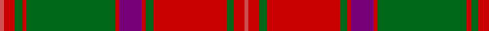

In pattern [RRGRGRBRGRGRR](/patterns/rrgrgrbrgrgrr/).

This was sourced from house-of-tartan.  It is a [13 stripes tartan](/stripes/stripes13/).

Original link http://www.house-of-tartan.scotland.net/house/TartanViewjs.asp?colr=Def&tnam=1636

## Thread count
DO/4 R10 G7 R4 G85 R4 P21 R4 G7 R70 G7 R10 DO/4

## Palette
Each colour and its ΔE from the base-6 reference it is a variant of.

| Colour | Shade | Base | ΔE (OKLab) |
|---|---|---|---|
| DO | <code style="background-color:#D05054;">#D05054</code> `#D05054` | R <code style="background-color:#C80000;">#C80000</code> | 0.10 |
| G | <code style="background-color:#006818;">#006818</code> `#006818` | G <code style="background-color:#006400;">#006400</code> | 0.02 |
| P | <code style="background-color:#780078;">#780078</code> `#780078` | B <code style="background-color:#2C4084;">#2C4084</code> | 0.16 |
| R | <code style="background-color:#C80000;">#C80000</code> `#C80000` | R <code style="background-color:#C80000;">#C80000</code> | 0.00 |

## Nearest tartans

The nearest existing variants by ΔTartan distance.

1. [Crieff](/setts/s13/r4ra10g7ra70g7ra4b21ra4g85ra4g7ra10r4-b800080-g008000-rd03030-rac00000/) — ΔT 0.44
1. [MacLintock](/setts/s12/g72r6g6r6b18r6ba4r80b6r6b4r12-b304080-ba5480b0-g008000-rc00000/) — ΔT 0.61
1. [Stewart of Appin 4](/setts/s16/r6b4ba2r4g48r8g4r4b16r4g4r48b4ba2r4g4-b304080-ba5480b0-g008000-rc00000/) — ΔT 0.67
1. [MacLintock Clan Tartan Tartan Number: 881. Earliest known date: 1842 Tartan is in the MacGregor Hastie collection of the STS and also appears in the J. T. Thompson files at the STA. It also appears in Clans Originaux verified by BW in 2004. Mentioned in correspondence by D C Stewart sending this count to Life Member Andrew Pearson in October 1971. See products available Copyright © Blair Urquhart, Comrie, 2015](/setts/s12/g72r6g6r6b18r6ba4r80b6r6b4r12-b2c2c80-ba5c8ca8-g006818-rc80000/) — ΔT 0.68
1. [Stewart of Appin - 1906](/setts/s16/r6b4ba2r4g48r8g4r4b16r4g4r48b4ba2r4g4-b2c2c80-ba5c8ca8-g006818-rc80000/) — ΔT 0.70
1. [MacLintock](/setts/s12/g76r6g6r6b18r6ba4r80b6r6b4r12-b1c0070-ba5c8ca8-g006818-rc80000/) — ΔT 0.82
1. [Unidentified, coat](/setts/s14/g12r4g4r48b2ba2r4ba24r4ba2b2r4g48r4-b5480b0-ba304080-g008000-rc00000/) — ΔT 0.87
1. [MacLintock - 1880 (Clan)](/setts/s12/g72r6g6r6b18r6ba4r80b6r6b4r12-b1c0070-ba5c8ca8-g006818-rc80000/) — ΔT 0.89
1. [Unidentified Coat](/setts/s14/g12r4g4r48b2ba2r4ba24r4ba2b2r4g48r4-b3c82af-ba2c4084-g005020-rdc0000/) — ΔT 0.92
1. [MacDonald of Glenaladale](/setts/s12/r14ra4b4r4g64r12b24r82g4r10ra4g10-b304080-g008000-r900030-rad03030/) — ΔT 0.93

## Neighbour map

Every grey dot is one of 15726 variants placed by the first two principal components of the ΔTartan feature space (44% of its variance). Red is this tartan; blue dots are its nearest — click one to open its page.

<svg viewBox="0 0 640 380" role="img" style="max-width:100%;height:auto;border:1px solid #e0e0e0;border-radius:4px;display:block" xmlns="http://www.w3.org/2000/svg"><image href="/nn/cloud.v1.png" width="640" height="380"/><a href="/setts/s13/r4ra10g7ra70g7ra4b21ra4g85ra4g7ra10r4-b800080-g008000-rd03030-rac00000/"><circle cx="325.2" cy="112.8" r="4" fill="#3465a4"><title>Crieff</title></circle></a><a href="/setts/s12/g72r6g6r6b18r6ba4r80b6r6b4r12-b304080-ba5480b0-g008000-rc00000/"><circle cx="346.9" cy="120.2" r="4" fill="#3465a4"><title>MacLintock</title></circle></a><a href="/setts/s16/r6b4ba2r4g48r8g4r4b16r4g4r48b4ba2r4g4-b304080-ba5480b0-g008000-rc00000/"><circle cx="322.2" cy="100.2" r="4" fill="#3465a4"><title>Stewart of Appin 4</title></circle></a><a href="/setts/s12/g72r6g6r6b18r6ba4r80b6r6b4r12-b2c2c80-ba5c8ca8-g006818-rc80000/"><circle cx="348.3" cy="119.9" r="4" fill="#3465a4"><title>MacLintock Clan Tartan Tartan Number: 881. Earliest known date: 1842 Tartan is in the MacGregor Hastie collection of the STS and also appears in the J. T. Thompson files at the STA. It also appears in Clans Originaux verified by BW in 2004. Mentioned in correspondence by D C Stewart sending this count to Life Member Andrew Pearson in October 1971. See products available Copyright © Blair Urquhart, Comrie, 2015</title></circle></a><a href="/setts/s16/r6b4ba2r4g48r8g4r4b16r4g4r48b4ba2r4g4-b2c2c80-ba5c8ca8-g006818-rc80000/"><circle cx="323.4" cy="99.9" r="4" fill="#3465a4"><title>Stewart of Appin - 1906</title></circle></a><a href="/setts/s12/g76r6g6r6b18r6ba4r80b6r6b4r12-b1c0070-ba5c8ca8-g006818-rc80000/"><circle cx="335.5" cy="115.9" r="4" fill="#3465a4"><title>MacLintock</title></circle></a><a href="/setts/s14/g12r4g4r48b2ba2r4ba24r4ba2b2r4g48r4-b5480b0-ba304080-g008000-rc00000/"><circle cx="294.6" cy="109.1" r="4" fill="#3465a4"><title>Unidentified, coat</title></circle></a><a href="/setts/s12/g72r6g6r6b18r6ba4r80b6r6b4r12-b1c0070-ba5c8ca8-g006818-rc80000/"><circle cx="338.6" cy="116.2" r="4" fill="#3465a4"><title>MacLintock - 1880 (Clan)</title></circle></a><a href="/setts/s14/g12r4g4r48b2ba2r4ba24r4ba2b2r4g48r4-b3c82af-ba2c4084-g005020-rdc0000/"><circle cx="294.5" cy="106.8" r="4" fill="#3465a4"><title>Unidentified Coat</title></circle></a><a href="/setts/s12/r14ra4b4r4g64r12b24r82g4r10ra4g10-b304080-g008000-r900030-rad03030/"><circle cx="348.6" cy="132.2" r="4" fill="#3465a4"><title>MacDonald of Glenaladale</title></circle></a><circle cx="333.2" cy="115.7" r="5" fill="#c00000"/></svg>

ID: /setts/s13/r4ra10g7ra70g7ra4b21ra4g85ra4g7ra10r4-b780078-g006818-rd05054-rac80000/
