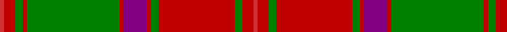

In pattern [RRGRGRBRGRGRR](/patterns/rrgrgrbrgrgrr/).

This was sourced from weddslist.  It is a [13 stripes tartan](/stripes/stripes13/).

Original link http://www.weddslist.com/cgi-bin/tartans/pg.pl?source=sts

## Thread count
R/4 Ra10 G7 Ra4 G85 Ra4 P21 Ra4 G7 Ra70 G7 Ra10 R/4

## Palette
Each colour and its ΔE from the base-6 reference it is a variant of.

| Colour | Shade | Base | ΔE (OKLab) |
|---|---|---|---|
| G | <code style="background-color:#008000;">#008000</code> `#008000` | G <code style="background-color:#006400;">#006400</code> | 0.09 |
| P | <code style="background-color:#800080;">#800080</code> `#800080` | B <code style="background-color:#2C4084;">#2C4084</code> | 0.17 |
| R | <code style="background-color:#D03030;">#D03030</code> `#D03030` | R <code style="background-color:#C80000;">#C80000</code> | 0.05 |
| Ra | <code style="background-color:#C00000;">#C00000</code> `#C00000` | R <code style="background-color:#C80000;">#C80000</code> | 0.02 |

ID: /setts/s13/r4ra10g7ra70g7ra4b21ra4g85ra4g7ra10r4-b800080-g008000-rd03030-rac00000/
