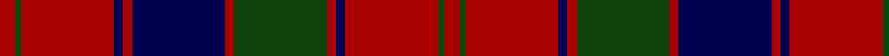

**Bands:** [RGRBRBRGRBRGR](/stripes/rgrbrbrgrbrgr/) · **Stripes:** [R DG R DB R DB R DG R DB R DG R](/stripes/stripes13/) R DG R DB R DB R DG R DB R DG R

This was sourced from weddslist.  It is a [13 band tartan](/bands/bands13/).

Original link http://www.weddslist.com/cgi-bin/tartans/pg.pl?source=tinsel

## Register references

External register numbers recorded for this tartan.

- Scottish Register of Tartans: [1166](https://www.tartanregister.gov.uk/tartanDetails.aspx?ref=1166)
- Scottish Register of Tartans: [1510](https://www.tartanregister.gov.uk/tartanDetails.aspx?ref=1510)
- Scottish Register of Tartans: [1758](https://www.tartanregister.gov.uk/tartanDetails.aspx?ref=1758)
- Scottish Register of Tartans: [2307](https://www.tartanregister.gov.uk/tartanDetails.aspx?ref=2307)
- Scottish Register of Tartans: [2349](https://www.tartanregister.gov.uk/tartanDetails.aspx?ref=2349)
- Scottish Register of Tartans: [2540](https://www.tartanregister.gov.uk/tartanDetails.aspx?ref=2540)
- Scottish Register of Tartans: [2582](https://www.tartanregister.gov.uk/tartanDetails.aspx?ref=2582)
- Scottish Register of Tartans: [2585](https://www.tartanregister.gov.uk/tartanDetails.aspx?ref=2585)
- Scottish Register of Tartans: [2625](https://www.tartanregister.gov.uk/tartanDetails.aspx?ref=2625)
- Scottish Register of Tartans: [2730](https://www.tartanregister.gov.uk/tartanDetails.aspx?ref=2730)
- Scottish Register of Tartans: [2862](https://www.tartanregister.gov.uk/tartanDetails.aspx?ref=2862)
- Scottish Register of Tartans: [3072](https://www.tartanregister.gov.uk/tartanDetails.aspx?ref=3072)
- Scottish Register of Tartans: [3555](https://www.tartanregister.gov.uk/tartanDetails.aspx?ref=3555)
- Scottish Register of Tartans: [4925](https://www.tartanregister.gov.uk/tartanDetails.aspx?ref=4925)
- Scottish Register of Tartans: [696](https://www.tartanregister.gov.uk/tartanDetails.aspx?ref=696)
- Scottish Register of Tartans: [697](https://www.tartanregister.gov.uk/tartanDetails.aspx?ref=697)
- Scottish Register of Tartans: [982](https://www.tartanregister.gov.uk/tartanDetails.aspx?ref=982)
- Scottish Tartans Authority (ITI): 1277
- Scottish Tartans Authority (ITI): 1429
- Scottish Tartans Authority (ITI): 218
- Scottish Tartans Authority (ITI): 977
- Scottish Tartans World Register: 1042
- Scottish Tartans World Register: 127
- Scottish Tartans World Register: 1277
- Scottish Tartans World Register: 1399
- Scottish Tartans World Register: 1429
- Scottish Tartans World Register: 1593
- Scottish Tartans World Register: 218
- Scottish Tartans World Register: 2218
- Scottish Tartans World Register: 3061
- Scottish Tartans World Register: 441
- Scottish Tartans World Register: 737
- Scottish Tartans World Register: 858
- Scottish Tartans World Register: 864
- Scottish Tartans World Register: 873
- Scottish Tartans World Register: 897
- Scottish Tartans World Register: 977
- Scottish Tartans World Register: 978

## Variants

Other setts woven to the same stripe pattern.

- [Robertson Curtain](/setts/s13/r3dg2r19db2r3db20r3dg20r3db2r19dg2r3~x4/)
- [Robertson D](/setts/s13/r3dg1r15db2r2db15r2dg15r2db2r15dg1r3~x2/)
- [Robertson D](/setts/s13/r5dg2r30db3r3db30r3dg30r3db3r30dg2r5/)

## Thread count
DR/10 DG4 DR60 DB6 DR6 DB60 DR6 DG60 DR6 DB6 DR60 DG4 DR/10

## Palette
Each colour and its ΔE from the base-6 reference it is a variant of.

| Colour | Shade | Base | ΔE (OKLab) |
|---|---|---|---|
| DB | <code style="background-color:#000052;">#000052</code> `#000052` | B <code style="background-color:#2A418A;">#2A418A</code> | 0.20 |
| DG | <code style="background-color:#11450D;">#11450D</code> `#11450D` | G <code style="background-color:#006100;">#006100</code> | 0.09 |
| DR | <code style="background-color:#AA0000;">#AA0000</code> `#AA0000` | R <code style="background-color:#CC0000;">#CC0000</code> | 0.07 |

## Nearest tartans

The nearest existing variants by ΔTartan distance.

1. [Robertson D](/setts/s13/r5dg2r30db3r3db30r3dg30r3db3r30dg2r5/) — ΔT 0.00
1. [Robertson D](/setts/s13/r3dg1r15db2r2db15r2dg15r2db2r15dg1r3~x2/) — ΔT 0.80
1. [Robertson](/setts/s13/r1dg1r9db1r1dg9r1db9r1dg1r9dg1r1~x2/) — ΔT 0.80
1. [Robertson 1819](/setts/s13/r3g3r35db3r3db35r3g35r3db3r35g3r3~x2/) — ΔT 0.86
1. [Walker, Evening (Name)](/setts/s12/o4k2r7k15r3k3r3k7r28dg7r6dg2~x2/) — ΔT 1.01
1. [Robertson](/setts/s13/r1dg1r9db1r1dg9r1db9r1dg1r9dg1r1/) — ΔT 1.02
1. [MacTier of Durris](/setts/s18/r18db1r1db2r1db1r18db18r2db18r18g2r4g2r18g18r2g9~x2/) — ΔT 1.07
1. [Harry (Welsh Name)](/setts/s10/dt6o3dt3o15r7dt7r5dt17r46o4/) — ΔT 1.12
1. [Robertson #5](/setts/s12/r28dg2r5dg2r28db3r3dg24r3db24r3db3~x2/) — ΔT 1.14
1. [Bruce Old](/setts/s14/r45db4r4dg48r4db4r4db15r4db4r40dg4r4dg30/) — ΔT 1.15

## Neighbour map

Every grey dot is one of 14313 variants placed by the first two principal components of the ΔTartan feature space (44% of its variance). Red is this tartan; blue dots are its nearest — click one to open its page.

<svg viewBox="0 0 640 380" role="img" style="max-width:100%;height:auto;border:1px solid #e0e0e0;border-radius:4px;display:block" xmlns="http://www.w3.org/2000/svg"><image href="/nn/cloud.v1.png" width="640" height="380"/><a href="/setts/s13/r5dg2r30db3r3db30r3dg30r3db3r30dg2r5/"><circle cx="340.0" cy="163.5" r="4" fill="#3465a4"><title>Robertson D</title></circle></a><a href="/setts/s13/r3dg1r15db2r2db15r2dg15r2db2r15dg1r3~x2/"><circle cx="321.5" cy="155.7" r="4" fill="#3465a4"><title>Robertson D</title></circle></a><a href="/setts/s13/r1dg1r9db1r1dg9r1db9r1dg1r9dg1r1~x2/"><circle cx="311.8" cy="183.6" r="4" fill="#3465a4"><title>Robertson</title></circle></a><a href="/setts/s13/r3g3r35db3r3db35r3g35r3db3r35g3r3~x2/"><circle cx="319.8" cy="160.6" r="4" fill="#3465a4"><title>Robertson 1819</title></circle></a><a href="/setts/s12/o4k2r7k15r3k3r3k7r28dg7r6dg2~x2/"><circle cx="324.8" cy="164.5" r="4" fill="#3465a4"><title>Walker, Evening (Name)</title></circle></a><a href="/setts/s13/r1dg1r9db1r1dg9r1db9r1dg1r9dg1r1/"><circle cx="293.8" cy="171.2" r="4" fill="#3465a4"><title>Robertson</title></circle></a><a href="/setts/s18/r18db1r1db2r1db1r18db18r2db18r18g2r4g2r18g18r2g9~x2/"><circle cx="325.3" cy="156.1" r="4" fill="#3465a4"><title>MacTier of Durris</title></circle></a><a href="/setts/s10/dt6o3dt3o15r7dt7r5dt17r46o4/"><circle cx="338.8" cy="163.0" r="4" fill="#3465a4"><title>Harry (Welsh Name)</title></circle></a><a href="/setts/s12/r28dg2r5dg2r28db3r3dg24r3db24r3db3~x2/"><circle cx="344.0" cy="163.1" r="4" fill="#3465a4"><title>Robertson #5</title></circle></a><a href="/setts/s14/r45db4r4dg48r4db4r4db15r4db4r40dg4r4dg30/"><circle cx="319.7" cy="160.6" r="4" fill="#3465a4"><title>Bruce Old</title></circle></a><circle cx="340.0" cy="163.5" r="5" fill="#c00000"/></svg>

ID: /setts/s13/r5dg2r30db3r3db30r3dg30r3db3r30dg2r5~x2/
