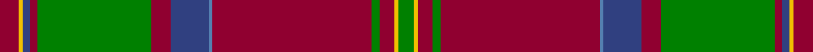

This page is one **sett** — a single exact thread-count. It belongs to the [tartan](/tartans/dr5y1b2dr2g30dr5b10ba1dr42g2dr4y1g4/)
(the same proportion at any scale), whose colour order is pattern [GYRGRBBRGRBYR](/stripes/gyrgrbbrgrbyr/).

Sourced from weddslist.  It is a [13 stripe tartan](/stripes/stripes13/).

Original link http://www.weddslist.com/cgi-bin/tartans/pg.pl?source=sts

## Thread count
DR/10 Y2 B4 DR4 G60 DR10 B20 Ba2 DR84 G4 DR8 Y2 G/8

## Palette
Each colour and the base-6 reference it is a variant of.

| Colour | Shade | Base |
|---|---|---|
| B | <code style="background-color:#304080;">#304080</code> `oklch(39.4% 0.109 270.2)` <small>#304080</small> | B <code style="background-color:#2A418A;">#2A418A</code> |
| Ba | <code style="background-color:#5480B0;">#5480B0</code> `oklch(58.8% 0.089 251.5)` <small>#5480B0</small> | B <code style="background-color:#2A418A;">#2A418A</code> |
| DR | <code style="background-color:#900030;">#900030</code> `oklch(41.6% 0.166 13.6)` <small>#900030</small> | R <code style="background-color:#CC0000;">#CC0000</code> |
| G | <code style="background-color:#008000;">#008000</code> `oklch(52.0% 0.177 142.5)` <small>#008000</small> | G <code style="background-color:#006100;">#006100</code> |
| Y | <code style="background-color:#F0C000;">#F0C000</code> `oklch(82.7% 0.169 90.5)` <small>#F0C000</small> | Y <code style="background-color:#F2BF00;">#F2BF00</code> |

## Nearest tartans

The nearest existing variants by ΔTartan distance, with this tartan at the top so the swatches line up against it.

ΔTartan

Tartan

Sett

—

<a href="/ttd/edit/#slug=r5ly1db2r2g30r5db10t1r42g2r4ly1g4~x2">MacDonald, of Glencoe</a> <a class="nn-out" href="/setts/s13/r5ly1db2r2g30r5db10t1r42g2r4ly1g4~x2/" title="open its dictionary page">↗</a>

0.35

<a href="/ttd/edit/#slug=r6r1db2r2g40r6db13t1r48g2r4r1g4~x2">MacDonald of Glencoe</a> <a class="nn-out" href="/setts/s13/r6r1db2r2g40r6db13t1r48g2r4r1g4~x2/" title="open its dictionary page">↗</a>

0.78

<a href="/ttd/edit/#slug=m6r1db2m2g40m6db13t1m48g2m4r1g4~x2">MacDonald of Glencoe Artifact Tartan Tartan Number: 1012. Earliest known date: 17th century Cargill fragment now at Fort William museum. See products available Copyright © Blair Urquhart, Comrie, 2015</a> <a class="nn-out" href="/setts/s13/m6r1db2m2g40m6db13t1m48g2m4r1g4~x2/" title="open its dictionary page">↗</a>

0.84

<a href="/ttd/edit/#slug=dt8k3y1k1y39k3r3y2dt11k8y2k3w2~x2">Afghanistan Memorial</a> <a class="nn-out" href="/setts/s13/dt8k3y1k1y39k3r3y2dt11k8y2k3w2~x2/" title="open its dictionary page">↗</a>

0.88

<a href="/ttd/edit/#slug=r6dg4ly2dg36r2dg2r2dg12r48dg4r2k1r2lr6~x2">Hay</a> <a class="nn-out" href="/setts/s14/r6dg4ly2dg36r2dg2r2dg12r48dg4r2k1r2lr6~x2/" title="open its dictionary page">↗</a>

1.05

<a href="/ttd/edit/#slug=g8r1r6g3r40y2k12r6g30r3k2r1r6~x2">MacDonald of Glencoe #3</a> <a class="nn-out" href="/setts/s13/g8r1r6g3r40y2k12r6g30r3k2r1r6~x2/" title="open its dictionary page">↗</a>

1.06

<a href="/ttd/edit/#slug=r5ly1db2r2dg30r5db10t1r42dg2r4ly1dg4~x2">MacDonald of Glencoe #2</a> <a class="nn-out" href="/setts/s13/r5ly1db2r2dg30r5db10t1r42dg2r4ly1dg4~x2/" title="open its dictionary page">↗</a>

1.11

<a href="/ttd/edit/#slug=r24lr1db2r4dg32r4db2lr1r4db6r4lr1db2r32dg2dr3dg6~x2">Dalzell</a> <a class="nn-out" href="/setts/s17/r24lr1db2r4dg32r4db2lr1r4db6r4lr1db2r32dg2dr3dg6~x2/" title="open its dictionary page">↗</a>

1.12

<a href="/ttd/edit/#slug=r36ly2db1r3g41r3db1ly2r3db12r3ly2db1r36g3r3g4~x2">Munro (Clan)</a> <a class="nn-out" href="/setts/s17/r36ly2db1r3g41r3db1ly2r3db12r3ly2db1r36g3r3g4~x2/" title="open its dictionary page">↗</a>

1.13

<a href="/ttd/edit/#slug=r7db1r2db2r35lb2r2db10r2g2r2g37r3db2r6~x2">Drummond of Megginch - 2023 BertieLexa</a> <a class="nn-out" href="/setts/s15/r7db1r2db2r35lb2r2db10r2g2r2g37r3db2r6~x2/" title="open its dictionary page">↗</a>

1.13

<a href="/ttd/edit/#slug=r24w1db2r8g52r8db2w1r8db12r8w1db2r52g4r6g6~x2">Dalzell</a> <a class="nn-out" href="/setts/s17/r24w1db2r8g52r8db2w1r8db12r8w1db2r52g4r6g6~x2/" title="open its dictionary page">↗</a>

## Neighbour map

Every grey dot is one of 14299 variants placed by the first two principal components of the ΔTartan feature space (44% of its variance). Red is this tartan; blue dots are its nearest — click one to open its page.

<svg viewBox="0 0 640 380" role="img" style="max-width:100%;height:auto;border:1px solid #e0e0e0;border-radius:4px;display:block" xmlns="http://www.w3.org/2000/svg"><image href="/nn/cloud.v1.png" width="640" height="380"/><a href="/setts/s13/r6r1db2r2g40r6db13t1r48g2r4r1g4~x2/"><circle cx="371.7" cy="75.6" r="4" fill="#3465a4"><title>MacDonald of Glencoe</title></circle></a><a href="/setts/s13/m6r1db2m2g40m6db13t1m48g2m4r1g4~x2/"><circle cx="379.8" cy="77.6" r="4" fill="#3465a4"><title>MacDonald of Glencoe Artifact Tartan Tartan Number: 1012. Earliest known date: 17th century Cargill fragment now at Fort William museum. See products available Copyright © Blair Urquhart, Comrie, 2015</title></circle></a><a href="/setts/s13/dt8k3y1k1y39k3r3y2dt11k8y2k3w2~x2/"><circle cx="330.8" cy="76.7" r="4" fill="#3465a4"><title>Afghanistan Memorial</title></circle></a><a href="/setts/s14/r6dg4ly2dg36r2dg2r2dg12r48dg4r2k1r2lr6~x2/"><circle cx="381.7" cy="74.0" r="4" fill="#3465a4"><title>Hay</title></circle></a><a href="/setts/s13/g8r1r6g3r40y2k12r6g30r3k2r1r6~x2/"><circle cx="330.3" cy="77.7" r="4" fill="#3465a4"><title>MacDonald of Glencoe #3</title></circle></a><a href="/setts/s13/r5ly1db2r2dg30r5db10t1r42dg2r4ly1dg4~x2/"><circle cx="400.6" cy="93.3" r="4" fill="#3465a4"><title>MacDonald of Glencoe #2</title></circle></a><a href="/setts/s17/r24lr1db2r4dg32r4db2lr1r4db6r4lr1db2r32dg2dr3dg6~x2/"><circle cx="371.3" cy="84.7" r="4" fill="#3465a4"><title>Dalzell</title></circle></a><a href="/setts/s17/r36ly2db1r3g41r3db1ly2r3db12r3ly2db1r36g3r3g4~x2/"><circle cx="361.9" cy="57.6" r="4" fill="#3465a4"><title>Munro (Clan)</title></circle></a><a href="/setts/s15/r7db1r2db2r35lb2r2db10r2g2r2g37r3db2r6~x2/"><circle cx="382.4" cy="92.7" r="4" fill="#3465a4"><title>Drummond of Megginch - 2023 BertieLexa</title></circle></a><a href="/setts/s17/r24w1db2r8g52r8db2w1r8db12r8w1db2r52g4r6g6~x2/"><circle cx="376.5" cy="58.5" r="4" fill="#3465a4"><title>Dalzell</title></circle></a><circle cx="372.0" cy="78.7" r="5" fill="#c00000"/></svg>

ID: /setts/s13/r5ly1db2r2g30r5db10t1r42g2r4ly1g4~x2/
