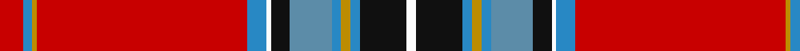

**Bands:** [RBYRBWKBBYBKW](/stripes/rbyrbwkbbybkw/) · **Stripes:** [R T LO R T W K T T LO T K W](/stripes/stripes13/) R T LO R T W K T T LO T K W

This was sourced from tartans-authority.  It is a [13 band tartan](/bands/bands13/).

Original link http://www.tartansauthority.com/tartan-ferret/display/10638/

## Thread count
R/10 Ba4 DY2 R90 Ba8 W2 K8 B18 Ba4 DY4 Ba4 K20 W/4

## Palette
Each colour and its ΔE from the base-6 reference it is a variant of.

| Colour | Shade | Base | ΔE (OKLab) |
|---|---|---|---|
| B | <code style="background-color:#5C8CA8;">#5C8CA8</code> `#5C8CA8` | B <code style="background-color:#2A418A;">#2A418A</code> | 0.23 |
| Ba | <code style="background-color:#2888C4;">#2888C4</code> `#2888C4` | B <code style="background-color:#2A418A;">#2A418A</code> | 0.21 |
| DY | <code style="background-color:#BC8C00;">#BC8C00</code> `#BC8C00` | Y <code style="background-color:#F2BF00;">#F2BF00</code> | 0.16 |
| K | <code style="background-color:#101010;">#101010</code> `#101010` | K <code style="background-color:#000000;">#000000</code> | 0.17 |
| R | <code style="background-color:#C80000;">#C80000</code> `#C80000` | R <code style="background-color:#CC0000;">#CC0000</code> | 0.01 |
| W | <code style="background-color:#FCFCFC;">#FCFCFC</code> `#FCFCFC` | W <code style="background-color:#F7F7F7;">#F7F7F7</code> | 0.01 |

## Nearest tartans

The nearest existing variants by ΔTartan distance.

1. [Stratford City Police PB (Corp)](/setts/s13/r5db2ly1r46db4w1k5t9db2ly2db2k10w2~x2/) — ΔT 0.34
1. [Stratford Police Pipe Band (Ontario)](/setts/s13/r5b2ly1r45b4w1k4lt9b2ly2b2k10w2~x2/) — ΔT 0.37
1. [Clan Chattan](/setts/s16/r122k4lr2dg32lr4ly7r7k2r7ly7lr4b32k8r8ly12lr4~x2/) — ΔT 0.85
1. [Clan Chattan](/setts/s16/r122k4lr2dg32lr4ly7r7k2r7ly7lr4b32k8r8ly12lr4/) — ΔT 0.85
1. [Chattan, Clan](/setts/s16/r120k4w2g32w4k7r7k2r7k7w4t32k8r8k12w4/) — ΔT 0.85
1. [Clan Chattan D](/setts/s16/r60k2lr1dg16lr2ly3r3k1r3ly3lr2b16k4r4ly6lr2~x2/) — ΔT 0.86
1. [Clan Chattan D](/setts/s16/r60k2lr1dg16lr2ly3r3k1r3ly3lr2b16k4r4ly6lr2/) — ΔT 0.86
1. [Stuart/Stewart of Rothesay](/setts/s13/dg7r122db17r12k12ly3k4w3dg48r16k4r6w5/) — ΔT 0.89
1. [Doig (Personal)](/setts/s11/r52ly2r1ly2t8db4g18r11w2db5t8~x2/) — ΔT 0.90
1. [Stuart/Stewart](/setts/s14/dg2r30db4r4k6ly1k1w1k1dg10r4k1r1w1~x2/) — ΔT 0.92

## Neighbour map

Every grey dot is one of 14313 variants placed by the first two principal components of the ΔTartan feature space (44% of its variance). Red is this tartan; blue dots are its nearest — click one to open its page.

<svg viewBox="0 0 640 380" role="img" style="max-width:100%;height:auto;border:1px solid #e0e0e0;border-radius:4px;display:block" xmlns="http://www.w3.org/2000/svg"><image href="/nn/cloud.v1.png" width="640" height="380"/><a href="/setts/s13/r5db2ly1r46db4w1k5t9db2ly2db2k10w2~x2/"><circle cx="335.8" cy="25.2" r="4" fill="#3465a4"><title>Stratford City Police PB (Corp)</title></circle></a><a href="/setts/s13/r5b2ly1r45b4w1k4lt9b2ly2b2k10w2~x2/"><circle cx="328.1" cy="22.1" r="4" fill="#3465a4"><title>Stratford Police Pipe Band (Ontario)</title></circle></a><a href="/setts/s16/r122k4lr2dg32lr4ly7r7k2r7ly7lr4b32k8r8ly12lr4~x2/"><circle cx="337.7" cy="18.7" r="4" fill="#3465a4"><title>Clan Chattan</title></circle></a><a href="/setts/s16/r122k4lr2dg32lr4ly7r7k2r7ly7lr4b32k8r8ly12lr4/"><circle cx="337.7" cy="18.7" r="4" fill="#3465a4"><title>Clan Chattan</title></circle></a><a href="/setts/s16/r120k4w2g32w4k7r7k2r7k7w4t32k8r8k12w4/"><circle cx="313.1" cy="14.0" r="4" fill="#3465a4"><title>Chattan, Clan</title></circle></a><a href="/setts/s16/r60k2lr1dg16lr2ly3r3k1r3ly3lr2b16k4r4ly6lr2~x2/"><circle cx="336.4" cy="18.1" r="4" fill="#3465a4"><title>Clan Chattan D</title></circle></a><a href="/setts/s16/r60k2lr1dg16lr2ly3r3k1r3ly3lr2b16k4r4ly6lr2/"><circle cx="336.4" cy="18.1" r="4" fill="#3465a4"><title>Clan Chattan D</title></circle></a><a href="/setts/s13/dg7r122db17r12k12ly3k4w3dg48r16k4r6w5/"><circle cx="372.3" cy="36.4" r="4" fill="#3465a4"><title>Stuart/Stewart of Rothesay</title></circle></a><a href="/setts/s11/r52ly2r1ly2t8db4g18r11w2db5t8~x2/"><circle cx="347.9" cy="50.3" r="4" fill="#3465a4"><title>Doig (Personal)</title></circle></a><a href="/setts/s14/dg2r30db4r4k6ly1k1w1k1dg10r4k1r1w1~x2/"><circle cx="337.2" cy="43.1" r="4" fill="#3465a4"><title>Stuart/Stewart</title></circle></a><circle cx="337.8" cy="26.6" r="5" fill="#c00000"/></svg>

ID: /setts/s13/r5t2lo1r45t4w1k4t9t2lo2t2k10w2~x2/
