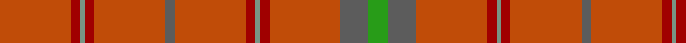

In pattern [GBRRGRRBRRGRR](/patterns/gbrrgrrbrrgrr/).

This was sourced from register-of-tartans.  It is a [13 stripes tartan](/stripes/stripes13/).

Original link https://www.tartanregister.gov.uk/tartanDetails.aspx?ref=3565

## Attestations

This cloth appears in 2 source records; the oldest owns this page.

- 01/06/2003 — Ross, David (register-of-tartans, [record](https://www.tartanregister.gov.uk/tartanDetails.aspx?ref=3565))
- June 2003 — Ross, David (Commemorative) (tartans-authority, [record](http://www.tartansauthority.com/tartan-ferret/display/6103/))

## Thread count
DO/60 DR8 LG4 DR8 DO60 N8 DO60 DR8 LG4 DR8 DO60 N24 G/16

## Palette
Each colour and its ΔE from the base-6 reference it is a variant of.

| Colour | Shade | Base | ΔE (OKLab) |
|---|---|---|---|
| DO | <code style="background-color:#C04C08;">#C04C08</code> `#C04C08` | R <code style="background-color:#C80000;">#C80000</code> | 0.08 |
| DR | <code style="background-color:#A00000;">#A00000</code> `#A00000` | R <code style="background-color:#C80000;">#C80000</code> | 0.09 |
| G | <code style="background-color:#289C18;">#289C18</code> `#289C18` | G <code style="background-color:#006400;">#006400</code> | 0.18 |
| LG | <code style="background-color:#789484;">#789484</code> `#789484` | G <code style="background-color:#006400;">#006400</code> | 0.23 |
| N | <code style="background-color:#5C5C5C;">#5C5C5C</code> `#5C5C5C` | B <code style="background-color:#2C4084;">#2C4084</code> | 0.14 |

## Nearest tartans

The nearest existing variants by ΔTartan distance.

1. [Fitzgibbon Red](/setts/s9/r4b12r48g4r4ra2r12b2ra4-b2d2d2d-g1c5627-ra3262a-rabd2125/) — ΔT 2.15
1. [Australia, The](/setts/s17/w4r30y20r8y4k4y4r8y100r8y4k4y4r8y20r30wa4-k101010-rc04c08-w98c8e8-wae0e0e0-yd87c00/) — ΔT 2.44
1. [Sarna](/setts/s16/r26ra2r4ra4r4ra2r4ra10r22ra2r4g4r4ra2r4g14-g008000-r806050-rac00000/) — ΔT 2.58
1. [Tyrone, County](/setts/s12/r100g12b14ga4b4w4b4g28r16ga4r18ga6-b4c3428-g8c7038-ga003820-r880000-wc0c0c0/) — ΔT 2.65
1. [MacColl](/setts/s14/r24g2r2ra16r4ra2r2b6r2ra2r24g2r2g8-b304080-g008000-rc00000-ra806050/) — ΔT 2.67
1. [Australian District Tartan Tartan Number: 611. Earliest known date: 1984 The Australian tartan was designed by John Reid, a Melbourne architect, as the result of a national competition held by the Scottish Australian Heritage Council. He based his design on the warm colours of the 'outback' and the pattern of the tartan of Lachlan MacQuarrie, the Scotsman who became the first civil governor of the Australian colony in 1809. The tartan is design registered in Australia (No. 97439). (Source: District Tartans, P. Smith and G Teall, 1992) See products available Copyright © Blair Urquhart, Comrie, 2015](/setts/s17/w4r30y20r8y4k4y4r8y100r8y4k4y4r8y20r30wa4-k101010-rac6444-w98c8e8-wae0e0e0-ybc9450/) — ΔT 2.72
1. [Sarna (District)](/setts/s16/g26r2g4r4g4r2g4r10g22r2g4ga4g4r2g4ga14-g604000-ga006818-rc80000/) — ΔT 2.73
1. [MacIver of Strathendry Htg (Personal](/setts/s9/r6ra56b10ra10b66ra10b10ra56y6-b441800-r880000-ra98481c-ybc8c00/) — ΔT 2.73
1. [Portosalvo (Corporate)](/setts/s11/r10g2r64ra2r16ra18r4g4g6ra6g2-g006440-ra07c58-ra880000/) — ΔT 2.81
1. [Cairn O'Mount (Personal)](/setts/s6/r116b24r10g56r14y10-b647480-g648468-rb40000-ybc8c00/) — ΔT 2.90

## Neighbour map

Every grey dot is one of 15726 variants placed by the first two principal components of the ΔTartan feature space (44% of its variance). Red is this tartan; blue dots are its nearest — click one to open its page.

<svg viewBox="0 0 640 380" role="img" style="max-width:100%;height:auto;border:1px solid #e0e0e0;border-radius:4px;display:block" xmlns="http://www.w3.org/2000/svg"><image href="/nn/cloud.v1.png" width="640" height="380"/><a href="/setts/s9/r4b12r48g4r4ra2r12b2ra4-b2d2d2d-g1c5627-ra3262a-rabd2125/"><circle cx="602.0" cy="171.3" r="4" fill="#3465a4"><title>Fitzgibbon Red</title></circle></a><a href="/setts/s17/w4r30y20r8y4k4y4r8y100r8y4k4y4r8y20r30wa4-k101010-rc04c08-w98c8e8-wae0e0e0-yd87c00/"><circle cx="469.8" cy="106.8" r="4" fill="#3465a4"><title>Australia, The</title></circle></a><a href="/setts/s16/r26ra2r4ra4r4ra2r4ra10r22ra2r4g4r4ra2r4g14-g008000-r806050-rac00000/"><circle cx="479.9" cy="203.9" r="4" fill="#3465a4"><title>Sarna</title></circle></a><a href="/setts/s12/r100g12b14ga4b4w4b4g28r16ga4r18ga6-b4c3428-g8c7038-ga003820-r880000-wc0c0c0/"><circle cx="466.8" cy="124.7" r="4" fill="#3465a4"><title>Tyrone, County</title></circle></a><a href="/setts/s14/r24g2r2ra16r4ra2r2b6r2ra2r24g2r2g8-b304080-g008000-rc00000-ra806050/"><circle cx="412.7" cy="162.5" r="4" fill="#3465a4"><title>MacColl</title></circle></a><a href="/setts/s17/w4r30y20r8y4k4y4r8y100r8y4k4y4r8y20r30wa4-k101010-rac6444-w98c8e8-wae0e0e0-ybc9450/"><circle cx="461.9" cy="112.4" r="4" fill="#3465a4"><title>Australian District Tartan Tartan Number: 611. Earliest known date: 1984 The Australian tartan was designed by John Reid, a Melbourne architect, as the result of a national competition held by the Scottish Australian Heritage Council. He based his design on the warm colours of the 'outback' and the pattern of the tartan of Lachlan MacQuarrie, the Scotsman who became the first civil governor of the Australian colony in 1809. The tartan is design registered in Australia (No. 97439). (Source: District Tartans, P. Smith and G Teall, 1992) See products available Copyright © Blair Urquhart, Comrie, 2015</title></circle></a><a href="/setts/s16/g26r2g4r4g4r2g4r10g22r2g4ga4g4r2g4ga14-g604000-ga006818-rc80000/"><circle cx="478.2" cy="206.0" r="4" fill="#3465a4"><title>Sarna (District)</title></circle></a><a href="/setts/s9/r6ra56b10ra10b66ra10b10ra56y6-b441800-r880000-ra98481c-ybc8c00/"><circle cx="420.4" cy="211.8" r="4" fill="#3465a4"><title>MacIver of Strathendry Htg (Personal</title></circle></a><a href="/setts/s11/r10g2r64ra2r16ra18r4g4g6ra6g2-g006440-ra07c58-ra880000/"><circle cx="537.8" cy="135.8" r="4" fill="#3465a4"><title>Portosalvo (Corporate)</title></circle></a><a href="/setts/s6/r116b24r10g56r14y10-b647480-g648468-rb40000-ybc8c00/"><circle cx="428.5" cy="211.5" r="4" fill="#3465a4"><title>Cairn O'Mount (Personal)</title></circle></a><circle cx="531.4" cy="182.5" r="5" fill="#c00000"/></svg>

ID: /setts/s13/r60ra8g4ra8r60b8r60ra8g4ra8r60b24ga16-b5c5c5c-g789484-ga289c18-rc04c08-raa00000/
