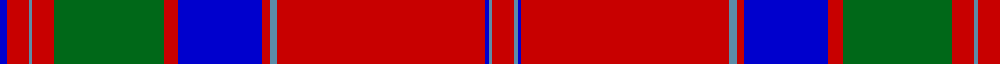

In pattern [BRBRGRBRBRBBR](/patterns/brbrgrbrbrbbr/).

This was sourced from register-of-tartans.  It is a [13 stripes tartan](/stripes/stripes13/).

Original link https://www.tartanregister.gov.uk/tartanDetails.aspx?ref=2440

## Register references

External register numbers recorded for this tartan.

- Scottish Register of Tartans: [2440](https://www.tartanregister.gov.uk/tartanDetails.aspx?ref=2440)
- Scottish Tartans Authority (ITI): 446
- Scottish Tartans World Register: 446

## Thread count
Ba/4 R12 B2 R12 G60 R8 Ba46 R4 B4 R114 Ba2 B2 R/12

## Palette
Each colour and its ΔE from the base-6 reference it is a variant of.

| Colour | Shade | Base | ΔE (OKLab) |
|---|---|---|---|
| B | <code style="background-color:#5C8CA8;">#5C8CA8</code> `#5C8CA8` | B <code style="background-color:#2A418A;">#2A418A</code> | 0.23 |
| Ba | <code style="background-color:#0000CD;">#0000CD</code> `#0000CD` | B <code style="background-color:#2A418A;">#2A418A</code> | 0.14 |
| DB | <code style="background-color:#2C2C80;">#2C2C80</code> `#2C2C80` | B <code style="background-color:#2A418A;">#2A418A</code> | 0.06 |
| DG | <code style="background-color:#003820;">#003820</code> `#003820` | G <code style="background-color:#006100;">#006100</code> | 0.15 |
| DP | <code style="background-color:#440044;">#440044</code> `#440044` | B <code style="background-color:#2A418A;">#2A418A</code> | 0.18 |
| G | <code style="background-color:#006818;">#006818</code> `#006818` | G <code style="background-color:#006100;">#006100</code> | 0.02 |
| R | <code style="background-color:#C80000;">#C80000</code> `#C80000` | R <code style="background-color:#CC0000;">#CC0000</code> | 0.01 |

## Nearest tartans

The nearest existing variants by ΔTartan distance.

1. [Drummond of Megginch - 1820 Plaid](/setts/s15/r26b2r6b6r126w6r6b38r6g6r6g130r19b6r18~b000064-g004c00-rc80000-w98c8e8/) — ΔT 0.98
1. [MacGillivray](/setts/s13/r4w1b1r32w2r2b12r2g16r4w1r4b2~b00004c-g004c00-rc80000-wd0d0d0~x2/) — ΔT 0.99
1. [Grant](/setts/s15/r6b2r2g24r2b2r2b8r2w1r32b2r2b1r6~b00004c-g004c00-rc80000-wd0d0d0/) — ΔT 1.08
1. [MacGillivray - 1819 (Clan)](/setts/s13/r6b1ba1r57b2r2ba23r4g30r6b1r6ba2~b5c8ca8-ba14283c-g006818-rc80000~x2/) — ΔT 1.09
1. [Drummond of Megginch - 1849 Kilt](/setts/s15/r7b1r2b2r35w2r2b10r2g2r2g37r3b2r6~b000064-g004c00-rc80000-w98c8e8~x2/) — ΔT 1.12
1. [MacGillivray Clan Tartan Tartan Number: 446. Earliest known date: 1831 "A characteristic Clan Chattan tartan...", writes D.C.Stewart, with much in common with the setts of the neighbouring clans in Strathnairn and Morvern. Wilson produced this sett with a black stripe in the centre of the the red square. The chiefship of Clan MacGillivray is vacant and the 'Steward' of clan affairs, appointed by Lord Lyon, is Commander Colonel George Brown MacGillivray. See products available Copyright © Blair Urquhart, Comrie, 2015](/setts/s13/r4b1ba1r32b2r2ba12r2g16r4b1r4ba2~b5c8ca8-ba2c2c80-g006818-rc80000~x2/) — ΔT 1.12
1. [MacFarlane, or Lendrum](/setts/s14/r42k1g12w2r3k1r3w2g2b12k4r3w4g3~b800080-g008000-k000000-r900030-we0e0e0~x2/) — ΔT 1.16
1. [MacPherson Of Cluny](/setts/s11/r3b1r1g21r3b18r35b1y1r4g1~b5a3094-g004c00-rc80000-yffc800~x2/) — ΔT 1.21
1. [MacGillivray](/setts/s13/r4b1ba1r32b2r2ba12r2g16r4b1r4ba2~b4367ae-ba000052-g11450d-raa0000~x2/) — ΔT 1.22
1. [Grant VS](/setts/s13/r4b2r2b2r56b16r4g1r4g36r3g1r4~b00004c-g004c00-rc80000/) — ΔT 1.22

## Neighbour map

Every grey dot is one of 15726 variants placed by the first two principal components of the ΔTartan feature space (44% of its variance). Red is this tartan; blue dots are its nearest — click one to open its page.

<svg viewBox="0 0 640 380" role="img" style="max-width:100%;height:auto;border:1px solid #e0e0e0;border-radius:4px;display:block" xmlns="http://www.w3.org/2000/svg"><image href="/nn/cloud.v1.png" width="640" height="380"/><a href="/setts/s15/r26b2r6b6r126w6r6b38r6g6r6g130r19b6r18~b000064-g004c00-rc80000-w98c8e8/"><circle cx="374.4" cy="69.2" r="4" fill="#3465a4"><title>Drummond of Megginch - 1820 Plaid</title></circle></a><a href="/setts/s13/r4w1b1r32w2r2b12r2g16r4w1r4b2~b00004c-g004c00-rc80000-wd0d0d0~x2/"><circle cx="364.3" cy="91.3" r="4" fill="#3465a4"><title>MacGillivray</title></circle></a><a href="/setts/s15/r6b2r2g24r2b2r2b8r2w1r32b2r2b1r6~b00004c-g004c00-rc80000-wd0d0d0/"><circle cx="376.9" cy="86.9" r="4" fill="#3465a4"><title>Grant</title></circle></a><a href="/setts/s13/r6b1ba1r57b2r2ba23r4g30r6b1r6ba2~b5c8ca8-ba14283c-g006818-rc80000~x2/"><circle cx="412.5" cy="80.2" r="4" fill="#3465a4"><title>MacGillivray - 1819 (Clan)</title></circle></a><a href="/setts/s15/r7b1r2b2r35w2r2b10r2g2r2g37r3b2r6~b000064-g004c00-rc80000-w98c8e8~x2/"><circle cx="355.7" cy="80.2" r="4" fill="#3465a4"><title>Drummond of Megginch - 1849 Kilt</title></circle></a><a href="/setts/s13/r4b1ba1r32b2r2ba12r2g16r4b1r4ba2~b5c8ca8-ba2c2c80-g006818-rc80000~x2/"><circle cx="391.4" cy="100.6" r="4" fill="#3465a4"><title>MacGillivray Clan Tartan Tartan Number: 446. Earliest known date: 1831 &quot;A characteristic Clan Chattan tartan...&quot;, writes D.C.Stewart, with much in common with the setts of the neighbouring clans in Strathnairn and Morvern. Wilson produced this sett with a black stripe in the centre of the the red square. The chiefship of Clan MacGillivray is vacant and the 'Steward' of clan affairs, appointed by Lord Lyon, is Commander Colonel George Brown MacGillivray. See products available Copyright © Blair Urquhart, Comrie, 2015</title></circle></a><a href="/setts/s14/r42k1g12w2r3k1r3w2g2b12k4r3w4g3~b800080-g008000-k000000-r900030-we0e0e0~x2/"><circle cx="331.7" cy="51.9" r="4" fill="#3465a4"><title>MacFarlane, or Lendrum</title></circle></a><a href="/setts/s11/r3b1r1g21r3b18r35b1y1r4g1~b5a3094-g004c00-rc80000-yffc800~x2/"><circle cx="368.4" cy="103.9" r="4" fill="#3465a4"><title>MacPherson Of Cluny</title></circle></a><a href="/setts/s13/r4b1ba1r32b2r2ba12r2g16r4b1r4ba2~b4367ae-ba000052-g11450d-raa0000~x2/"><circle cx="390.3" cy="106.1" r="4" fill="#3465a4"><title>MacGillivray</title></circle></a><a href="/setts/s13/r4b2r2b2r56b16r4g1r4g36r3g1r4~b00004c-g004c00-rc80000/"><circle cx="423.2" cy="89.1" r="4" fill="#3465a4"><title>Grant VS</title></circle></a><circle cx="390.6" cy="72.6" r="5" fill="#c00000"/></svg>

ID: /setts/s13/r6b1ba1r57b2r2ba23r4g30r6b1r6ba2~b5c8ca8-ba0000cd-g006818-rc80000~x2/
