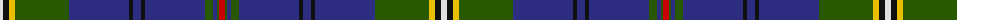

In pattern [RGBGBKBKBGYKW](/patterns/rgbgbkbkbgykw/).

This was sourced from tartans-authority.  It is a [13 stripes tartan](/stripes/stripes13/).

Original link http://www.tartansauthority.com/tartan-ferret/display/2598/

## Thread count
LN/6 K6 Y6 G54 DB60 K4 DB8 K4 DB60 G8 DB4 G2 R/6

## Palette
Each colour and its ΔE from the base-6 reference it is a variant of.

| Colour | Shade | Base | ΔE (OKLab) |
|---|---|---|---|
| DB | <code style="background-color:#2C2C80;">#2C2C80</code> `#2C2C80` | B <code style="background-color:#2A418A;">#2A418A</code> | 0.06 |
| G | <code style="background-color:#285800;">#285800</code> `#285800` | G <code style="background-color:#006100;">#006100</code> | 0.03 |
| K | <code style="background-color:#101010;">#101010</code> `#101010` | K <code style="background-color:#000000;">#000000</code> | 0.17 |
| LN | <code style="background-color:#E0E0E0;">#E0E0E0</code> `#E0E0E0` | W <code style="background-color:#F7F7F7;">#F7F7F7</code> | 0.07 |
| R | <code style="background-color:#C80000;">#C80000</code> `#C80000` | R <code style="background-color:#CC0000;">#CC0000</code> | 0.01 |
| Y | <code style="background-color:#E8C000;">#E8C000</code> `#E8C000` | Y <code style="background-color:#F2BF00;">#F2BF00</code> | 0.02 |

## Nearest tartans

The nearest existing variants by ΔTartan distance.

1. [Scottish Heritage Society (Corporate](/setts/s12/b76ba6k6b24g17k4r10k4g17b4k2w6-b1c1c50-baa400a4-g006818-k101010-rc80000-we0e0e0/) — ΔT 0.76
1. [St. Andrew Quebec City](/setts/s14/b80g20y2g10r10w2r4w2r10g10y2g20b80ya4-b2c2c80-g006818-rc80000-we0e0e0-yd87c00-yae8c000/) — ΔT 0.82
1. [Northfield Academy](/setts/s15/r4b2ba4b4ra2ba24b4ra2rb20b56ba2b6ba4b6w2-b14283c-ba2474e8-r888888-raff0000-rb901c38-wffffff/) — ΔT 0.92
1. [Huaum, Patrick Antoine (Personal))](/setts/s11/g10b9ba4r2ba4g6k10w4g24b60k4-b2c2c80-ba780078-g006818-k101010-r880000-we0e0e0/) — ΔT 0.96
1. [Riyadh Caledonian (Corporate)](/setts/s13/b92g16b4w4b12g20b4ba16b12y4g12w4g16-b2c2c80-ba780078-g006818-we0e0e0-ye8c000/) — ΔT 1.00
1. [Quigley of Knockcroghery (Modern)](/setts/s12/b50w4k4b30y4b2y4b30k4w4g32r2-b172d60-g124b24-k120a01-rdd1212-wf5f1ea-ye0a126/) — ΔT 1.00
1. [Wcwm 9275-1510-1](/setts/s10/b120y4b20k18w4k4r4k4g56y6-b1c0070-g006818-k101010-r880000-wc0c0c0-yd09800/) — ΔT 1.00
1. [Joss](/setts/s13/r6g2b4g8b60k4b8k4b60g54y6k6w6-b304080-g008000-k000000-rc00000-we0e0e0-yf0c000/) — ΔT 1.01
1. [Brough from Orkney (Name)](/setts/s13/b4k4b2r2k4ra14k4r4b24y6b54r8k4-b003c64-k101010-r888888-rac80000-yfccc00/) — ΔT 1.06
1. [Quigley of Knockcroghery (Pers)](/setts/s12/b50w4k4b30y4b2y4b30k4w4g32r2-b2c2c80-g00643c-k101010-rc80000-we0e0e0-ybc8c00/) — ΔT 1.11

## Neighbour map

Every grey dot is one of 15726 variants placed by the first two principal components of the ΔTartan feature space (44% of its variance). Red is this tartan; blue dots are its nearest — click one to open its page.

<svg viewBox="0 0 640 380" role="img" style="max-width:100%;height:auto;border:1px solid #e0e0e0;border-radius:4px;display:block" xmlns="http://www.w3.org/2000/svg"><image href="/nn/cloud.v1.png" width="640" height="380"/><a href="/setts/s12/b76ba6k6b24g17k4r10k4g17b4k2w6-b1c1c50-baa400a4-g006818-k101010-rc80000-we0e0e0/"><circle cx="346.5" cy="82.7" r="4" fill="#3465a4"><title>Scottish Heritage Society (Corporate</title></circle></a><a href="/setts/s14/b80g20y2g10r10w2r4w2r10g10y2g20b80ya4-b2c2c80-g006818-rc80000-we0e0e0-yd87c00-yae8c000/"><circle cx="381.5" cy="70.1" r="4" fill="#3465a4"><title>St. Andrew Quebec City</title></circle></a><a href="/setts/s15/r4b2ba4b4ra2ba24b4ra2rb20b56ba2b6ba4b6w2-b14283c-ba2474e8-r888888-raff0000-rb901c38-wffffff/"><circle cx="309.3" cy="70.1" r="4" fill="#3465a4"><title>Northfield Academy</title></circle></a><a href="/setts/s11/g10b9ba4r2ba4g6k10w4g24b60k4-b2c2c80-ba780078-g006818-k101010-r880000-we0e0e0/"><circle cx="297.7" cy="99.5" r="4" fill="#3465a4"><title>Huaum, Patrick Antoine (Personal))</title></circle></a><a href="/setts/s13/b92g16b4w4b12g20b4ba16b12y4g12w4g16-b2c2c80-ba780078-g006818-we0e0e0-ye8c000/"><circle cx="347.7" cy="112.5" r="4" fill="#3465a4"><title>Riyadh Caledonian (Corporate)</title></circle></a><a href="/setts/s12/b50w4k4b30y4b2y4b30k4w4g32r2-b172d60-g124b24-k120a01-rdd1212-wf5f1ea-ye0a126/"><circle cx="365.6" cy="113.1" r="4" fill="#3465a4"><title>Quigley of Knockcroghery (Modern)</title></circle></a><a href="/setts/s10/b120y4b20k18w4k4r4k4g56y6-b1c0070-g006818-k101010-r880000-wc0c0c0-yd09800/"><circle cx="342.8" cy="93.0" r="4" fill="#3465a4"><title>Wcwm 9275-1510-1</title></circle></a><a href="/setts/s13/r6g2b4g8b60k4b8k4b60g54y6k6w6-b304080-g008000-k000000-rc00000-we0e0e0-yf0c000/"><circle cx="315.4" cy="84.2" r="4" fill="#3465a4"><title>Joss</title></circle></a><a href="/setts/s13/b4k4b2r2k4ra14k4r4b24y6b54r8k4-b003c64-k101010-r888888-rac80000-yfccc00/"><circle cx="368.4" cy="102.9" r="4" fill="#3465a4"><title>Brough from Orkney (Name)</title></circle></a><a href="/setts/s12/b50w4k4b30y4b2y4b30k4w4g32r2-b2c2c80-g00643c-k101010-rc80000-we0e0e0-ybc8c00/"><circle cx="370.9" cy="112.8" r="4" fill="#3465a4"><title>Quigley of Knockcroghery (Pers)</title></circle></a><circle cx="337.8" cy="93.0" r="5" fill="#c00000"/></svg>

ID: /setts/s13/r6g2b4g8b60k4b8k4b60g54y6k6w6-b2c2c80-g285800-k101010-rc80000-we0e0e0-ye8c000/
