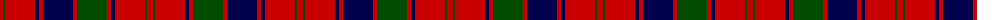

In pattern [RGRBRBRGRBRGR](/patterns/rgrbrbrgrbrgr/).

This was sourced from weddslist.  It is a [13 stripes tartan](/stripes/stripes13/).

Original link http://www.weddslist.com/cgi-bin/tartans/pg.pl?source=rb

## Thread count
R/6 G2 R30 DB4 R4 DB30 R4 G30 R4 DB4 R30 G2 R/6

## Palette
Each colour and its ΔE from the base-6 reference it is a variant of.

| Colour | Shade | Base | ΔE (OKLab) |
|---|---|---|---|
| DB | <code style="background-color:#00004C;">#00004C</code> `#00004C` | B <code style="background-color:#2C4084;">#2C4084</code> | 0.21 |
| G | <code style="background-color:#004C00;">#004C00</code> `#004C00` | G <code style="background-color:#006400;">#006400</code> | 0.08 |
| R | <code style="background-color:#C80000;">#C80000</code> `#C80000` | R <code style="background-color:#C80000;">#C80000</code> | 0.00 |

## Nearest tartans

The nearest existing variants by ΔTartan distance.

1. [Robertson D](/setts/s13/r10g4r60b6r6b60r6g60r6b6r60g4r10-b000052-g11450d-raa0000/) — ΔT 0.79
1. [Robertson D](/setts/s13/r5g2r30b3r3b30r3g30r3b3r30g2r5-b000052-g11450d-raa0000/) — ΔT 0.79
1. [Robertson](/setts/s13/r1g1r9b1r1g9r1b9r1g1r9g1r1-b000064-g004c00-rc80000/) — ΔT 0.87
1. [Robertson 1819](/setts/s13/r6g6r70b6r6b70r6g70r6b6r70g6r6-b202060-g006818-rc80000/) — ΔT 0.92
1. [Robertson #5](/setts/s12/r56g4r10g4r56b6r6g48r6b48r6b6-b2c4084-g005020-rdc0000/) — ΔT 0.98
1. [Walkers Shortbread (Corporate)](/setts/s15/r10k2r4k4r32b4r4k18r4k4r4k26r4k4r8-b5c8ca8-k101010-rc80000/) — ΔT 1.01
1. [Harry/Parry](/setts/s10/k6r3k3r15ra7k7ra5k17ra46r4-k000028-rbe7832-rac80028/) — ΔT 1.02
1. [Murray of Tullibardine - Artefact](/setts/s21/k8r6k6r8k44r8k6r6g8r6k6r88k60r20g20r80g60r54k20r28g6-g003820-k00002c-rc80000/) — ΔT 1.08
1. [Harry (Welsh Name)](/setts/s10/b6r3b3r15ra7b7ra5b17ra46r4-b002c48-r888888-rac80000/) — ΔT 1.08
1. [Robertson Curtain](/setts/s13/r12g8r76b8r12b80r12g80r12b8r76g8r12-b2c4084-g005020-rdc0000/) — ΔT 1.09

## Neighbour map

Every grey dot is one of 15726 variants placed by the first two principal components of the ΔTartan feature space (44% of its variance). Red is this tartan; blue dots are its nearest — click one to open its page.

<svg viewBox="0 0 640 380" role="img" style="max-width:100%;height:auto;border:1px solid #e0e0e0;border-radius:4px;display:block" xmlns="http://www.w3.org/2000/svg"><image href="/nn/cloud.v1.png" width="640" height="380"/><a href="/setts/s13/r10g4r60b6r6b60r6g60r6b6r60g4r10-b000052-g11450d-raa0000/"><circle cx="338.0" cy="161.9" r="4" fill="#3465a4"><title>Robertson D</title></circle></a><a href="/setts/s13/r5g2r30b3r3b30r3g30r3b3r30g2r5-b000052-g11450d-raa0000/"><circle cx="338.0" cy="161.9" r="4" fill="#3465a4"><title>Robertson D</title></circle></a><a href="/setts/s13/r1g1r9b1r1g9r1b9r1g1r9g1r1-b000064-g004c00-rc80000/"><circle cx="292.3" cy="171.2" r="4" fill="#3465a4"><title>Robertson</title></circle></a><a href="/setts/s13/r6g6r70b6r6b70r6g70r6b6r70g6r6-b202060-g006818-rc80000/"><circle cx="318.2" cy="159.9" r="4" fill="#3465a4"><title>Robertson 1819</title></circle></a><a href="/setts/s12/r56g4r10g4r56b6r6g48r6b48r6b6-b2c4084-g005020-rdc0000/"><circle cx="343.2" cy="162.8" r="4" fill="#3465a4"><title>Robertson #5</title></circle></a><a href="/setts/s15/r10k2r4k4r32b4r4k18r4k4r4k26r4k4r8-b5c8ca8-k101010-rc80000/"><circle cx="351.5" cy="149.6" r="4" fill="#3465a4"><title>Walkers Shortbread (Corporate)</title></circle></a><a href="/setts/s10/k6r3k3r15ra7k7ra5k17ra46r4-k000028-rbe7832-rac80028/"><circle cx="314.8" cy="150.8" r="4" fill="#3465a4"><title>Harry/Parry</title></circle></a><a href="/setts/s21/k8r6k6r8k44r8k6r6g8r6k6r88k60r20g20r80g60r54k20r28g6-g003820-k00002c-rc80000/"><circle cx="318.4" cy="135.5" r="4" fill="#3465a4"><title>Murray of Tullibardine - Artefact</title></circle></a><a href="/setts/s10/b6r3b3r15ra7b7ra5b17ra46r4-b002c48-r888888-rac80000/"><circle cx="337.6" cy="162.5" r="4" fill="#3465a4"><title>Harry (Welsh Name)</title></circle></a><a href="/setts/s13/r12g8r76b8r12b80r12g80r12b8r76g8r12-b2c4084-g005020-rdc0000/"><circle cx="314.7" cy="172.7" r="4" fill="#3465a4"><title>Robertson Curtain</title></circle></a><circle cx="320.1" cy="156.0" r="5" fill="#c00000"/></svg>

ID: /setts/s13/r6g2r30b4r4b30r4g30r4b4r30g2r6-b00004c-g004c00-rc80000/
