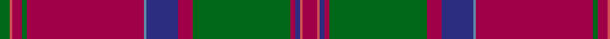

In pattern [GRRGRBBRGRBRR](/patterns/grrgrbbrgrbrr/).

This was sourced from house-of-tartan.  It is a [13 stripes tartan](/stripes/stripes13/).

Original link http://www.house-of-tartan.scotland.net/house/TartanViewjs.asp?colr=Def&tnam=1012

## Thread count
G/8 DO2 R8 G4 R96 B2 DB26 R12 G80 R4 DB4 DO2 R/12

## Palette
Each colour and its ΔE from the base-6 reference it is a variant of.

| Colour | Shade | Base | ΔE (OKLab) |
|---|---|---|---|
| B | <code style="background-color:#5C8CA8;">#5C8CA8</code> `#5C8CA8` | B <code style="background-color:#2A418A;">#2A418A</code> | 0.23 |
| DB | <code style="background-color:#2C2C80;">#2C2C80</code> `#2C2C80` | B <code style="background-color:#2A418A;">#2A418A</code> | 0.06 |
| DO | <code style="background-color:#D05054;">#D05054</code> `#D05054` | R <code style="background-color:#CC0000;">#CC0000</code> | 0.09 |
| G | <code style="background-color:#006818;">#006818</code> `#006818` | G <code style="background-color:#006100;">#006100</code> | 0.02 |
| R | <code style="background-color:#A00048;">#A00048</code> `#A00048` | R <code style="background-color:#CC0000;">#CC0000</code> | 0.12 |
| Ra | <code style="background-color:#C80000;">#C80000</code> `#C80000` | R <code style="background-color:#CC0000;">#CC0000</code> | 0.01 |

## Nearest tartans

The nearest existing variants by ΔTartan distance.

1. [MacDonald of Glencoe](/setts/s13/r6ra1b2r2g40r6b13ba1r48g2r4ra1g4~b304080-ba5480b0-g008000-r900030-rad03030~x2/) — ΔT 0.69
1. [MacDonald of Glencoe #2](/setts/s13/r5y1b2r2g30r5b10ba1r42g2r4y1g4~b2c4084-ba3c82af-g005020-r960028-ye8c000~x2/) — ΔT 0.72
1. [MacDonald, of Glencoe](/setts/s13/r5y1b2r2g30r5b10ba1r42g2r4y1g4~b304080-ba5480b0-g008000-r900030-yf0c000~x2/) — ΔT 0.78
1. [MacDonald of Glenaladale #2](/setts/s13/r6ra1b2r2g40r6b13ba1r48g2r4ra1g4~b2c4084-ba3c82af-g005020-r960028-rac82828~x2/) — ΔT 1.02
1. [Hay](/setts/s14/r6g4y2g36r2g2r2g12r48g4r2k1r2ya6~g11450d-k000000-raa0000-yaaaa00-yaaaaaaa~x2/) — ΔT 1.23
1. [MacFarlane](/setts/s14/r42k1g12y2r3k1r3y2g2b12k4r3y4g3~b6e5058-g11450d-k000000-raa0000-yaaaaaa~x2/) — ΔT 1.28
1. [Afghanistan Memorial](/setts/s13/b8k3g1k1g39k3r3g2b11k8g2k3w2~b14283c-g8c7038-k300500-ra00000-wfcfcfc~x2/) — ΔT 1.30
1. [Dalzell](/setts/s17/r24y1b2r4g32r4b2y1r4b6r4y1b2r32g2ba3g6~b000052-ba59110d-g11450d-raa0000-yaaaaaa~x2/) — ΔT 1.31
1. [Dalzell](/setts/s17/r24y1b2r4g32r4b2y1r4b6r4y1b2r32g2ba3g6~b000052-ba59110d-g11450d-raa0000-yaaaaaa/) — ΔT 1.31
1. [Chisholm, Christopher (Personal)](/setts/s14/r2b2r1b2r1b28k6r2ba1r2ba1r24k1ra1~b003c64-ba3474fc-k101010-r960000-raff0000~x2/) — ΔT 1.33

## Neighbour map

Every grey dot is one of 15726 variants placed by the first two principal components of the ΔTartan feature space (44% of its variance). Red is this tartan; blue dots are its nearest — click one to open its page.

<svg viewBox="0 0 640 380" role="img" style="max-width:100%;height:auto;border:1px solid #e0e0e0;border-radius:4px;display:block" xmlns="http://www.w3.org/2000/svg"><image href="/nn/cloud.v1.png" width="640" height="380"/><a href="/setts/s13/r6ra1b2r2g40r6b13ba1r48g2r4ra1g4~b304080-ba5480b0-g008000-r900030-rad03030~x2/"><circle cx="370.6" cy="73.0" r="4" fill="#3465a4"><title>MacDonald of Glencoe</title></circle></a><a href="/setts/s13/r5y1b2r2g30r5b10ba1r42g2r4y1g4~b2c4084-ba3c82af-g005020-r960028-ye8c000~x2/"><circle cx="400.0" cy="88.6" r="4" fill="#3465a4"><title>MacDonald of Glencoe #2</title></circle></a><a href="/setts/s13/r5y1b2r2g30r5b10ba1r42g2r4y1g4~b304080-ba5480b0-g008000-r900030-yf0c000~x2/"><circle cx="371.0" cy="77.0" r="4" fill="#3465a4"><title>MacDonald, of Glencoe</title></circle></a><a href="/setts/s13/r6ra1b2r2g40r6b13ba1r48g2r4ra1g4~b2c4084-ba3c82af-g005020-r960028-rac82828~x2/"><circle cx="406.5" cy="87.4" r="4" fill="#3465a4"><title>MacDonald of Glenaladale #2</title></circle></a><a href="/setts/s14/r6g4y2g36r2g2r2g12r48g4r2k1r2ya6~g11450d-k000000-raa0000-yaaaa00-yaaaaaaa~x2/"><circle cx="380.9" cy="71.7" r="4" fill="#3465a4"><title>Hay</title></circle></a><a href="/setts/s14/r42k1g12y2r3k1r3y2g2b12k4r3y4g3~b6e5058-g11450d-k000000-raa0000-yaaaaaa~x2/"><circle cx="358.4" cy="62.3" r="4" fill="#3465a4"><title>MacFarlane</title></circle></a><a href="/setts/s13/b8k3g1k1g39k3r3g2b11k8g2k3w2~b14283c-g8c7038-k300500-ra00000-wfcfcfc~x2/"><circle cx="329.1" cy="75.1" r="4" fill="#3465a4"><title>Afghanistan Memorial</title></circle></a><a href="/setts/s17/r24y1b2r4g32r4b2y1r4b6r4y1b2r32g2ba3g6~b000052-ba59110d-g11450d-raa0000-yaaaaaa~x2/"><circle cx="370.8" cy="82.8" r="4" fill="#3465a4"><title>Dalzell</title></circle></a><a href="/setts/s17/r24y1b2r4g32r4b2y1r4b6r4y1b2r32g2ba3g6~b000052-ba59110d-g11450d-raa0000-yaaaaaa/"><circle cx="370.8" cy="82.8" r="4" fill="#3465a4"><title>Dalzell</title></circle></a><a href="/setts/s14/r2b2r1b2r1b28k6r2ba1r2ba1r24k1ra1~b003c64-ba3474fc-k101010-r960000-raff0000~x2/"><circle cx="342.0" cy="91.4" r="4" fill="#3465a4"><title>Chisholm, Christopher (Personal)</title></circle></a><circle cx="378.9" cy="74.5" r="5" fill="#c00000"/></svg>

ID: /setts/s13/r6ra1b2r2g40r6b13ba1r48g2r4ra1g4~b2c2c80-ba5c8ca8-g006818-ra00048-rad05054~x2/
