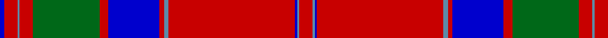

**Bands:** [BRBRGRBRBRBBR](/stripes/brbrgrbrbrbbr/) · **Stripes:** [DB R T R G R DB R T R DB T R](/stripes/stripes13/) DB R T R G R DB R T R DB T R

This was sourced from register-of-tartans.  It is a [13 band tartan](/bands/bands13/).

Original link https://www.tartanregister.gov.uk/tartanDetails.aspx?ref=2440

## Register references

External register numbers recorded for this tartan.

- Scottish Register of Tartans: [2440](https://www.tartanregister.gov.uk/tartanDetails.aspx?ref=2440)
- Scottish Tartans Authority (ITI): 446
- Scottish Tartans World Register: 446

## Variants

Other setts woven to the same stripe pattern.

- [MacGillivray](/setts/s13/r4t1db1r32t2r2db12r2g16r4t1r4db2~x2/)

## Thread count
Ba/4 R12 B2 R12 G60 R8 Ba46 R4 B4 R114 Ba2 B2 R/12

## Palette
Each colour and its ΔE from the base-6 reference it is a variant of.

| Colour | Shade | Base | ΔE (OKLab) |
|---|---|---|---|
| B | <code style="background-color:#5C8CA8;">#5C8CA8</code> `#5C8CA8` | B <code style="background-color:#2A418A;">#2A418A</code> | 0.23 |
| Ba | <code style="background-color:#0000CD;">#0000CD</code> `#0000CD` | B <code style="background-color:#2A418A;">#2A418A</code> | 0.14 |
| DB | <code style="background-color:#2C2C80;">#2C2C80</code> `#2C2C80` | B <code style="background-color:#2A418A;">#2A418A</code> | 0.06 |
| DG | <code style="background-color:#003820;">#003820</code> `#003820` | G <code style="background-color:#006100;">#006100</code> | 0.15 |
| DP | <code style="background-color:#440044;">#440044</code> `#440044` | B <code style="background-color:#2A418A;">#2A418A</code> | 0.18 |
| G | <code style="background-color:#006818;">#006818</code> `#006818` | G <code style="background-color:#006100;">#006100</code> | 0.02 |
| R | <code style="background-color:#C80000;">#C80000</code> `#C80000` | R <code style="background-color:#CC0000;">#CC0000</code> | 0.01 |

## Nearest tartans

The nearest existing variants by ΔTartan distance.

1. [Drummond of Megginch - 1820 Plaid](/setts/s15/r26db2r6db6r126lb6r6db38r6dg6r6dg130r19db6r18/) — ΔT 0.98
1. [MacGillivray](/setts/s13/r4lb1db1r32lb2r2db12r2dg16r4lb1r4db2~x2/) — ΔT 0.99
1. [Grant](/setts/s15/r6db2r2dg24r2db2r2db8r2lb1r32db2r2db1r6/) — ΔT 1.08
1. [MacGillivray - 1819 (Clan)](/setts/s13/r6t1dt1r57t2r2dt23r4g30r6t1r6dt2~x2/) — ΔT 1.08
1. [Drummond of Megginch - 1849 Kilt](/setts/s15/r7db1r2db2r35lb2r2db10r2dg2r2dg37r3db2r6~x2/) — ΔT 1.12
1. [MacFarlane, or Lendrum](/setts/s14/r42k1g12w2r3k1r3w2g2p12k4r3w4g3~x2/) — ΔT 1.16
1. [MacPherson Of Cluny](/setts/s11/r3dp1r1dg21r3dp18r35dp1ly1r4dg1~x2/) — ΔT 1.21
1. [MacGillivray](/setts/s13/r4b1db1r32b2r2db12r2dg16r4b1r4db2~x2/) — ΔT 1.22
1. [MacPherson of Cluny](/setts/s11/r5k2r2g42r5k36r70k2ly2r7g2/) — ΔT 1.22
1. [Grant VS](/setts/s13/r4db2r2db2r56db16r4dg1r4dg36r3dg1r4/) — ΔT 1.23

## Neighbour map

Every grey dot is one of 14313 variants placed by the first two principal components of the ΔTartan feature space (44% of its variance). Red is this tartan; blue dots are its nearest — click one to open its page.

<svg viewBox="0 0 640 380" role="img" style="max-width:100%;height:auto;border:1px solid #e0e0e0;border-radius:4px;display:block" xmlns="http://www.w3.org/2000/svg"><image href="/nn/cloud.v1.png" width="640" height="380"/><a href="/setts/s15/r26db2r6db6r126lb6r6db38r6dg6r6dg130r19db6r18/"><circle cx="375.7" cy="67.9" r="4" fill="#3465a4"><title>Drummond of Megginch - 1820 Plaid</title></circle></a><a href="/setts/s13/r4lb1db1r32lb2r2db12r2dg16r4lb1r4db2~x2/"><circle cx="365.1" cy="87.6" r="4" fill="#3465a4"><title>MacGillivray</title></circle></a><a href="/setts/s15/r6db2r2dg24r2db2r2db8r2lb1r32db2r2db1r6/"><circle cx="377.8" cy="84.2" r="4" fill="#3465a4"><title>Grant</title></circle></a><a href="/setts/s13/r6t1dt1r57t2r2dt23r4g30r6t1r6dt2~x2/"><circle cx="413.1" cy="79.3" r="4" fill="#3465a4"><title>MacGillivray - 1819 (Clan)</title></circle></a><a href="/setts/s15/r7db1r2db2r35lb2r2db10r2dg2r2dg37r3db2r6~x2/"><circle cx="357.0" cy="78.9" r="4" fill="#3465a4"><title>Drummond of Megginch - 1849 Kilt</title></circle></a><a href="/setts/s14/r42k1g12w2r3k1r3w2g2p12k4r3w4g3~x2/"><circle cx="333.0" cy="50.0" r="4" fill="#3465a4"><title>MacFarlane, or Lendrum</title></circle></a><a href="/setts/s11/r3dp1r1dg21r3dp18r35dp1ly1r4dg1~x2/"><circle cx="369.1" cy="103.5" r="4" fill="#3465a4"><title>MacPherson Of Cluny</title></circle></a><a href="/setts/s13/r4b1db1r32b2r2db12r2dg16r4b1r4db2~x2/"><circle cx="391.2" cy="105.8" r="4" fill="#3465a4"><title>MacGillivray</title></circle></a><a href="/setts/s11/r5k2r2g42r5k36r70k2ly2r7g2/"><circle cx="346.0" cy="94.1" r="4" fill="#3465a4"><title>MacPherson of Cluny</title></circle></a><a href="/setts/s13/r4db2r2db2r56db16r4dg1r4dg36r3dg1r4/"><circle cx="424.1" cy="86.1" r="4" fill="#3465a4"><title>Grant VS</title></circle></a><circle cx="391.7" cy="70.1" r="5" fill="#c00000"/></svg>

ID: /setts/s13/r6t1db1r57t2r2db23r4g30r6t1r6db2~x2/
