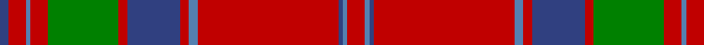

In pattern [BRBRGRBRBRBBR](/patterns/brbrgrbrbrbbr/).

This was sourced from weddslist.  It is a [13 stripes tartan](/stripes/stripes13/).

Original link http://www.weddslist.com/cgi-bin/tartans/pg.pl?source=sts

## Thread count
B/4 R8 Ba2 R8 G32 R4 B24 R4 Ba4 R64 B2 Ba2 R/8

## Palette
Each colour and its ΔE from the base-6 reference it is a variant of.

| Colour | Shade | Base | ΔE (OKLab) |
|---|---|---|---|
| B | <code style="background-color:#304080;">#304080</code> `#304080` | B <code style="background-color:#2C4084;">#2C4084</code> | 0.01 |
| Ba | <code style="background-color:#5480B0;">#5480B0</code> `#5480B0` | B <code style="background-color:#2C4084;">#2C4084</code> | 0.20 |
| G | <code style="background-color:#008000;">#008000</code> `#008000` | G <code style="background-color:#006400;">#006400</code> | 0.09 |
| R | <code style="background-color:#C00000;">#C00000</code> `#C00000` | R <code style="background-color:#C80000;">#C80000</code> | 0.02 |

## Nearest tartans

The nearest existing variants by ΔTartan distance.

1. [MacGillivray Clan Tartan Tartan Number: 446. Earliest known date: 1831 "A characteristic Clan Chattan tartan...", writes D.C.Stewart, with much in common with the setts of the neighbouring clans in Strathnairn and Morvern. Wilson produced this sett with a black stripe in the centre of the the red square. The chiefship of Clan MacGillivray is vacant and the 'Steward' of clan affairs, appointed by Lord Lyon, is Commander Colonel George Brown MacGillivray. See products available Copyright © Blair Urquhart, Comrie, 2015](/setts/s13/r8b2ba2r64b4r4ba24r4g32r8b2r8ba4-b5c8ca8-ba2c2c80-g006818-rc80000/) — ΔT 0.34
1. [Grant or Drummond Clan Tartan Tartan Number: 1384. Earliest known date: 1831 The usual design is sometimes called Drummond. It is recorded by Logan (1831), Smibert (1850), and Smith (1850). McIan's drawing of the Grant tartan is too roughly done to make out the pattern details. A certain difficulty arises in establishing a single Grant tartan to represent the clan, illustrated by the existance of ten Grant portraits at Cullen House in which each brother is wearing a different tartan, and where a coat or plaid is worn, these also differ. The chief of the Grants is Lord Strathspey. See products available Copyright © Blair Urquhart, Comrie, 2015](/setts/s15/r12b4r4g48r4g4r4b16r4ba4r64b4r4b2r12-b2c2c80-ba2888c4-g006818-rc80000/) — ΔT 0.41
1. [Drummond](/setts/s15/r12b4r4g48r4g4r4b16r4ba2r64b4r4b2r12-b1474b4-ba5c8ca8-g006818-rc80000/) — ΔT 0.48
1. [Grant, or Drummond](/setts/s15/r12b4r4g48r4g4r4b16r4ba2r64b4r4b2r12-b304080-ba5480b0-g008000-rc00000/) — ΔT 0.57
1. [Unidentified Cant #12](/setts/s12/r60b2g24r8b2ba3b2ba3b2r8g24b2-b2c2c80-ba2888c4-g006818-rc80000/) — ΔT 0.62
1. [Drummond Clan Tartan Tartan Number: 457. Earliest known date: 1822 The sett closely resembles the pattern used by McIan for his Drummond figure, which Logan asserts is in fact a Grant tartan. Nevertheless it is established that the Drummonds wore this sett to meet George IV in Edinburgh in 1822. The illustration here come from a sample in the MacGregor-Hastie Collection. There is also a Drummond of Perth sett. See products available Copyright © Blair Urquhart, Comrie, 2015](/setts/s16/r12b2r4b4r56ba4r4b18r4g4r4g48r6b4r12b4-b2c2c80-ba5c8ca8-g006818-rc80000/) — ΔT 0.66
1. [Drummond](/setts/s16/r12b2r4b4r56ba4r4b18r4g4r4g48r6b4r12b4-b304080-ba5480b0-g008000-rc00000/) — ΔT 0.73
1. [MacDonell of Keppoch (artefact)](/setts/s11/r12b2r2g56r8b16w2r64g2r8g4-b2c4084-g005020-rdc0000-we0e0e0/) — ΔT 0.75
1. [MacDonell of Keppoch Clan Tartan Tartan Number: 511. Earliest known date: 1906 MacDonells of Keppoch are an independant branch of Clan Donald. See products available Copyright © Blair Urquhart, Comrie, 2015](/setts/s10/g4r4b2r48ba2b12r6g24r8b2-b2c2c80-ba5c8ca8-g006818-rc80000/) — ΔT 0.81
1. [MacPherson Of Cluny](/setts/s11/r6b2r2g42r6b36r70b2y2r8g2-b5a3094-g004c00-rc80000-yffc800/) — ΔT 0.82

## Neighbour map

Every grey dot is one of 15726 variants placed by the first two principal components of the ΔTartan feature space (44% of its variance). Red is this tartan; blue dots are its nearest — click one to open its page.

<svg viewBox="0 0 640 380" role="img" style="max-width:100%;height:auto;border:1px solid #e0e0e0;border-radius:4px;display:block" xmlns="http://www.w3.org/2000/svg"><image href="/nn/cloud.v1.png" width="640" height="380"/><a href="/setts/s13/r8b2ba2r64b4r4ba24r4g32r8b2r8ba4-b5c8ca8-ba2c2c80-g006818-rc80000/"><circle cx="389.6" cy="98.5" r="4" fill="#3465a4"><title>MacGillivray Clan Tartan Tartan Number: 446. Earliest known date: 1831 &quot;A characteristic Clan Chattan tartan...&quot;, writes D.C.Stewart, with much in common with the setts of the neighbouring clans in Strathnairn and Morvern. Wilson produced this sett with a black stripe in the centre of the the red square. The chiefship of Clan MacGillivray is vacant and the 'Steward' of clan affairs, appointed by Lord Lyon, is Commander Colonel George Brown MacGillivray. See products available Copyright © Blair Urquhart, Comrie, 2015</title></circle></a><a href="/setts/s15/r12b4r4g48r4g4r4b16r4ba4r64b4r4b2r12-b2c2c80-ba2888c4-g006818-rc80000/"><circle cx="388.9" cy="91.5" r="4" fill="#3465a4"><title>Grant or Drummond Clan Tartan Tartan Number: 1384. Earliest known date: 1831 The usual design is sometimes called Drummond. It is recorded by Logan (1831), Smibert (1850), and Smith (1850). McIan's drawing of the Grant tartan is too roughly done to make out the pattern details. A certain difficulty arises in establishing a single Grant tartan to represent the clan, illustrated by the existance of ten Grant portraits at Cullen House in which each brother is wearing a different tartan, and where a coat or plaid is worn, these also differ. The chief of the Grants is Lord Strathspey. See products available Copyright © Blair Urquhart, Comrie, 2015</title></circle></a><a href="/setts/s15/r12b4r4g48r4g4r4b16r4ba2r64b4r4b2r12-b1474b4-ba5c8ca8-g006818-rc80000/"><circle cx="398.8" cy="92.7" r="4" fill="#3465a4"><title>Drummond</title></circle></a><a href="/setts/s15/r12b4r4g48r4g4r4b16r4ba2r64b4r4b2r12-b304080-ba5480b0-g008000-rc00000/"><circle cx="396.8" cy="92.2" r="4" fill="#3465a4"><title>Grant, or Drummond</title></circle></a><a href="/setts/s12/r60b2g24r8b2ba3b2ba3b2r8g24b2-b2c2c80-ba2888c4-g006818-rc80000/"><circle cx="384.4" cy="103.8" r="4" fill="#3465a4"><title>Unidentified Cant #12</title></circle></a><a href="/setts/s16/r12b2r4b4r56ba4r4b18r4g4r4g48r6b4r12b4-b2c2c80-ba5c8ca8-g006818-rc80000/"><circle cx="357.4" cy="96.4" r="4" fill="#3465a4"><title>Drummond Clan Tartan Tartan Number: 457. Earliest known date: 1822 The sett closely resembles the pattern used by McIan for his Drummond figure, which Logan asserts is in fact a Grant tartan. Nevertheless it is established that the Drummonds wore this sett to meet George IV in Edinburgh in 1822. The illustration here come from a sample in the MacGregor-Hastie Collection. There is also a Drummond of Perth sett. See products available Copyright © Blair Urquhart, Comrie, 2015</title></circle></a><a href="/setts/s16/r12b2r4b4r56ba4r4b18r4g4r4g48r6b4r12b4-b304080-ba5480b0-g008000-rc00000/"><circle cx="358.4" cy="97.9" r="4" fill="#3465a4"><title>Drummond</title></circle></a><a href="/setts/s11/r12b2r2g56r8b16w2r64g2r8g4-b2c4084-g005020-rdc0000-we0e0e0/"><circle cx="373.2" cy="103.8" r="4" fill="#3465a4"><title>MacDonell of Keppoch (artefact)</title></circle></a><a href="/setts/s10/g4r4b2r48ba2b12r6g24r8b2-b2c2c80-ba5c8ca8-g006818-rc80000/"><circle cx="393.5" cy="127.5" r="4" fill="#3465a4"><title>MacDonell of Keppoch Clan Tartan Tartan Number: 511. Earliest known date: 1906 MacDonells of Keppoch are an independant branch of Clan Donald. See products available Copyright © Blair Urquhart, Comrie, 2015</title></circle></a><a href="/setts/s11/r6b2r2g42r6b36r70b2y2r8g2-b5a3094-g004c00-rc80000-yffc800/"><circle cx="366.4" cy="102.1" r="4" fill="#3465a4"><title>MacPherson Of Cluny</title></circle></a><circle cx="393.5" cy="101.3" r="5" fill="#c00000"/></svg>

ID: /setts/s13/r8b2ba2r64b4r4ba24r4g32r8b2r8ba4-b5480b0-ba304080-g008000-rc00000/
