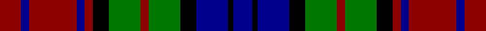

**Bands:** [RBRBRKGRGKBKB](/stripes/rbrbrkgrgkbkb/) · **Stripes:** [R DB R DB R K G R G K DB K DB](/stripes/stripes13/) R DB R DB R K G R G K DB K DB

This was sourced from register-of-tartans.  It is a [13 band tartan](/bands/bands13/).

Original link https://www.tartanregister.gov.uk/tartanDetails.aspx?ref=4364

## Register references

External register numbers recorded for this tartan.

- Scottish Register of Tartans: [4364](https://www.tartanregister.gov.uk/tartanDetails.aspx?ref=4364)
- Scottish Tartans Authority (ITI): 4404

## Variants

Other setts woven to the same stripe pattern.

- [Murray of Atholl, Red Dress](/setts/s13/db4k1db5k4g8r4g8k4r3db3r12db2r4~x4/)

## Thread count
DR/16 DB6 DR36 DB6 DR6 K12 G24 DR6 G24 K12 DB24 K4 DB/14

## Palette
Each colour and its ΔE from the base-6 reference it is a variant of.

| Colour | Shade | Base | ΔE (OKLab) |
|---|---|---|---|
| B | <code style="background-color:#788CB4;">#788CB4</code> `#788CB4` | B <code style="background-color:#2A418A;">#2A418A</code> | 0.25 |
| DB | <code style="background-color:#00008C;">#00008C</code> `#00008C` | B <code style="background-color:#2A418A;">#2A418A</code> | 0.13 |
| DR | <code style="background-color:#8C0000;">#8C0000</code> `#8C0000` | R <code style="background-color:#CC0000;">#CC0000</code> | 0.14 |
| DY | <code style="background-color:#C88C00;">#C88C00</code> `#C88C00` | Y <code style="background-color:#F2BF00;">#F2BF00</code> | 0.15 |
| G | <code style="background-color:#007800;">#007800</code> `#007800` | G <code style="background-color:#006100;">#006100</code> | 0.07 |
| K | <code style="background-color:#000000;">#000000</code> `#000000` | K <code style="background-color:#000000;">#000000</code> | 0.00 |
| N | <code style="background-color:#C8C8C8;">#C8C8C8</code> `#C8C8C8` | W <code style="background-color:#F7F7F7;">#F7F7F7</code> | 0.14 |
| P | <code style="background-color:#64008C;">#64008C</code> `#64008C` | B <code style="background-color:#2A418A;">#2A418A</code> | 0.14 |

## Nearest tartans

The nearest existing variants by ΔTartan distance.

1. [Wilson's No.158](/setts/s10/g19w2g4k13dp12k3~x2/) — ΔT 0.75
1. [Wilson's No.160](/setts/s10/g19ly2g4k13dp12k3~x2/) — ΔT 0.80
1. [Wilson's No.175](/setts/s10/dp16k17g18w2k5w2g18k17dp16k3~x2/) — ΔT 0.80
1. [Young Presidents Organisation](/setts/s12/r22db5k10g12k2g12k10db3k2db3k2db16~x2/) — ΔT 0.84
1. [Wilson's No.076](/setts/s10/dp17k18w2g17k3g17w2k18dp17g3~x2/) — ΔT 0.96
1. [MacDonald 7](/setts/s12/db11r2db2r4db15r2k15g15r4g2r2g11~x2/) — ΔT 0.99
1. [Black Watch (Piper)](/setts/s13/db12w2db2w2db2r10dg12r3dg12r10db12w2db2~x2/) — ΔT 1.02
1. [Wilson's No.150](/setts/s10/g19t2g4k13dp12k3~x2/) — ΔT 1.05
1. [MacDonald 2](/setts/s12/db8r2db2r4db10r2k11g10r4g2r2g8~x2/) — ΔT 1.05
1. [Highfield (Name)](/setts/s11/db10k2g2r2g2k2r2k2r4k1g2~x4/) — ΔT 1.06

## Neighbour map

Every grey dot is one of 14299 variants placed by the first two principal components of the ΔTartan feature space (44% of its variance). Red is this tartan; blue dots are its nearest — click one to open its page.

<svg viewBox="0 0 640 380" role="img" style="max-width:100%;height:auto;border:1px solid #e0e0e0;border-radius:4px;display:block" xmlns="http://www.w3.org/2000/svg"><image href="/nn/cloud.v1.png" width="640" height="380"/><a href="/setts/s10/g19w2g4k13dp12k3~x2/"><circle cx="163.4" cy="204.5" r="4" fill="#3465a4"><title>Wilson's No.158</title></circle></a><a href="/setts/s10/g19ly2g4k13dp12k3~x2/"><circle cx="167.2" cy="206.2" r="4" fill="#3465a4"><title>Wilson's No.160</title></circle></a><a href="/setts/s10/dp16k17g18w2k5w2g18k17dp16k3~x2/"><circle cx="164.7" cy="215.2" r="4" fill="#3465a4"><title>Wilson's No.175</title></circle></a><a href="/setts/s12/r22db5k10g12k2g12k10db3k2db3k2db16~x2/"><circle cx="117.5" cy="177.2" r="4" fill="#3465a4"><title>Young Presidents Organisation</title></circle></a><a href="/setts/s10/dp17k18w2g17k3g17w2k18dp17g3~x2/"><circle cx="155.3" cy="206.7" r="4" fill="#3465a4"><title>Wilson's No.076</title></circle></a><a href="/setts/s12/db11r2db2r4db15r2k15g15r4g2r2g11~x2/"><circle cx="129.2" cy="190.6" r="4" fill="#3465a4"><title>MacDonald 7</title></circle></a><a href="/setts/s13/db12w2db2w2db2r10dg12r3dg12r10db12w2db2~x2/"><circle cx="130.0" cy="193.0" r="4" fill="#3465a4"><title>Black Watch (Piper)</title></circle></a><a href="/setts/s10/g19t2g4k13dp12k3~x2/"><circle cx="179.5" cy="213.7" r="4" fill="#3465a4"><title>Wilson's No.150</title></circle></a><a href="/setts/s12/db8r2db2r4db10r2k11g10r4g2r2g8~x2/"><circle cx="95.8" cy="211.3" r="4" fill="#3465a4"><title>MacDonald 2</title></circle></a><a href="/setts/s11/db10k2g2r2g2k2r2k2r4k1g2~x4/"><circle cx="143.7" cy="183.1" r="4" fill="#3465a4"><title>Highfield (Name)</title></circle></a><circle cx="128.8" cy="195.8" r="5" fill="#c00000"/></svg>

ID: /setts/s13/r8db3r18db3r3k6g12r3g12k6db12k2db7~x2/
