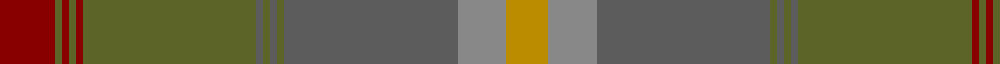

In pattern [RGRGRGBGBGBRY](/patterns/rgrgrgbgbgbry/).

This was sourced from tartans-authority.  It is a [13 stripes tartan](/stripes/stripes13/).

Original link http://www.tartansauthority.com/tartan-ferret/display/10457/

## Thread count
DR/16 G2 DR2 G2 DR2 G50 N2 G2 N2 G2 N50 Na14 DY/12

## Palette
Each colour and its ΔE from the base-6 reference it is a variant of.

| Colour | Shade | Base | ΔE (OKLab) |
|---|---|---|---|
| DR | <code style="background-color:#880000;">#880000</code> `#880000` | R <code style="background-color:#CC0000;">#CC0000</code> | 0.15 |
| DY | <code style="background-color:#BC8C00;">#BC8C00</code> `#BC8C00` | Y <code style="background-color:#F2BF00;">#F2BF00</code> | 0.16 |
| G | <code style="background-color:#5C6428;">#5C6428</code> `#5C6428` | G <code style="background-color:#006100;">#006100</code> | 0.10 |
| N | <code style="background-color:#5C5C5C;">#5C5C5C</code> `#5C5C5C` | B <code style="background-color:#2A418A;">#2A418A</code> | 0.15 |
| Na | <code style="background-color:#888888;">#888888</code> `#888888` | R <code style="background-color:#CC0000;">#CC0000</code> | 0.24 |

## Nearest tartans

The nearest existing variants by ΔTartan distance.

1. [Johansson (Aneby, Sweden), Christian (Personal)](/setts/s13/r8g1r1g1r1g25b1g1b1g1b25ga7y6x2~b3f4441-g70714d-ga75786c-r97342f-yc5831b/) — ΔT 0.47
1. [Tricor](/setts/s12/g4w1g4ga6gb6r4g23r4gb6ga6g4w1x4~g8c7038-ga00643c-gb604000-r98481c-wc0c0c0/) — ΔT 1.72
1. [The Broons (Corporate)](/setts/s9/r3k1g8y1ga7y1g19gb25k1x2~g5c6428-ga604000-gb603800-k101010-rc80000-ybc8c00/) — ΔT 1.73
1. [Scottish Borderland (Fashion)](/setts/s9/w2g2b1g30ba10b20g1b2y1x2~b405460-ba646464-g005020-wc8c8c8-yc88c00/) — ΔT 2.01
1. [Broons, The (DC Thomson)](/setts/s9/r3k1g8y1ga7y1g19gb25k1x2~g556b2f-ga603311-gb8b6508-k101010-rff0000-yffd700/) — ΔT 2.03
1. [Ensign of Ontario (Fashion)](/setts/s15/g21k1r4k1ga21g3ga3g3ga21g3y4g21ga3g3ga3x2~g006038-ga604000-k101010-rc80000-ybc8c00/) — ΔT 2.07
1. [Hyland Day (Personal)](/setts/s14/y3b2g29b6g4r26g2r3g2r26g4b6g29b2x2~b441800-g604000-rb03000-ydc943c/) — ΔT 2.08
1. [Strathmore District Tartan Tartan Number: 10118. Earliest known date: 20/11/2009 The name 'Strathmore' means the big valley and its fertile lands have made this area lying between the Grampians to the North and the Sidlaws to the South one the wealthiest farming areas in Scotland. The tartan is thus influenced by the brown and black of the rich soil, the green of the pastures, the red for the abundance of soft fruit grown and the gold to represent its prosperity. See products available Copyright © Blair Urquhart, Comrie, 2015](/setts/s16/g3r15ga2r2g2r2g18b2g2b2g2b27k2b2k6ka2x2~b402010-g303c0c-ga344625-k101010-ka000000-r8c1c20/) — ΔT 2.11
1. [Granite City (Fashion)](/setts/s8/k3b3k3b21ba21k3ba3y1x2~b5c5c5c-ba505050-k101010-ya0a0a0/) — ΔT 2.15
1. [Clyde](/setts/s10/r5b3r22ra3b6ba17ra2ba4ra2ba4x2~b646464-ba5c5c5c-r8c8c8c-ra8c0000/) — ΔT 2.15

## Neighbour map

Every grey dot is one of 15726 variants placed by the first two principal components of the ΔTartan feature space (44% of its variance). Red is this tartan; blue dots are its nearest — click one to open its page.

<svg viewBox="0 0 640 380" role="img" style="max-width:100%;height:auto;border:1px solid #e0e0e0;border-radius:4px;display:block" xmlns="http://www.w3.org/2000/svg"><image href="/nn/cloud.v1.png" width="640" height="380"/><a href="/setts/s13/r8g1r1g1r1g25b1g1b1g1b25ga7y6x2~b3f4441-g70714d-ga75786c-r97342f-yc5831b/"><circle cx="339.7" cy="135.9" r="4" fill="#3465a4"><title>Johansson (Aneby, Sweden), Christian (Personal)</title></circle></a><a href="/setts/s12/g4w1g4ga6gb6r4g23r4gb6ga6g4w1x4~g8c7038-ga00643c-gb604000-r98481c-wc0c0c0/"><circle cx="385.2" cy="174.2" r="4" fill="#3465a4"><title>Tricor</title></circle></a><a href="/setts/s9/r3k1g8y1ga7y1g19gb25k1x2~g5c6428-ga604000-gb603800-k101010-rc80000-ybc8c00/"><circle cx="375.7" cy="165.7" r="4" fill="#3465a4"><title>The Broons (Corporate)</title></circle></a><a href="/setts/s9/w2g2b1g30ba10b20g1b2y1x2~b405460-ba646464-g005020-wc8c8c8-yc88c00/"><circle cx="413.5" cy="167.1" r="4" fill="#3465a4"><title>Scottish Borderland (Fashion)</title></circle></a><a href="/setts/s9/r3k1g8y1ga7y1g19gb25k1x2~g556b2f-ga603311-gb8b6508-k101010-rff0000-yffd700/"><circle cx="321.0" cy="140.5" r="4" fill="#3465a4"><title>Broons, The (DC Thomson)</title></circle></a><a href="/setts/s15/g21k1r4k1ga21g3ga3g3ga21g3y4g21ga3g3ga3x2~g006038-ga604000-k101010-rc80000-ybc8c00/"><circle cx="405.7" cy="172.9" r="4" fill="#3465a4"><title>Ensign of Ontario (Fashion)</title></circle></a><a href="/setts/s14/y3b2g29b6g4r26g2r3g2r26g4b6g29b2x2~b441800-g604000-rb03000-ydc943c/"><circle cx="349.7" cy="171.8" r="4" fill="#3465a4"><title>Hyland Day (Personal)</title></circle></a><a href="/setts/s16/g3r15ga2r2g2r2g18b2g2b2g2b27k2b2k6ka2x2~b402010-g303c0c-ga344625-k101010-ka000000-r8c1c20/"><circle cx="299.5" cy="147.9" r="4" fill="#3465a4"><title>Strathmore District Tartan Tartan Number: 10118. Earliest known date: 20/11/2009 The name 'Strathmore' means the big valley and its fertile lands have made this area lying between the Grampians to the North and the Sidlaws to the South one the wealthiest farming areas in Scotland. The tartan is thus influenced by the brown and black of the rich soil, the green of the pastures, the red for the abundance of soft fruit grown and the gold to represent its prosperity. See products available Copyright © Blair Urquhart, Comrie, 2015</title></circle></a><a href="/setts/s8/k3b3k3b21ba21k3ba3y1x2~b5c5c5c-ba505050-k101010-ya0a0a0/"><circle cx="394.3" cy="208.3" r="4" fill="#3465a4"><title>Granite City (Fashion)</title></circle></a><a href="/setts/s10/r5b3r22ra3b6ba17ra2ba4ra2ba4x2~b646464-ba5c5c5c-r8c8c8c-ra8c0000/"><circle cx="337.8" cy="220.3" r="4" fill="#3465a4"><title>Clyde</title></circle></a><circle cx="348.1" cy="139.6" r="5" fill="#c00000"/></svg>

ID: /setts/s13/r8g1r1g1r1g25b1g1b1g1b25ra7y6x2~b5c5c5c-g5c6428-r880000-ra888888-ybc8c00/
