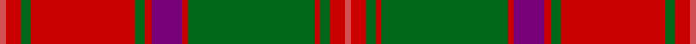

This page is one **sett** — a single exact thread-count. It belongs to the [tartan](/tartans/ri4r10g7r70g7r4dp21r4g85r4g7r10ri4/)
(the same proportion at any scale), whose colour order is pattern [RRGRGRBRGRGRR](/stripes/rrgrgrbrgrgrr/).

Sourced from house-of-tartan.  It is a [13 stripe tartan](/stripes/stripes13/).

Original link http://www.house-of-tartan.scotland.net/house/TartanViewjs.asp?colr=Def&tnam=1636

## Thread count
DO/4 R10 G7 R70 G7 R4 P21 R4 G85 R4 G7 R10 DO/4

## Palette

Palette: <strong>Tartan Register</strong> <small style="color:#888">(3 of 4 colours)</small>
<table><thead><tr><th>Colour</th><th>Threads</th><th>Shade</th><th>Base</th><th>OKLCh</th></tr></thead><tbody><tr><td>DO/</td><td style="text-align:right;font-variant-numeric:tabular-nums">4</td><td><code style="background-color:#D05054;">#D05054</code> <small style="color:#888">#D05054</small></td><td>R <code style="background-color:#CC0000;">#CC0000</code></td><td><small style="color:#888">oklch(60.2% 0.162 21.5)</small></td></tr><tr><td>R</td><td style="text-align:right;font-variant-numeric:tabular-nums">10</td><td><code style="background-color:#C80000;">#C80000</code> <small style="color:#888">#C80000</small></td><td>R <code style="background-color:#CC0000;">#CC0000</code></td><td><small style="color:#888">oklch(52.3% 0.215 29.2)</small></td></tr><tr><td>G</td><td style="text-align:right;font-variant-numeric:tabular-nums">7</td><td><code style="background-color:#006818;">#006818</code> <small style="color:#888">#006818</small></td><td>G <code style="background-color:#006100;">#006100</code></td><td><small style="color:#888">oklch(45.0% 0.142 145.0)</small></td></tr><tr><td>R</td><td style="text-align:right;font-variant-numeric:tabular-nums">70</td><td><code style="background-color:#C80000;">#C80000</code> <small style="color:#888">#C80000</small></td><td>R <code style="background-color:#CC0000;">#CC0000</code></td><td><small style="color:#888">oklch(52.3% 0.215 29.2)</small></td></tr><tr><td>G</td><td style="text-align:right;font-variant-numeric:tabular-nums">7</td><td><code style="background-color:#006818;">#006818</code> <small style="color:#888">#006818</small></td><td>G <code style="background-color:#006100;">#006100</code></td><td><small style="color:#888">oklch(45.0% 0.142 145.0)</small></td></tr><tr><td>R</td><td style="text-align:right;font-variant-numeric:tabular-nums">4</td><td><code style="background-color:#C80000;">#C80000</code> <small style="color:#888">#C80000</small></td><td>R <code style="background-color:#CC0000;">#CC0000</code></td><td><small style="color:#888">oklch(52.3% 0.215 29.2)</small></td></tr><tr><td>P</td><td style="text-align:right;font-variant-numeric:tabular-nums">21</td><td><code style="background-color:#780078;">#780078</code> <small style="color:#888">#780078</small></td><td>B <code style="background-color:#2A418A;">#2A418A</code></td><td><small style="color:#888">oklch(40.2% 0.185 328.4)</small></td></tr><tr><td>R</td><td style="text-align:right;font-variant-numeric:tabular-nums">4</td><td><code style="background-color:#C80000;">#C80000</code> <small style="color:#888">#C80000</small></td><td>R <code style="background-color:#CC0000;">#CC0000</code></td><td><small style="color:#888">oklch(52.3% 0.215 29.2)</small></td></tr><tr><td>G</td><td style="text-align:right;font-variant-numeric:tabular-nums">85</td><td><code style="background-color:#006818;">#006818</code> <small style="color:#888">#006818</small></td><td>G <code style="background-color:#006100;">#006100</code></td><td><small style="color:#888">oklch(45.0% 0.142 145.0)</small></td></tr><tr><td>R</td><td style="text-align:right;font-variant-numeric:tabular-nums">4</td><td><code style="background-color:#C80000;">#C80000</code> <small style="color:#888">#C80000</small></td><td>R <code style="background-color:#CC0000;">#CC0000</code></td><td><small style="color:#888">oklch(52.3% 0.215 29.2)</small></td></tr><tr><td>G</td><td style="text-align:right;font-variant-numeric:tabular-nums">7</td><td><code style="background-color:#006818;">#006818</code> <small style="color:#888">#006818</small></td><td>G <code style="background-color:#006100;">#006100</code></td><td><small style="color:#888">oklch(45.0% 0.142 145.0)</small></td></tr><tr><td>R</td><td style="text-align:right;font-variant-numeric:tabular-nums">10</td><td><code style="background-color:#C80000;">#C80000</code> <small style="color:#888">#C80000</small></td><td>R <code style="background-color:#CC0000;">#CC0000</code></td><td><small style="color:#888">oklch(52.3% 0.215 29.2)</small></td></tr><tr><td>DO/</td><td style="text-align:right;font-variant-numeric:tabular-nums">4</td><td><code style="background-color:#D05054;">#D05054</code> <small style="color:#888">#D05054</small></td><td>R <code style="background-color:#CC0000;">#CC0000</code></td><td><small style="color:#888">oklch(60.2% 0.162 21.5)</small></td></tr></tbody></table>

## Nearest tartans

The nearest existing variants by ΔTartan distance, with this tartan at the top so the swatches line up against it.

ΔTartan

Tartan

Sett

—

<a href="/ttd/edit/#slug=ri4r10g7r70g7r4dp21r4g85r4g7r10ri4">Crieff District Tartan Tartan Number: 1636. Earliest known date: 1793 Wilson's accounts of 1793 mention the Crieff tartan with no details. A manuscript dated 1800 gives details of colour but it is not until the publication of the Key Pattern Book of 1819 that this sett is revealed in full. Crieff in Perthshire was the most famous of the cattle drovers 'trysts' prior to 1700. It is a very large sett which has been proportionately reduced for this illustration. The full threadcount: Light Red 4, Red 12, Green 8, R 140, G 8, R 4, Purple 42, R 4, G 170, R 4, G 8, R 12, LR 4. See products available Copyright © Blair Urquhart, Comrie, 2015</a> <a class="nn-out" href="/setts/s13/ri4r10g7r70g7r4dp21r4g85r4g7r10ri4/" title="open its dictionary page">↗</a>

0.45

<a href="/ttd/edit/#slug=r4ri10g7ri70g7ri4p21ri4g85ri4g7ri10r4">Crieff</a> <a class="nn-out" href="/setts/s13/r4ri10g7ri70g7ri4p21ri4g85ri4g7ri10r4/" title="open its dictionary page">↗</a>

0.70

<a href="/ttd/edit/#slug=r3db2t1r2g24r4g2r2db8r2g2r24db2t1r2g2~x2">Stewart of Appin - 1906</a> <a class="nn-out" href="/setts/s16/r3db2t1r2g24r4g2r2db8r2g2r24db2t1r2g2~x2/" title="open its dictionary page">↗</a>

0.83

<a href="/ttd/edit/#slug=g38r3g3r3db9r3t2r40db3r3db2r6~x2">MacLintock</a> <a class="nn-out" href="/setts/s12/g38r3g3r3db9r3t2r40db3r3db2r6~x2/" title="open its dictionary page">↗</a>

0.88

<a href="/ttd/edit/#slug=g6r2g2r24t1db1r2db12r2db1t1r2g24r2~x2">Unidentified, coat</a> <a class="nn-out" href="/setts/s14/g6r2g2r24t1db1r2db12r2db1t1r2g24r2~x2/" title="open its dictionary page">↗</a>

0.89

<a href="/ttd/edit/#slug=g36r3g3r3db9r3t2r40db3r3db2r6~x2">MacLintock - 1880 (Clan)</a> <a class="nn-out" href="/setts/s12/g36r3g3r3db9r3t2r40db3r3db2r6~x2/" title="open its dictionary page">↗</a>

0.92

<a href="/ttd/edit/#slug=dg6r2dg2r24t1db1r2db12r2db1t1r2dg24r2~x2">Unidentified Coat</a> <a class="nn-out" href="/setts/s14/dg6r2dg2r24t1db1r2db12r2db1t1r2dg24r2~x2/" title="open its dictionary page">↗</a>

0.93

<a href="/ttd/edit/#slug=ri7r2db2ri2g32ri6db12ri41g2ri5r2g5~x2">MacDonald of Glenaladale</a> <a class="nn-out" href="/setts/s12/ri7r2db2ri2g32ri6db12ri41g2ri5r2g5~x2/" title="open its dictionary page">↗</a>

0.94

<a href="/ttd/edit/#slug=r2dg1ly1dg12r1dg1r1dg4r17dg3r2dg1r2lr2~x4">Hayes (Fashion)</a> <a class="nn-out" href="/setts/s14/r2dg1ly1dg12r1dg1r1dg4r17dg3r2dg1r2lr2~x4/" title="open its dictionary page">↗</a>

1.01

<a href="/ttd/edit/#slug=r6db1r2db2r28t2r2db9r2g2r2g24r3db2r6db2~x2">Drummond</a> <a class="nn-out" href="/setts/s16/r6db1r2db2r28t2r2db9r2g2r2g24r3db2r6db2~x2/" title="open its dictionary page">↗</a>

1.02

<a href="/setts/s12/r60db2g24r8db2t3db2/">Unidentified Cant #12</a>

## Neighbour map

Every grey dot is one of 14359 variants placed by the first two principal components of the ΔTartan feature space (44% of its variance). Red is this tartan; blue dots are its nearest — click one to open its page.

<svg viewBox="0 0 640 380" role="img" style="max-width:100%;height:auto;border:1px solid #e0e0e0;border-radius:4px;display:block" xmlns="http://www.w3.org/2000/svg"><image href="/nn/cloud.v1.png" width="640" height="380"/><a href="/setts/s13/r4ri10g7ri70g7ri4p21ri4g85ri4g7ri10r4/"><circle cx="327.0" cy="114.7" r="4" fill="#3465a4"><title>Crieff</title></circle></a><a href="/setts/s16/r3db2t1r2g24r4g2r2db8r2g2r24db2t1r2g2~x2/"><circle cx="325.8" cy="102.1" r="4" fill="#3465a4"><title>Stewart of Appin - 1906</title></circle></a><a href="/setts/s12/g38r3g3r3db9r3t2r40db3r3db2r6~x2/"><circle cx="336.8" cy="117.1" r="4" fill="#3465a4"><title>MacLintock</title></circle></a><a href="/setts/s14/g6r2g2r24t1db1r2db12r2db1t1r2g24r2~x2/"><circle cx="297.5" cy="111.8" r="4" fill="#3465a4"><title>Unidentified, coat</title></circle></a><a href="/setts/s12/g36r3g3r3db9r3t2r40db3r3db2r6~x2/"><circle cx="339.9" cy="117.3" r="4" fill="#3465a4"><title>MacLintock - 1880 (Clan)</title></circle></a><a href="/setts/s14/dg6r2dg2r24t1db1r2db12r2db1t1r2dg24r2~x2/"><circle cx="297.4" cy="109.2" r="4" fill="#3465a4"><title>Unidentified Coat</title></circle></a><a href="/setts/s12/ri7r2db2ri2g32ri6db12ri41g2ri5r2g5~x2/"><circle cx="350.4" cy="135.3" r="4" fill="#3465a4"><title>MacDonald of Glenaladale</title></circle></a><a href="/setts/s14/r2dg1ly1dg12r1dg1r1dg4r17dg3r2dg1r2lr2~x4/"><circle cx="346.1" cy="124.7" r="4" fill="#3465a4"><title>Hayes (Fashion)</title></circle></a><a href="/setts/s16/r6db1r2db2r28t2r2db9r2g2r2g24r3db2r6db2~x2/"><circle cx="359.9" cy="99.8" r="4" fill="#3465a4"><title>Drummond</title></circle></a><a href="/setts/s12/r60db2g24r8db2t3db2/"><circle cx="385.4" cy="105.4" r="4" fill="#3465a4"><title>Unidentified Cant #12</title></circle></a><circle cx="335.1" cy="118.1" r="5" fill="#c00000"/></svg>

ID: /setts/s13/ri4r10g7r70g7r4dp21r4g85r4g7r10ri4/
