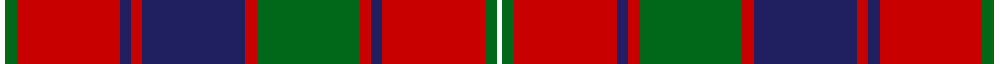

In pattern [WGRBRBRGRBRGW](/stripes/wgrbrbrgrbrgw/).

This was sourced from register-of-tartans.  It is a [13 stripe tartan](/stripes/stripes13/).

Original link https://www.tartanregister.gov.uk/tartanDetails.aspx?ref=3528

## Also known as

This cloth is also recorded under:

- Robertson 1820
- Robertson 7

## Attestations

This cloth appears in 3 source records; the oldest owns this page.

- 01/01/1820 — Robertson 1820 - White line (register-of-tartans, [record](https://www.tartanregister.gov.uk/tartanDetails.aspx?ref=3528))
- 1820 — Robertson - 1820 (White line) (tartans-authority, [record](http://www.tartansauthority.com/tartan-ferret/display/1803/))
- undated — Robertson 7 (weddslist, [record](http://www.weddslist.com/cgi-bin/tartans/pg.pl?source=sts))

## Register references

External register numbers recorded for this tartan.

- Scottish Register of Tartans: [3528](https://www.tartanregister.gov.uk/tartanDetails.aspx?ref=3528)
- Scottish Tartans Authority (ITI): 1803
- Scottish Tartans World Register: 1803

## Thread count
W/2 G4 R36 DB4 R4 DB36 R4 G36 R4 DB4 R36 G4 W/2

## Palette
Each colour and the base-6 reference it is a variant of.

| Colour | Shade | Base |
|---|---|---|
| DB | <code style="background-color:#202060;">#202060</code> `oklch(28.9% 0.111 276.9)` <small>#202060</small> | B <code style="background-color:#2A418A;">#2A418A</code> |
| G | <code style="background-color:#006818;">#006818</code> `oklch(45.0% 0.142 145.0)` <small>#006818</small> | G <code style="background-color:#006100;">#006100</code> |
| R | <code style="background-color:#C80000;">#C80000</code> `oklch(52.3% 0.215 29.2)` <small>#C80000</small> | R <code style="background-color:#CC0000;">#CC0000</code> |
| W | <code style="background-color:#FCFCFC;">#FCFCFC</code> `oklch(99.1% 0.000 89.9)` <small>#FCFCFC</small> | W <code style="background-color:#F7F7F7;">#F7F7F7</code> |

## Nearest tartans

The nearest existing variants by ΔTartan distance, with this tartan at the top so the swatches line up against it.

ΔTartan

Tartan

Sett

—

<a href="/ttd/edit/#slug=w1g2r18db2r2db18r2g18r2db2r18g2w1~x2">Robertson 1820 - White line</a> <a class="nn-out" href="/setts/s13/w1g2r18db2r2db18r2g18r2db2r18g2w1~x2/" title="open its dictionary page">↗</a>

0.53

<a href="/ttd/edit/#slug=r12db3r4db4r36lb6r4db18r4dg2r4dg36r4db4r8">Drummond of Megginch - 1969 Carpet</a> <a class="nn-out" href="/setts/s15/r12db3r4db4r36lb6r4db18r4dg2r4dg36r4db4r8/" title="open its dictionary page">↗</a>

0.94

<a href="/ttd/edit/#slug=db2r30g8r3g8r6db4r3db12w2~x2">Jenkins (Name)</a> <a class="nn-out" href="/setts/s10/db2r30g8r3g8r6db4r3db12w2~x2/" title="open its dictionary page">↗</a>

0.94

<a href="/ttd/edit/#slug=dt6k3r2k3r31k6lo2k6lo13k2lo2~x2">Rourke-Frew (Name)</a> <a class="nn-out" href="/setts/s11/dt6k3r2k3r31k6lo2k6lo13k2lo2~x2/" title="open its dictionary page">↗</a>

0.94

<a href="/ttd/edit/#slug=db28r26w2db5w2r26g28r5w2r5~x2">Glenaladale</a> <a class="nn-out" href="/setts/s10/db28r26w2db5w2r26g28r5w2r5~x2/" title="open its dictionary page">↗</a>

0.95

<a href="/ttd/edit/#slug=dg4r2k2r20t1k7r2dg10r3k2~x2">MacKillop (Scottish Tartan Society)</a> <a class="nn-out" href="/setts/s10/dg4r2k2r20t1k7r2dg10r3k2~x2/" title="open its dictionary page">↗</a>

0.95

<a href="/ttd/edit/#slug=g3r2db2r14b1db4r2g12r2db2~x8">MacKillop (Clan)</a> <a class="nn-out" href="/setts/s10/g3r2db2r14b1db4r2g12r2db2~x8/" title="open its dictionary page">↗</a>

0.95

<a href="/ttd/edit/#slug=t3r24db4r8g32r4db4r8g4r4db32r8g4r4t2~x2">MacIntyre (of Gatehouse)</a> <a class="nn-out" href="/setts/s15/t3r24db4r8g32r4db4r8g4r4db32r8g4r4t2~x2/" title="open its dictionary page">↗</a>

0.96

<a href="/ttd/edit/#slug=g36r3g3r3db9r3t2r40db3r3db2r6~x2">MacLintock - 1880 (Clan)</a> <a class="nn-out" href="/setts/s12/g36r3g3r3db9r3t2r40db3r3db2r6~x2/" title="open its dictionary page">↗</a>

0.97

<a href="/ttd/edit/#slug=g38r3g3r3db9r3t2r40db3r3db2r6~x2">MacLintock</a> <a class="nn-out" href="/setts/s12/g38r3g3r3db9r3t2r40db3r3db2r6~x2/" title="open its dictionary page">↗</a>

0.99

<a href="/ttd/edit/#slug=r5k1r2k2r16t2r2k9r2dg2r2dg13r2k2r4~x2">Unidentified No 3 #2</a> <a class="nn-out" href="/setts/s15/r5k1r2k2r16t2r2k9r2dg2r2dg13r2k2r4~x2/" title="open its dictionary page">↗</a>

## Neighbour map

Every grey dot is one of 14299 variants placed by the first two principal components of the ΔTartan feature space (44% of its variance). Red is this tartan; blue dots are its nearest — click one to open its page.

<svg viewBox="0 0 640 380" role="img" style="max-width:100%;height:auto;border:1px solid #e0e0e0;border-radius:4px;display:block" xmlns="http://www.w3.org/2000/svg"><image href="/nn/cloud.v1.png" width="640" height="380"/><a href="/setts/s15/r12db3r4db4r36lb6r4db18r4dg2r4dg36r4db4r8/"><circle cx="289.3" cy="119.0" r="4" fill="#3465a4"><title>Drummond of Megginch - 1969 Carpet</title></circle></a><a href="/setts/s10/db2r30g8r3g8r6db4r3db12w2~x2/"><circle cx="315.4" cy="150.0" r="4" fill="#3465a4"><title>Jenkins (Name)</title></circle></a><a href="/setts/s11/dt6k3r2k3r31k6lo2k6lo13k2lo2~x2/"><circle cx="253.9" cy="125.8" r="4" fill="#3465a4"><title>Rourke-Frew (Name)</title></circle></a><a href="/setts/s10/db28r26w2db5w2r26g28r5w2r5~x2/"><circle cx="264.8" cy="160.1" r="4" fill="#3465a4"><title>Glenaladale</title></circle></a><a href="/setts/s10/dg4r2k2r20t1k7r2dg10r3k2~x2/"><circle cx="306.8" cy="135.4" r="4" fill="#3465a4"><title>MacKillop (Scottish Tartan Society)</title></circle></a><a href="/setts/s10/g3r2db2r14b1db4r2g12r2db2~x8/"><circle cx="278.5" cy="162.6" r="4" fill="#3465a4"><title>MacKillop (Clan)</title></circle></a><a href="/setts/s15/t3r24db4r8g32r4db4r8g4r4db32r8g4r4t2~x2/"><circle cx="251.9" cy="137.2" r="4" fill="#3465a4"><title>MacIntyre (of Gatehouse)</title></circle></a><a href="/setts/s12/g36r3g3r3db9r3t2r40db3r3db2r6~x2/"><circle cx="340.8" cy="116.9" r="4" fill="#3465a4"><title>MacLintock - 1880 (Clan)</title></circle></a><a href="/setts/s12/g38r3g3r3db9r3t2r40db3r3db2r6~x2/"><circle cx="337.8" cy="116.7" r="4" fill="#3465a4"><title>MacLintock</title></circle></a><a href="/setts/s15/r5k1r2k2r16t2r2k9r2dg2r2dg13r2k2r4~x2/"><circle cx="296.1" cy="128.0" r="4" fill="#3465a4"><title>Unidentified No 3 #2</title></circle></a><circle cx="284.9" cy="127.5" r="5" fill="#c00000"/></svg>

ID: /setts/s13/w1g2r18db2r2db18r2g18r2db2r18g2w1~x2/
