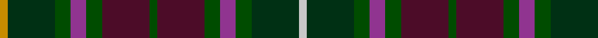

In pattern [WGGBGBGBGBGGY](/patterns/wggbgbgbgbggy/).

This was sourced from register-of-tartans.  It is a [13 stripes tartan](/stripes/stripes13/).

Original link https://www.tartanregister.gov.uk/tartanDetails.aspx?ref=813

## Attestations

This cloth appears in 2 source records; the oldest owns this page.

- 01/01/1999 — Crosby (Personal) (register-of-tartans, [record](https://www.tartanregister.gov.uk/tartanDetails.aspx?ref=813))
- 1999 — Crosby (Personal) (tartans-authority, [record](http://www.tartansauthority.com/tartan-ferret/display/4223/))

## Thread count
DY/6 DG36 G12 LP12 G12 DR36 G6 DR36 G12 LP12 G12 DG36 N/6

## Palette
Each colour and its ΔE from the base-6 reference it is a variant of.

| Colour | Shade | Base | ΔE (OKLab) |
|---|---|---|---|
| DG | <code style="background-color:#003014;">#003014</code> `#003014` | G <code style="background-color:#006100;">#006100</code> | 0.17 |
| DR | <code style="background-color:#4C0C28;">#4C0C28</code> `#4C0C28` | B <code style="background-color:#2A418A;">#2A418A</code> | 0.20 |
| DY | <code style="background-color:#C88C00;">#C88C00</code> `#C88C00` | Y <code style="background-color:#F2BF00;">#F2BF00</code> | 0.15 |
| G | <code style="background-color:#004C00;">#004C00</code> `#004C00` | G <code style="background-color:#006100;">#006100</code> | 0.07 |
| LP | <code style="background-color:#903490;">#903490</code> `#903490` | B <code style="background-color:#2A418A;">#2A418A</code> | 0.18 |
| N | <code style="background-color:#C8C8C8;">#C8C8C8</code> `#C8C8C8` | W <code style="background-color:#F7F7F7;">#F7F7F7</code> | 0.14 |

## Nearest tartans

The nearest existing variants by ΔTartan distance.

1. [Kinloch Anderson Granite (Corporate)](/setts/s12/r8b8r4b28ba12bb6ba12ra4bb8ra4bb29w6~b14283c-ba1c1c1c-bb5c5c5c-r888888-ra880000-wc0c0c0/) — ΔT 0.95
1. [Carinthian National](/setts/s11/w3b16ba15g18ba3r3ba3g18ba15b16y3~b14283c-ba4c3428-g285800-r800028-we0e0e0-ye8c000~x2/) — ΔT 0.99
1. [Forbes of Druinnor (Artefact)](/setts/s16/b6g2b2g2b2ba6ga8ba1w2ba1ga8gb2ba4b8g2b2~b202060-ba4c3428-g8c7038-ga003820-gb604000-wfcfcfc~x2/) — ΔT 1.06
1. [Forbes of Druminnor Artifact Tartan Tartan Number: 592. Earliest known date: 1968 Inspired by an old rug belonging to Hon. Peggy Forbes Semphill. A sample was woven by A Stewart while acting as Director of Research at the Scottish Tartans Society in 1968. See products available Copyright © Blair Urquhart, Comrie, 2015](/setts/s16/b6ba2b2ba2b2bb6g8bb1w2bb1g8bc2bb4b8ba2b2~b2c2c80-ba603030-bb4c2424-bc480800-g006818-we0e0e0~x2/) — ΔT 1.12
1. [Redgate (Connecticut) #2](/setts/s13/b1k5b9ba3b9ka10w1ka10g6ba3g6k4g1~b3f4b60-ba5d0f04-g334e3d-k000000-ka120a01-wddd5af~x2/) — ΔT 1.16
1. [Meath, County](/setts/s12/y5b2r14ba9g8b3r3b3r3b3g18ya3~b303070-ba4c3428-g003820-ra00000-ybc8c00-yac4b888~x2/) — ΔT 1.19
1. [Gordonstoun #3](/setts/s21/r4g4r1k7r1k1ga1r1k7r1g4r4ga1b4r1g7y1g7r1b4ga1~b440044-g003820-ga789484-k101010-r880000-yd8b000~x4/) — ΔT 1.21
1. [Cameron of Erracht (WCWM)](/setts/s11/b10r4b4r4b20k20r3g20r4g4y4~b4c3428-g408060-k101010-r880000-ybc8c00~x2/) — ΔT 1.21
1. [Malcolm #2](/setts/s14/b1k1g6k6ba6r1ba1r1ba6k6g6k1y1k1~b3c82af-ba2c4084-g005020-k101010-rdc0000-ye8c000~x4/) — ΔT 1.26
1. [Longford, County](/setts/s10/b5k3b18g6k6g6ga12r5ga12r3~b202060-g003820-ga604000-k101010-rc80000~x2/) — ΔT 1.29

## Neighbour map

Every grey dot is one of 15726 variants placed by the first two principal components of the ΔTartan feature space (44% of its variance). Red is this tartan; blue dots are its nearest — click one to open its page.

<svg viewBox="0 0 640 380" role="img" style="max-width:100%;height:auto;border:1px solid #e0e0e0;border-radius:4px;display:block" xmlns="http://www.w3.org/2000/svg"><image href="/nn/cloud.v1.png" width="640" height="380"/><a href="/setts/s12/r8b8r4b28ba12bb6ba12ra4bb8ra4bb29w6~b14283c-ba1c1c1c-bb5c5c5c-r888888-ra880000-wc0c0c0/"><circle cx="132.9" cy="178.2" r="4" fill="#3465a4"><title>Kinloch Anderson Granite (Corporate)</title></circle></a><a href="/setts/s11/w3b16ba15g18ba3r3ba3g18ba15b16y3~b14283c-ba4c3428-g285800-r800028-we0e0e0-ye8c000~x2/"><circle cx="147.2" cy="214.3" r="4" fill="#3465a4"><title>Carinthian National</title></circle></a><a href="/setts/s16/b6g2b2g2b2ba6ga8ba1w2ba1ga8gb2ba4b8g2b2~b202060-ba4c3428-g8c7038-ga003820-gb604000-wfcfcfc~x2/"><circle cx="135.8" cy="175.8" r="4" fill="#3465a4"><title>Forbes of Druinnor (Artefact)</title></circle></a><a href="/setts/s16/b6ba2b2ba2b2bb6g8bb1w2bb1g8bc2bb4b8ba2b2~b2c2c80-ba603030-bb4c2424-bc480800-g006818-we0e0e0~x2/"><circle cx="133.1" cy="172.6" r="4" fill="#3465a4"><title>Forbes of Druminnor Artifact Tartan Tartan Number: 592. Earliest known date: 1968 Inspired by an old rug belonging to Hon. Peggy Forbes Semphill. A sample was woven by A Stewart while acting as Director of Research at the Scottish Tartans Society in 1968. See products available Copyright © Blair Urquhart, Comrie, 2015</title></circle></a><a href="/setts/s13/b1k5b9ba3b9ka10w1ka10g6ba3g6k4g1~b3f4b60-ba5d0f04-g334e3d-k000000-ka120a01-wddd5af~x2/"><circle cx="108.8" cy="181.3" r="4" fill="#3465a4"><title>Redgate (Connecticut) #2</title></circle></a><a href="/setts/s12/y5b2r14ba9g8b3r3b3r3b3g18ya3~b303070-ba4c3428-g003820-ra00000-ybc8c00-yac4b888~x2/"><circle cx="148.8" cy="163.2" r="4" fill="#3465a4"><title>Meath, County</title></circle></a><a href="/setts/s21/r4g4r1k7r1k1ga1r1k7r1g4r4ga1b4r1g7y1g7r1b4ga1~b440044-g003820-ga789484-k101010-r880000-yd8b000~x4/"><circle cx="142.4" cy="161.4" r="4" fill="#3465a4"><title>Gordonstoun #3</title></circle></a><a href="/setts/s11/b10r4b4r4b20k20r3g20r4g4y4~b4c3428-g408060-k101010-r880000-ybc8c00~x2/"><circle cx="165.6" cy="198.1" r="4" fill="#3465a4"><title>Cameron of Erracht (WCWM)</title></circle></a><a href="/setts/s14/b1k1g6k6ba6r1ba1r1ba6k6g6k1y1k1~b3c82af-ba2c4084-g005020-k101010-rdc0000-ye8c000~x4/"><circle cx="129.3" cy="179.8" r="4" fill="#3465a4"><title>Malcolm #2</title></circle></a><a href="/setts/s10/b5k3b18g6k6g6ga12r5ga12r3~b202060-g003820-ga604000-k101010-rc80000~x2/"><circle cx="152.7" cy="236.3" r="4" fill="#3465a4"><title>Longford, County</title></circle></a><circle cx="121.4" cy="196.0" r="5" fill="#c00000"/></svg>

ID: /setts/s13/w1g6ga2b2ga2ba6ga1ba6ga2b2ga2g6y1~b903490-ba4c0c28-g003014-ga004c00-wc8c8c8-yc88c00~x6/
